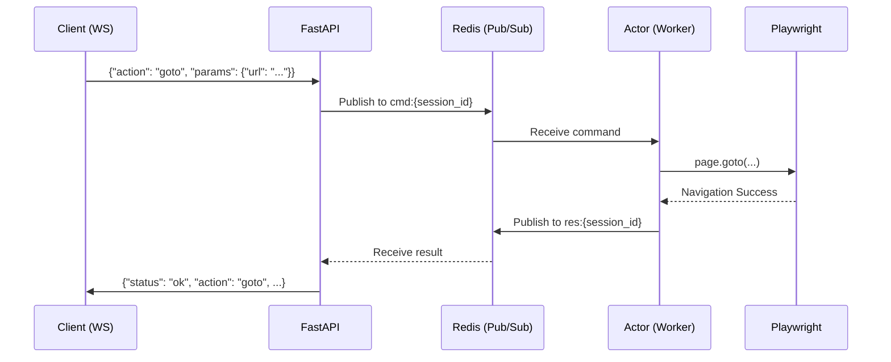
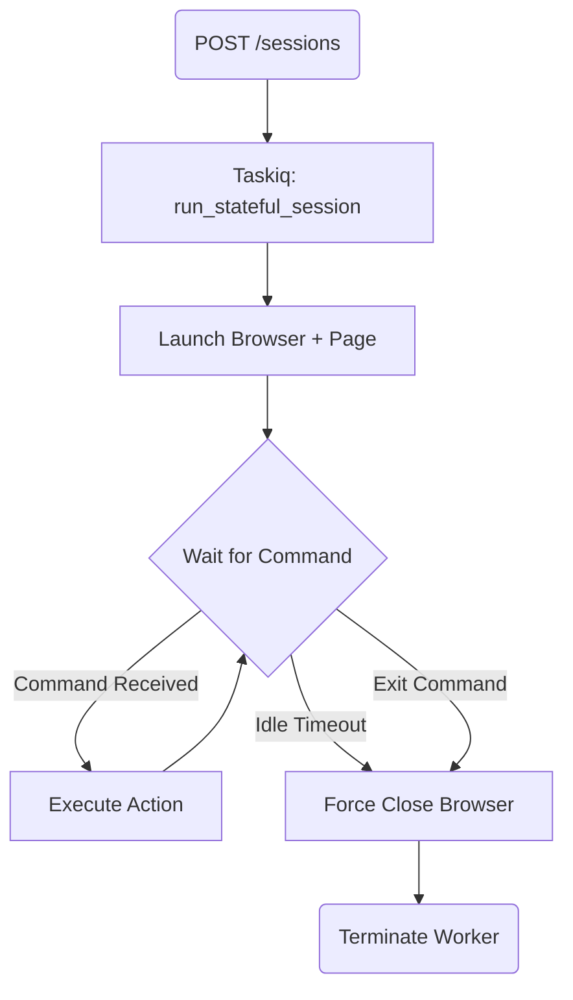

# System Structure & Logic

## 1. Execution Architecture

The system is split into two distinct execution circuits to balance performance and flexibility.

### Circuit A: Stateless Pool
- **Purpose:** High-throughput, low-latency atomic tasks (one-off scrapes, search queries).
- **Worker Management:** 
    - Taskiq workers use a **Global Playwright Instance** (Singleton).
    - Upon each task, a fresh `BrowserContext` is created and closed.
    - This avoids the overhead of launching a full browser process for every request.
- **Proxying:** Uses a server-side round-robin pool defined in `SCRAPER_SERPER_PROXIES`.

### Circuit B: Stateful Actors
- **Purpose:** Complex, multi-step interactive sessions requiring memory and AI orchestration.
- **Worker Management:**
    - Each session triggers a dedicated Taskiq task (the **Actor**).
    - The Actor owns a **Private Playwright Instance**.
    - It maintains state (cookies, local storage, current page) for the session duration.
- **Lifecycle & Safety:**
    - **Inactivity Timeout:** Force-kills the browser if no commands are received for N seconds.
    - **Max Duration:** Hard limit on session lifetime (e.g., 1 hour).
    - **Cleanup:** Ensures no dangling browser processes or memory leaks.

---

## 2. Component Logic

### Action Registry (DSL)
Actions are implemented as discrete classes inheriting from `BaseAction`. They register themselves with a string ID (e.g., `omni_click`). This allows the system to be easily extended with new commands without modifying the core actor loop.

### LLM Facade
A unified interface for AI services:
- **OpenAI:** For structured output and logical decision-making.
- **Jina Reader V2:** For HTML-to-Markdown conversion and schema-based extraction.
- **Omni-Parser:** For visual element detection on screenshots (coordinates).

---

## 3. Data Flow Diagrams

### Sequence: Stateful Session Command

### Flow: Lifecycle & Timeout

