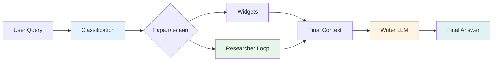
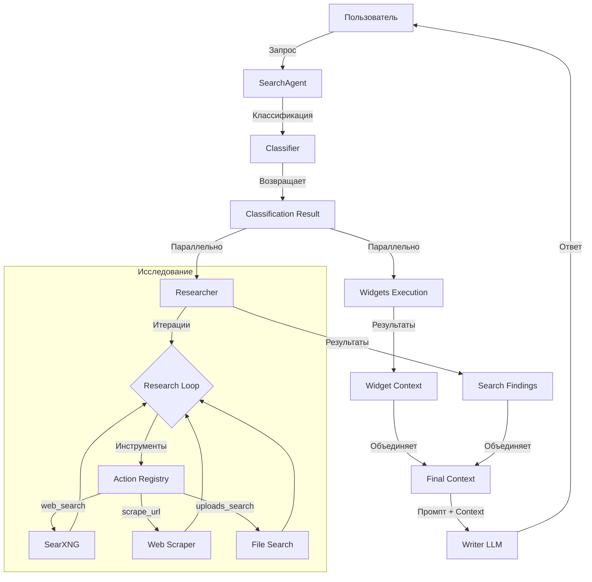
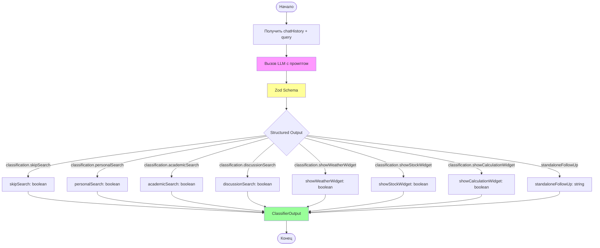
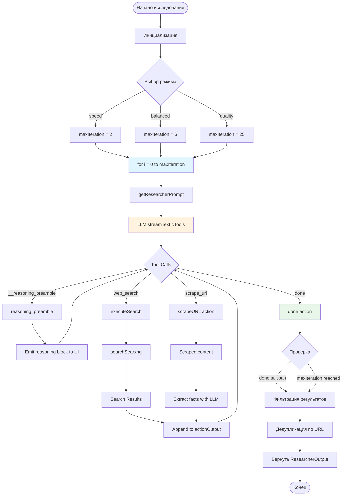
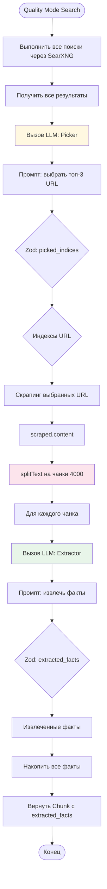
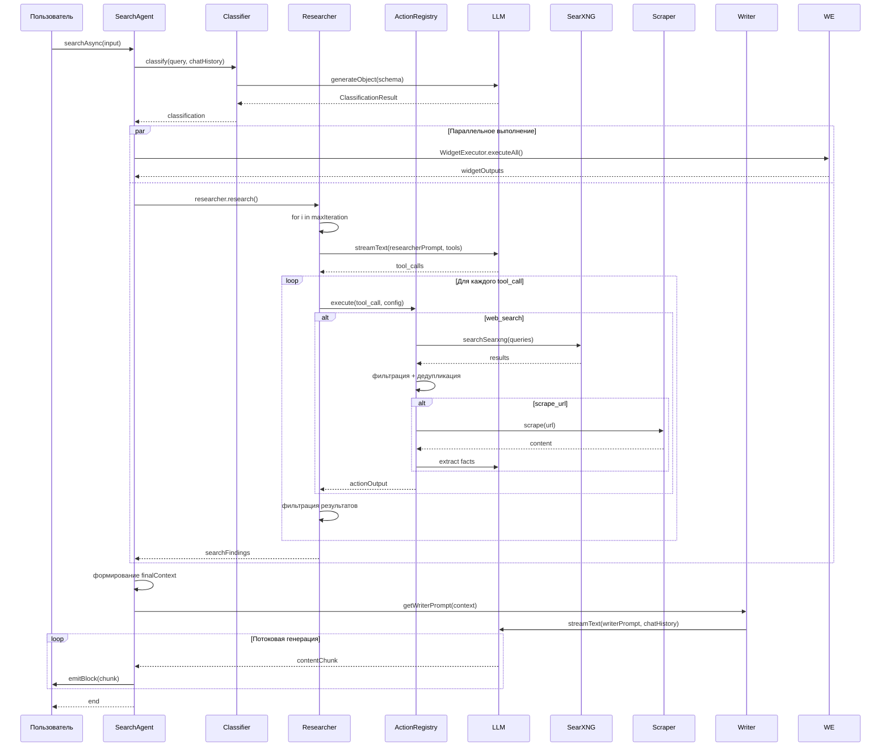
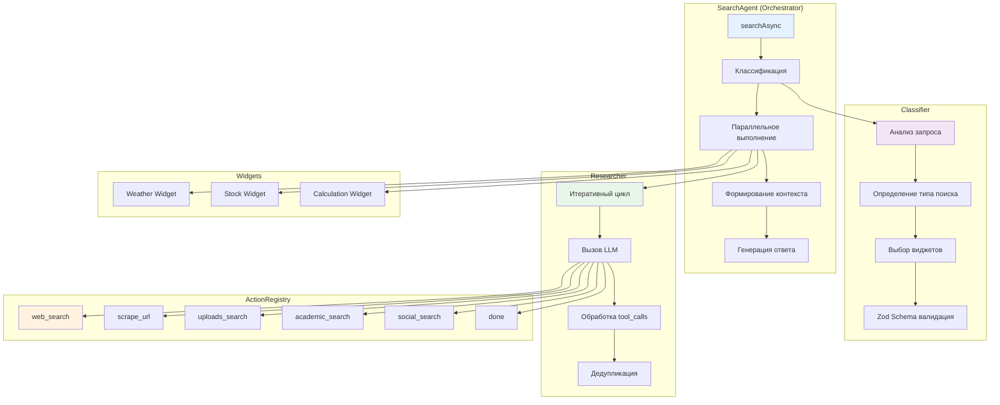
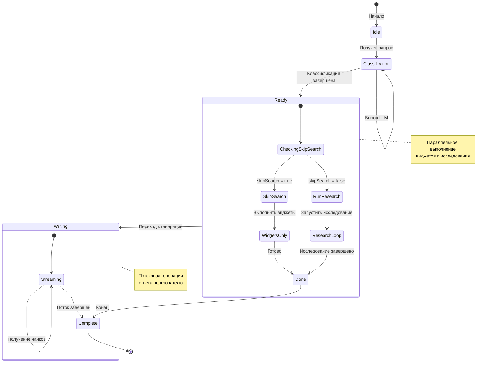
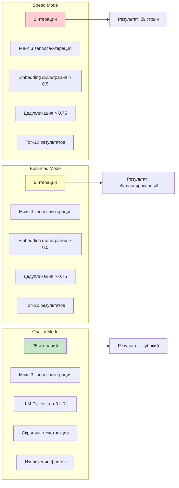

# Search Pipeline - Подробное описание исследования

https://github.com/ItzCrazyKns/Vane

## Обзор

Поисковый пайплайн в Vane представляет собой многоступенчатую систему исследования, которая классифицирует запрос пользователя, выполняет поиск с использованием различных источников и инструментов, а затем формирует итоговый ответ на основе собранной информации.

## Архитектура пайплайна



## Основные компоненты

### 1. SearchAgent (главный оркестратор)

**Файл**: `src/lib/agents/search/index.ts`

Главный класс, координирующий весь процесс поиска:

1. **Классификация запроса** - определяет тип поиска и необходимые виджеты
2. **Параллельное выполнение** - запускает виджеты и исследование одновременно
3. **Формирование контекста** - объединяет результаты поиска и виджетов
4. **Генерация ответа** - использует LLM для создания финального ответа

```typescript
class SearchAgent {
  async searchAsync(session: SessionManager, input: SearchAgentInput) {
    // 1. Классификация запроса
    const classification = await classify({...});

    // 2. Параллельное выполнение виджетов и поиска
    const widgetPromise = WidgetExecutor.executeAll({...});
    const searchPromise = researcher.research(session, {...});

    // 3. Формирование контекста
    const finalContextWithWidgets = `<search_results>...</search_results><widgets_result>...</widgets_result>`;

    // 4. Генерация ответа
    const answerStream = input.config.llm.streamText({...});
  }
}
```

### 2. Researcher (агент исследования)

**Файл**: `src/lib/agents/search/researcher/index.ts`

Отвечает за итеративный процесс исследования:

- **Итеративный цикл**: до 2-25 итераций (зависит от режима)
- **Доступные инструменты**: web_search, scrape_url, uploads_search и др.
- **Reasoning**: использует `__reasoning_preamble` для описания стратегии

```typescript
class Researcher {
  async research(session, input): Promise<ResearcherOutput> {
    // Определение количества итераций по режиму
    let maxIteration = input.config.mode === 'speed' ? 2
                    : input.config.mode === 'balanced' ? 6
                    : 25;

    // Итеративный цикл исследования
    for (let i = 0; i < maxIteration; i++) {
      // Получение промпта исследователя
      const researcherPrompt = getResearcherPrompt(...);

      // Вызов LLM с инструментами
      const actionStream = input.config.llm.streamText({
        messages: [...],
        tools: availableTools,
      });

      // Выполнение действий
      const actionResults = await ActionRegistry.executeAll(finalToolCalls, {...});
    }

    // Фильтрация и дедупликация результатов
    const filteredSearchResults = searchResults.filter(...);
  }
}
```

### 3. Classifier (классификатор запроса)

**Файл**: `src/lib/agents/search/classifier.ts`

Анализирует запрос пользователя для определения типа поиска и необходимых действий.

---

## Этапы исследования (подробно)

### Этап 1: Классификация запроса

**Цель**: Определить оптимальную стратегию обработки запроса

**Процесс**:

1. LLM анализирует историю чата и текущий запрос
2. Возвращает структурированный результат классификации

#### JSON Schema для классификации (Structured Output)

```typescript
const schema = z.object({
  classification: z.object({
    skipSearch: z
      .boolean()
      .describe('Indicates whether to skip the search step.'),
    personalSearch: z
      .boolean()
      .describe('Indicates whether to perform a personal search.'),
    academicSearch: z
      .boolean()
      .describe('Indicates whether to perform an academic search.'),
    discussionSearch: z
      .boolean()
      .describe('Indicates whether to perform a discussion search.'),
    showWeatherWidget: z
      .boolean()
      .describe('Indicates whether to show the weather widget.'),
    showStockWidget: z
      .boolean()
      .describe('Indicates whether to show the stock widget.'),
    showCalculationWidget: z
      .boolean()
      .describe('Indicates whether to show the calculation widget.'),
  }),
  standaloneFollowUp: z
    .string()
    .describe(
      "A self-contained, context-independent reformulation of the user's question.",
    ),
});
```

**Пример ответа**:

```json
{
  "classification": {
    "skipSearch": false,
    "personalSearch": false,
    "academicSearch": false,
    "discussionSearch": false,
    "showWeatherWidget": false,
    "showStockWidget": false,
    "showCalculationWidget": false
  },
  "standaloneFollowUp": "What are the features of GPT-5.1?"
}
```

#### Промпт классификатора

**Файл**: `src/lib/prompts/search/classifier.ts`

```
<role>
Assistant is an advanced AI system designed to analyze the user query and the conversation history to determine the most appropriate classification for the search operation.
</role>

<labels>
1. skipSearch: Определяет можно ли ответить без поиска
2. personalSearch: Требуется ли поиск по загруженным документам
3. academicSearch: Требуется ли академический поиск
4. discussionSearch: Нужен ли поиск по форумам/дискуссиям
5. showWeatherWidget: Показать виджет погоды
6. showStockWidget: Показать виджет акций
7. showCalculationWidget: Показать виджет калькулятора
</labels>

<output_format>
{
  "classification": {...},
  "standaloneFollowUp": string
}
</output_format>
```

---

### Этап 2: Итеративное исследование

**Цель**: Собрать максимум релевантной информации

**Режимы работы**:
| Режим | Итераций | Описание |
|-------|----------|----------|
| `speed` | 2 | Быстрый поиск, минимум итераций |
| `balanced` | 6 | Баланс между скоростью и глубиной |
| `quality` | 25 | Глубокое исследование |

#### Доступные инструменты (Actions)

**Файл**: `src/lib/agents/search/researcher/actions/`

1. **web_search** - Поиск в вебе через SearXNG
2. **scrape_url** - Извлечение контента с конкретных URL
3. **uploads_search** - Поиск по загруженным документам
4. **academic_search** - Академический поиск
5. **social_search** - Поиск по социальным сетям/форумам
6. **done** - Завершение исследования

#### Промпт исследователя (Speed Mode)

```
Assistant is an action orchestrator. Your job is to fulfill user requests by selecting and executing the available tools—no free-form replies.

Today's date: {today}

You are currently on iteration {i + 1} of your research process and have {maxIteration} total iterations so act efficiently.

<goal>
Fulfill the user's request as quickly as possible using the available tools.
</goal>

<core_principle>
Your knowledge is outdated; if you have web search, use it to ground answers even for seemingly basic facts.
</core_principle>

<mistakes_to_avoid>
1. Over-assuming: Don't assume things exist or don't exist - just look them up
2. Verification obsession: Don't waste tool calls "verifying existence"
3. Endless loops: If 2-3 tool calls don't find something, it probably doesn't exist
4. Ignoring task context: If user wants a calendar event, don't just search - create the event
</mistakes_to_avoid>

<response_protocol>
- NEVER output normal text to the user. ONLY call tools.
- Default to web_search when information is missing or stale
- Call done when you have gathered enough
</response_protocol>
```

#### Промпт исследователя (Quality Mode)

```
Assistant is a deep-research orchestrator. Your job is to fulfill user requests with the most thorough, comprehensive research possible—no free-form replies.

<goal>
Conduct the deepest, most thorough research possible. Leave no stone unturned.
Follow an iterative reason-act loop: __reasoning_preamble → tool call → __reasoning_preamble → tool call → ... → __reasoning_preamble → done.
</goal>

<research_strategy>
For any topic, consider searching:
1. Core definition/overview - What is it?
2. Features/capabilities - What can it do?
3. Comparisons - How does it compare to alternatives?
4. Recent news/updates - What's the latest?
5. Reviews/opinions - What do experts say?
6. Use cases - How is it being used?
7. Limitations/critiques - What are the downsides?
</research_strategy>

<mistakes_to_avoid>
1. Shallow research: Don't stop after one or two searches
2. Over-assuming: Don't assume things exist or don't exist
3. Missing perspectives: Search for both positive and critical viewpoints
4. Premature done: Don't call done until you've exhausted research avenues
</mistakes_to_avoid>
```

---

### Этап 3: Выполнение поиска

**Файл**: `src/lib/agents/search/researcher/actions/search/baseSearch.ts`

#### Speed/Balanced режим:

1. **Поиск** → выполняет запросы через SearXNG
2. **Эмбеддинг** → создает эмбеддинги для результатов и запроса
3. **Сходство** → вычисляет косинусное сходство
4. **Фильтрация** → оставляет результаты с similarity > 0.5
5. **Дедупликация** → удаляет дубликаты (similarity > 0.75)
6. **Лимит** → оставляет топ-20 результатов

#### Quality режим:

1. **Поиск** → выполняет все запросы
2. **Выбор результатов** → LLM выбирает топ-3 релевантных URL
3. **Скрапинг** → извлекает контент с выбранных URL
4. **Экстракция** → LLM извлекает факты из контента
5. **Объединение** → формирует финальные чанки

#### JSON Schema для picker (Quality mode)

```typescript
const pickerSchema = z.object({
  picked_indices: z
    .array(z.number())
    .describe('The array of the picked indices to be scraped for answering'),
});

// Пример ответа:
{
  "picked_indices": [0, 2, 4]
}
```

#### JSON Schema для экстрактора фактов

```typescript
const extractorSchema = z.object({
  extracted_facts: z
    .string()
    .describe('The extracted facts relevant to the query in bullet points format'),
});

// Пример ответа:
{
  "extracted_facts": "- Fact 1\n- Fact 2\n- Fact 3"
}
```

#### Промпт picker'а

```
Assistant is an AI search result picker. Assistant's task is to pick 2-3 of the most relevant search results based off the query.

## Критерии выбора:
1. Relevance to the query
2. Content quality
3. Favour known and reputable sources
4. Diversity
5. Avoid picking similar results
6. Maximum 3 results

## Output format
{
 "picked_indices": [0,2,4]
}
```

#### Промпт экстрактора

```
Assistant is an AI information extractor. Assistant will be shared with scraped information from a website along with the queries. Assistant's task is to extract relevant facts.

## Критерии:
1. Relevance: Extract based on query intent
2. Factual: Focus on facts, not opinions
3. Noise filtering: Ignore headers, footers, UI text
4. Concise: Use telegram-style sentences
5. No duplicates: Merge repeated info
6. Numerical data: Extract raw values, don't generalize

## Output format
{
  "extracted_facts": "- Fact 1\n- Fact 2\n- Fact 3"
}
```

---

### Этап 4: Генерация финального ответа

**Файл**: `src/lib/prompts/search/writer.ts`

#### Промпт Writer'а

```
You are Vane, an AI model skilled in web search and crafting detailed, engaging, and well-structured answers.

### Требования к ответу:
- Informative and relevant
- Well-structured with clear headings
- Engaging and detailed (blog-style)
- Cited with [number] notation
- Comprehensive and explanatory

### Форматирование:
- Use Markdown headings
- Neutral, journalistic tone
- No main heading/title
- Conclusion or summary at the end

### Цитирование:
- Cite every fact using [number]
- Use multiple sources when applicable
- Link all statements to context sources

### Special Instructions:
- If query is vague, explain what details might help
- If no relevant info found, be transparent about limitations

<context>
{search_results}
{widgets_result}
</context>
```

---

## Типы данных и интерфейсы

### SearchAgentInput

```typescript
export type SearchAgentInput = {
  chatHistory: ChatTurnMessage[];
  followUp: string;
  config: SearchAgentConfig;
  chatId: string;
  messageId: string;
};
```

### SearchAgentConfig

```typescript
export type SearchAgentConfig = {
  sources: SearchSources[]; // 'web' | 'discussions' | 'academic'
  fileIds: string[]; // ID загруженных файлов
  llm: BaseLLM<any>; // LLM провайдер
  embedding: BaseEmbedding<any>; // Embedding провайдер
  mode: 'speed' | 'balanced' | 'quality';
  systemInstructions: string; // Пользовательские инструкции
};
```

### ResearcherOutput

```typescript
export type ResearcherOutput = {
  findings: ActionOutput[];
  searchFindings: Chunk[];
};
```

### Chunk (результат поиска)

```typescript
export type Chunk = {
  content: string;
  metadata: {
    title: string;
    url: string;
    similarity?: number;
    embedding?: number[];
  };
};
```

### ActionOutput

```typescript
export type ActionOutput =
  | SearchActionOutput // { type: 'search_results', results: Chunk[] }
  | DoneActionOutput // { type: 'done' }
  | ReasoningResearchAction; // { type: 'reasoning', reasoning: string }
```

---

## Mermaid Диаграммы

### 1. Архитектура системы (High-Level)



---

### 2. Процесс классификации



---

### 3. Итеративный цикл исследования (Research Loop)



---

### 4. Выполнение поиска (Speed/Balanced режим)

```mermaid
flowchart LR
    subgraph Input
        Q[Queries] -->|до 3| Search[executeSearch]
    end

    Search --> Searxng{searchSearxng}

    Searxng -->|results| Process[Обработка результатов]

    Process --> Embed[Создание embedding для query]
    Process --> ForEach[Для каждого результата]

    ForEach --> Content[content = r.content | r.title]
    Content --> ResultEmb[Создание embedding для content]
    ResultEmb --> Similarity[computeSimilarity]
    Similarity --> Filter{similarity > 0.5?}

    Filter -->|Да| Keep[Оставить результат]
    Filter -->|Нет| Discard[Отбросить]

    Keep --> AllResults[Объединить все результаты]
    Discard --> AllResults

    AllResults --> Sort[Сортировка по similarity]
    Sort --> Dedupe[Дедупликация similarity > 0.75]
    Dedupe --> Limit[Оставить топ-20]
    Limit --> Output[Вернуть результаты]

    style Search fill:#f3e5f5,color:#333
    style Embed fill:#e8eaf6,color:#333
    style Dedupe fill:#e0f2f1,color:#333
```

---

### 5. Выполнение поиска (Quality режим)



---

### 6. Диаграмма последовательности (Sequence Diagram)



---

### 7. Компонентная диаграмма (Component Diagram)



---

### 8. Диаграмма состояний (State Diagram)



---

### 9. Диаграмма потока данных (Data Flow)

```mermaid
flowchart LR
    subgraph Входные данные
        Query[User Query]
        History[Chat History]
        Files[Uploaded Files]
        Config[Config: mode, sources, LLM, etc.]
    end

    subgraph Этап 1: Классификация
        CL[Classifier]
        CLPrompt[classifierPrompt]
        CLSchema[Zod Schema]
    end

    subgraph Этап 2: Исследование
        RP[Researcher Prompt]
        RPData[actionDesc + fileDesc]
        LLM1[LLM]
        Tools[Tools Definition]
    end

    subgraph Этап 3: Выполнение действий
        AR[ActionRegistry]
        Search[executeSearch]
        Scrape[scrape_url]
        Extract[extract facts]
    end

    subgraph Этап 4: Результаты
        Chunks[Chunk[]]
        Filtered[Filtered & Deduped]
        Context[Final Context]
    end

    subgraph Этап 5: Генерация ответа
        WP[Writer Prompt]
        LLM2[LLM]
        Answer[Final Answer]
    end

    Query --> CL
    History --> CL
    Config --> CL

    CL --> CLPrompt
    CLPrompt --> CLSchema
    CLSchema --> LLM1
    LLM1 --> ClassificationResult[Classification]

    ClassificationResult --> RP
    ClassificationResult --> RPData
    RP --> LLM1
    RPData --> LLM1
    Tools --> LLM1

    LLM1 --> ToolCalls[tool_calls]
    ToolCalls --> AR

    AR --> Search
    AR --> Scrape

    Search --> Searxng[SearXNG API]
    Searxng --> Chunks

    Scrape --> Scraper[Web Scraper]
    Scraper --> Extract
    Extract --> LLM1
    LLM1 --> ExtractedFacts[extracted_facts]
    ExtractedFacts --> Chunks

    Chunks --> Filtered
    Filtered --> Context

    Files --> RPData

    Context --> WP
    WP --> LLM2
    LLM2 --> Answer

    style CL fill:#e1f5fe,color:#333
    style LLM1 fill:#fff3e0,color:#333
    style AR fill:#e8f5e9,color:#333
    style Chunks fill:#fce4ec,color:#333
    style Answer fill:#e0f2f1,color:#333
```

---

### 10. Диаграмма режимов работы



---

### 11. JSON Schema диаграмма

```mermaid
erDiagram
    CLASSIFIER_OUTPUT {
        boolean skipSearch
        boolean personalSearch
        boolean academicSearch
        boolean discussionSearch
        boolean showWeatherWidget
        boolean showStockWidget
        boolean showCalculationWidget
        string standaloneFollowUp
    }

    RESEARCHER_OUTPUT {
        array findings
        array searchFindings
    }

    CHUNK {
        string content
        object metadata
    }

    CHUNK_METADATA {
        string title
        string url
        float similarity
        array embedding
    }

    ACTION_OUTPUT {
        string type
        array results
    }

    SEARCH_AGENT_CONFIG {
        array sources
        array fileIds
        object llm
        object embedding
        string mode
        string systemInstructions
    }

    CLASSIFIER_OUTPUT --> RESEARCHER_OUTPUT: "используется в"
    RESEARCHER_OUTPUT --> CHUNK: "включает"
    CHUNK --> CHUNK_METADATA: "имеет"
    CHUNK_METADATA --> ACTION_OUTPUT: "часть"
    SEARCH_AGENT_CONFIG --> RESEARCHER_OUTPUT: "конфигурирует"
```

---

## Ключевые файлы

| Файл                                                            | Описание                        |
| --------------------------------------------------------------- | ------------------------------- |
| `src/lib/agents/search/index.ts`                                | Главный оркестратор SearchAgent |
| `src/lib/agents/search/api.ts`                                  | API версия SearchAgent          |
| `src/lib/agents/search/classifier.ts`                           | Классификатор запроса           |
| `src/lib/agents/search/types.ts`                                | TypeScript типы                 |
| `src/lib/agents/search/researcher/index.ts`                     | Агент исследования              |
| `src/lib/agents/search/researcher/actions/registry.ts`          | Реестр действий                 |
| `src/lib/agents/search/researcher/actions/search/baseSearch.ts` | Базовый поиск                   |
| `src/lib/agents/search/researcher/actions/search/webSearch.ts`  | Web поиск                       |
| `src/lib/agents/search/researcher/actions/scrapeURL.ts`         | Скрапинг URL                    |
| `src/lib/prompts/search/classifier.ts`                          | Промпт классификатора           |
| `src/lib/prompts/search/researcher.ts`                          | Промпт исследователя            |
| `src/lib/prompts/search/writer.ts`                              | Промпт писателя                 |
| `src/lib/searxng.ts`                                            | Интеграция с SearXNG            |
| `src/lib/scraper.ts`                                            | Скрапер веб-страниц             |
| `src/lib/utils/computeSimilarity.ts`                            | Вычисление сходства             |
| `src/lib/utils/splitText.ts`                                    | Разбиение текста на чанки       |

---

## Конфигурация

### SearchSources

```typescript
export type SearchSources = 'web' | 'discussions' | 'academic';
```

### Mode конфигурация

| Параметр              | Speed | Balanced | Quality |
| --------------------- | ----- | -------- | ------- |
| Итерации              | 2     | 6        | 25      |
| Max запросов/итерацию | 3     | 3        | 3       |
| Max URL для скрапинга | -     | -        | 3       |
| Embedding фильтрация  | Да    | Да       | Нет     |
| Экстракция фактов     | Нет   | Нет      | Да      |

---

## Пример использования

```typescript
const searchAgent = new SearchAgent();

await searchAgent.searchAsync(session, {
  chatHistory: [
    { role: 'user', content: 'What is AI?' },
    { role: 'assistant', content: 'AI is...' },
  ],
  followUp: 'What are the latest GPT models?',
  config: {
    sources: ['web', 'discussions'],
    fileIds: [],
    llm: openAILLM,
    embedding: openAIEmbedding,
    mode: 'balanced',
    systemInstructions: '',
  },
  chatId: 'chat-123',
  messageId: 'msg-456',
});
```

---

## Заключение

Поисковый пайплайн Vane представляет собой комплексную систему, которая:

1. **Классифицирует** запрос для выбора оптимальной стратегии
2. **Исследует** тему итеративно с использованием различных инструментов
3. **Извлекает** релевантную информацию через поиск и скрапинг
4. **Генерирует** структурированный, хорошо цитируемый ответ

Система поддерживает гибкую конфигурацию через режимы (speed/balanced/quality) и легко расширяется через добавление новых действий в ActionRegistry.
