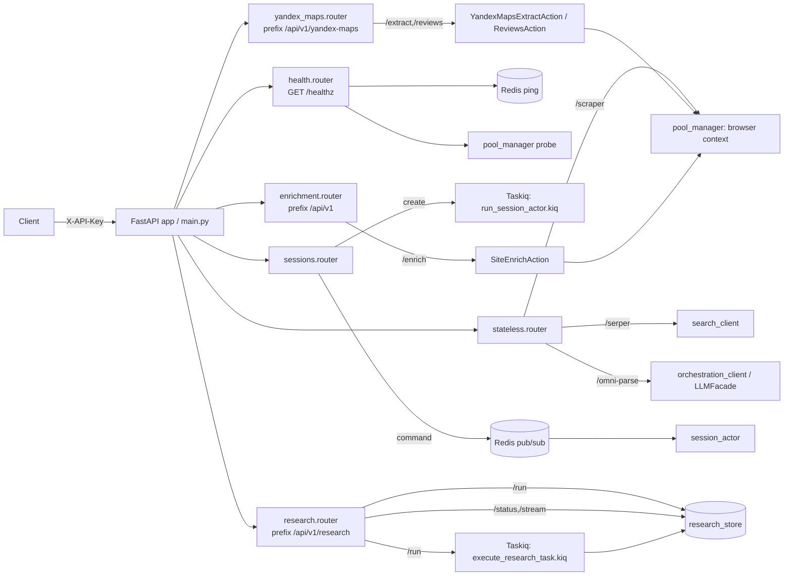

# API Routers (src/api/routers/)

## Files analyzed
- `src/api/routers/__init__.py` — пакет-маркер, без re-exports
- `src/api/routers/health.py` — `GET /healthz` (FR-003) для Docker healthcheck и LB
- `src/api/routers/stateless.py` — атомарные эндпоинты: scraper, serper-совместимый поиск, omni-parse, html-to-md
- `src/api/routers/sessions.py` — жизненный цикл интерактивных browser-сессий (create / command / delete) поверх Redis pub/sub + Taskiq актёр
- `src/api/routers/yandex_maps.py` — извлечение организаций и отзывов из Yandex Maps (FR-006)
- `src/api/routers/enrichment.py` — обогащение сайтов компаний чистым текстом (FR-007)
- `src/api/routers/research.py` — асинхронный Auto-Research Agent: submit / status / SSE-stream (feature 011)

## Purpose & responsibilities
Презентационный слой сервиса. Роутеры принимают HTTP-запросы, валидируют их через Pydantic-модели из `src/domain/models/requests.py`, делегируют выполнение либо напрямую в **Actions** (`src/actions/*`), либо в **infrastructure clients** (`search_client`, `orchestration_client`, `pool_manager`), либо ставят задачу в **Taskiq**-очередь (`session_actor.kiq()`, `execute_research_task.kiq()`). Аутентификация — статический API-key через `Depends(get_api_key)` (на уровне роутера или подключается в `main.py`). Прямого использования `action_registry` нет — DSL-команды доставляются в сессии через Redis pub/sub до изолированного актёра.

## Key classes / functions

### `__init__.py`
Пустой пакет-маркер.

### `health.py`
| Метод | Путь | Функция | Request | Response | Вызывает |
|---|---|---|---|---|---|
| GET | `/healthz` | `health_check()` | — | `HealthResponse` (status, timestamp, services) | `redis.Redis` ping + `pool_manager` probe |

Возвращает структурированный отчёт по Redis и browser pool; SLA < 200 мс. Tags: `["health"]`. Без auth.

### `stateless.py`
APIRouter с `dependencies=[Depends(get_api_key)]`. Без prefix/tags.

| Метод | Путь | Функция | Request | Response | Вызывает |
|---|---|---|---|---|---|
| POST | `/scraper` | `scrape` | `ScrapeRequest` | `ScrapeResponse` | `pool_manager` (browser context) |
| POST | `/serper` | `serper` | `SearchRequest` | `SearchResponse` | `search_client` (Serper-совместимая трансформация Google) |
| POST | `/omni-parse` | `omni_parse` | `OmniParseRequest` | dict (нет явной модели) | `orchestration_client` (LLM facade для UI grounding) |
| POST | `/html-to-md` | `html_to_md` | `HtmlToMdRequest` | dict (нет явной модели) | локальная конверсия |

Обработка ошибок узкая: только `/scraper` ловит `Exception` и возвращает `TaskStatus.FAILED` внутри 200 (нет явного 4xx/5xx).

### `sessions.py`
APIRouter с `dependencies=[Depends(get_api_key)]`.

| Метод | Путь | Функция | Request | Response | Вызывает |
|---|---|---|---|---|---|
| POST | `/sessions` | `create_session` | `CreateSessionRequest` | dict (session_id, status) | `run_session_actor.kiq()` (Taskiq) |
| POST | `/sessions/{session_id}/command` | `send_command` | `CommandRequest` | dict (результат команды) | Redis pub/sub → актёр сессии |
| DELETE | `/sessions/{session_id}` | `delete_session` | — | dict (status, message) | Redis cleanup |

Коды ошибок:
- **503 REDIS_UNAVAILABLE** — `redis.ConnectionError | TimeoutError | RedisError | RedisUnavailableError`
- **504 COMMAND_TIMEOUT** — ожидание ответа от актёра > 60 с

Использует WS-менеджер `src.api.websockets.manager` для координации.

### `yandex_maps.py`
APIRouter с `dependencies=[Depends(get_api_key)]`; mount: prefix=`/api/v1/yandex-maps`, tags=`["yandex-maps"]`.

| Метод | Путь | Полный URL | Функция | Request | Response | Action |
|---|---|---|---|---|---|---|
| POST | `/extract` | `/api/v1/yandex-maps/extract` | `extract_organizations` | `YandexMapsExtractRequest` | `YandexMapsExtractResponse` | `YandexMapsExtractAction` |
| POST | `/reviews` | `/api/v1/yandex-maps/reviews` | `fetch_reviews` | `YandexMapsReviewsRequest` | `YandexMapsReviewsResponse` | `YandexMapsReviewsAction` |

Коды:
- **503** при `YandexCaptchaError` (текст «yandex captcha: …»)
- **500** при любом другом `Exception` (помечено `# noqa: BLE001`)

### `enrichment.py`
APIRouter с `dependencies=[Depends(get_api_key)]`; mount: prefix=`/api/v1`, tags=`["enrichment"]`.

| Метод | Путь | Полный URL | Функция | Request | Response | Action |
|---|---|---|---|---|---|---|
| POST | `/enrich` | `/api/v1/enrich` | `enrich_website` | `EnrichRequest` | `EnrichResponse` | `SiteEnrichAction.execute(url, crawl_about, crawl_services)` |

Коды: **500** на любой `Exception` (generic). Нет 400/413, описанных в spec 010.

### `research.py`
APIRouter с tags=`["research"]`; mount: prefix=`/api/v1/research`, `dependencies=[Depends(get_api_key)]` ставится в `main.py`.

| Метод | Путь | Полный URL | Функция | Request | Response | Зависимости |
|---|---|---|---|---|---|---|
| POST | `/run` | `/api/v1/research/run` | `run_research` | `ResearchRequest` | `ResearchTaskCreateResponse` (202) | `get_concurrent_task_count`, `set_task`, `execute_research_task.kiq()` |
| GET | `/status/{task_id}` | `/api/v1/research/status/{task_id}` | `get_research_status` | — | `ResearchTaskStatus` | `get_task` |
| GET | `/stream/{task_id}` | `/api/v1/research/stream/{task_id}` | `stream_research_events` | — | `StreamingResponse` (SSE) | `get_task` polling |

Коды:
- **202 Accepted** на успешный submit
- **429** при `concurrent > settings.MAX_CONCURRENT_RESEARCH_TASKS`
- **404** если task отсутствует / истёк

Параметры стрима: `SSE_TIMEOUT = 1800 с`, `POLL_INTERVAL = 2.0 с`. Состояние задачи хранится в `src/infrastructure/tasks/research_store.py`; исполнение — в Taskiq-таске `src/infrastructure/queue/research_task.py`.

## Data flow within slice

- Все защищённые роутеры используют `Depends(get_api_key)` (объявлен в `src/api/auth.py`); включается либо на уровне APIRouter, либо при `app.include_router(...)` в `src/api/main.py`.
- FastAPI парсит JSON в Pydantic-модель из `src/domain/models/requests.py`; невалидные тела → автоматический 422.
- Маршрут:
  - **Stateless** → прямой вызов клиента инфраструктуры (`pool_manager` / `search_client` / `orchestration_client`), синхронный по отношению к запросу.
  - **Sessions** → fire-and-forget enqueue `run_session_actor.kiq(session_id)`; команды и ответы — через Redis pub/sub каналы, координируемые `websockets.manager`.
  - **Yandex Maps / Enrichment** → синхронное `Action.execute()` (Playwright-страница внутри пула), ответ блокирует HTTP-коннект.
  - **Research** → запись в `research_store` + `execute_research_task.kiq(task_id)`, клиент опрашивает `/status` или подписывается на `/stream` (SSE).

## Mermaid diagram(s)

## External dependencies

- **Auth**: `src/api/auth.py::get_api_key` (static API key из settings).
- **Browser pool**: `src/infrastructure/browser/pool_manager.py` — Playwright контексты для `/scraper`, `/extract`, `/reviews`, `/enrich`, healthcheck.
- **LLM / OpenAI-совместимый клиент**: `orchestration_client` (LLMFacade) для `/omni-parse`.
- **Search client**: `src/infrastructure/external_api/search_client.py` для `/serper`.
- **Taskiq broker**: `src/infrastructure/queue/broker.py`, задачи `run_session_actor`, `execute_research_task`.
- **Redis**: `redis.asyncio` напрямую в healthcheck и sessions (pub/sub каналы команд и ответов).
- **WebSocket manager**: `src/api/websockets/manager.py` для синхронизации session-стрима.
- **Actions**: `YandexMapsExtractAction`, `YandexMapsReviewsAction`, `SiteEnrichAction`.
- **Research store**: `src/infrastructure/tasks/research_store.py` (вероятно Redis-backed).

`action_registry` (`src/domain/registry/action_registry.py`) в роутерах **не используется** — он адресуется только из session-актёра при выполнении DSL.

## Tests covering this slice

Контрактные тесты для slice (см. `tests/contract/`):

- `tests/contract/test_health_endpoint.py` — `GET /healthz` (FR-003)
- `tests/contract/test_stateless.py` — `/scraper`
- `tests/contract/test_scraper.py` — общий контракт скрапера
- `tests/contract/test_searxng_search.py` — поиск (вероятно `/serper` или альтернативный backend)
- `tests/contract/test_html_to_md.py` — `/html-to-md`
- `tests/contract/test_sessions.py` — `/sessions*`
- `tests/contract/test_yandex_maps_api.py` — `/api/v1/yandex-maps/extract`
- `tests/contract/test_yandex_maps_reviews_api.py` — `/api/v1/yandex-maps/reviews`
- `tests/contract/test_enrichment_api.py` — `/api/v1/enrich`
- `tests/contract/test_research_endpoint.py` — `/api/v1/research/*`

Файлов с именем `*router*.py` под `tests/` не найдено — покрытие идёт строго через contract-тесты по эндпоинтам.

## Open questions / smells

- **Расхождение с spec 009 (`stateless`)**: spec заявляет `POST /jina-extract`, но в `stateless.py` его нет — вместо него реализован `POST /html-to-md`. `omni-parse` и `serper` соответствуют. Нужно либо обновить spec, либо реализовать `/jina-extract` (см. `src/infrastructure/external_api/jina_client.py`, который в STRUCTURE.md помечен как placeholder).
- **Расхождение с spec 010 (`yandex-maps`)**: spec описывает путь `POST /scrape/yandex-maps`, реальный — `POST /api/v1/yandex-maps/extract`, плюс добавлен незадокументированный `/reviews`. Также spec обещает 429/400 с конкретными `error`-кодами и `retry_after`, фактически только 503 (captcha) и 500 (catch-all).
- **Расхождение с spec 010 (`enrichment`)**: spec — `POST /enrich/site` с полями `crawl_pages: [...]`, `max_words`, `truncated` в ответе. Реальный — `POST /api/v1/enrich`, передаёт boolean `crawl_about/crawl_services` в action. Ответы `400 invalid_url` и `413 content_too_large` не реализованы — всегда 500.
- **Generic 500 на `Exception`** в `enrichment.py` и `yandex_maps.py` (`# noqa: BLE001`) скрывает реальные ошибки браузера / сети и мешает клиенту делать retry-логику.
- **Stateless `/scraper`** возвращает `TaskStatus.FAILED` внутри 200 OK вместо HTTP-ошибки — несовместимо с типовым REST-поведением и осложняет мониторинг.
- **Rate-limit headers** (`X-RateLimit-*`), обещанные spec 010, в роутерах не выставляются — `src/infrastructure/rate_limiter/token_bucket.py` существует, но из роутеров не вызывается напрямую (вероятно через middleware `src/api/middleware/rate_limit.py`).
- **`response_model` отсутствует** у `/omni-parse` и `/html-to-md` (возвращают `dict`) — нет автодоки OpenAPI и валидации ответа.
- **`research.py`**: дефолты `max_iterations=None`, `max_tokens=None` в spec означают «использовать пресет режима»; убедиться, что валидация диапазонов (`1-20`, `1000-32000`) реализована Pydantic-моделью.
- **`health.py`** не возвращает 503 явно в коде, который мы видели в сводке — стоит проверить, что unhealthy-ветка реально маппится в HTTP 503, иначе LB не сможет отделить деградацию.
- **Дублирование `dependencies=[Depends(get_api_key)]`**: часть роутеров объявляет его на APIRouter, часть — в `main.py` при `include_router`. Стоит унифицировать.
