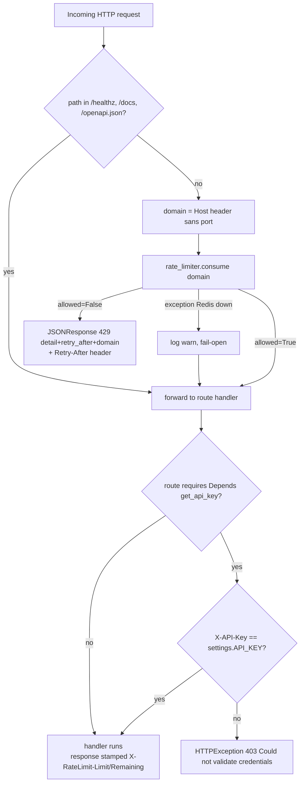

# API Middleware (src/api/middleware/)

## Files analyzed

Directly in scope (analyzed via `tools/ask_local_llm.py`):

- `src/api/middleware/__init__.py`
- `src/api/middleware/rate_limit.py` — per-domain rate limiting middleware (FR-009, FR-010)
- `src/api/auth.py` — X-API-Key dependency (note: lives in `src/api/`, not `src/api/middleware/`, despite `STRUCTURE.md` claiming `src/api/middleware/auth.py`)
- `src/api/main.py` — for registration context

Out of scope but referenced (left for slice 12 — infrastructure):

- `src/infrastructure/rate_limiter/token_bucket.py`
- `src/domain/models/rate_limit_rule.py`

## Purpose & responsibilities

The middleware slice provides two cross-cutting concerns for HTTP requests:

1. **Authentication** — Static `X-API-Key` validation via a FastAPI `Security()` dependency wrapping `APIKeyHeader`. Applied per-route through `Depends`, not as ASGI middleware.
2. **Per-domain rate limiting** — Starlette `BaseHTTPMiddleware` that consults a Redis-backed token bucket keyed by the request's `Host` header and enforces FR-009 (default 30/h for `*.yandex.*`).

The two are different mechanisms:

| Concern | Mechanism | Scope |
|---|---|---|
| Auth | `Security(APIKeyHeader)` dependency | per-route (whatever router declares `Depends(get_api_key)`) |
| Rate limit | `BaseHTTPMiddleware` registered globally | all requests except an explicit allowlist |

## Key classes / functions

### `src/api/auth.py`
- `APIKeyHeader(name="X-API-Key", auto_error=False)` — Starlette security scheme.
- `get_api_key(api_key: str = Security(api_key_header))` — dependency. Compares against `settings.API_KEY`. On mismatch raises `HTTPException(403, "Could not validate credentials")`.

### `src/api/middleware/rate_limit.py`
- `class RateLimitMiddleware(BaseHTTPMiddleware)`
  - `__init__(app, rules=DEFAULT_RULES)` — accepts a list of rate-limit rules.
  - `async dispatch(request, call_next)` — short-circuits for `/healthz`, `/docs`, `/openapi.json`; otherwise extracts domain, calls `rate_limiter.consume(...)`, and either returns `JSONResponse(429, ...)` or proceeds.
  - `_get_domain_from_request(request)` — strips port from the `Host` header.
- `DEFAULT_RULES` — module-level list combining a hardcoded `*.yandex.*` pattern with values from `settings.RATE_LIMIT_YANDEX_PER_HOUR` and `settings.RATE_LIMIT_DEFAULT_PER_HOUR`.

### `src/api/main.py`
- Registers `app.add_middleware(RateLimitMiddleware)` (no per-instance args — relies on `DEFAULT_RULES`).

## Data flow within slice

1. ASGI request enters → `RateLimitMiddleware.dispatch`.
2. If path ∈ `{/healthz, /docs, /openapi.json}` → forward unchanged.
3. Otherwise resolve `domain = host_header_without_port`.
4. Call `infrastructure.rate_limiter.token_bucket.consume(domain)` (Redis-backed).
   - On `Exception` (Redis down etc.) → log warning, **fail-open** (forward).
   - On `allowed=True` → forward, then stamp `X-RateLimit-Limit` and `X-RateLimit-Remaining` on the response.
   - On `allowed=False` → return `JSONResponse(429, {"detail":"Rate limit exceeded","retry_after":N,"domain":D})` with `Retry-After` header.
5. After (or instead of) middleware, individual routers may declare `Depends(get_api_key)`. If the `X-API-Key` header is missing or mismatched → `HTTPException(403, "Could not validate credentials")`.

Important caveat: the domain used for rate limiting is the **inbound `Host` header of the API request**, not the target URL inside the payload (e.g. the `url` field of a scrape request body). So a POST to the scraper API with `body.url = https://yandex.ru/...` is rate-limited against the *client's view of the API host* (e.g. `localhost:8000`), **not** against `yandex.ru`. This is almost certainly a bug relative to FR-009 ("per-domain rate limiting … default 30/hour for `*.yandex.*`") — see Open questions.

## Mermaid diagram(s)

## External dependencies

- `starlette.middleware.base.BaseHTTPMiddleware`, `starlette.responses.JSONResponse`
- `fastapi.Security`, `fastapi.HTTPException`, `fastapi.security.APIKeyHeader`
- `src/core/config.py` — `settings.API_KEY`, `settings.RATE_LIMIT_YANDEX_PER_HOUR`, `settings.RATE_LIMIT_DEFAULT_PER_HOUR`
- `src/infrastructure/rate_limiter/token_bucket.py` — `consume(domain)` (Redis-backed token bucket, key prefix `rate:{domain}`) — covered by slice 12
- `src/domain/models/rate_limit_rule.py` — `RateLimitRule` data class consumed in `DEFAULT_RULES` — covered by slice 12

## Tests covering this slice

Found via `Glob`:

- `tests/unit/test_rate_limiter.py` — FR-009/FR-010 unit coverage (likely targets the token bucket; may also cover the middleware shape)
- `tests/e2e/test_rate_limiting_flow.py` — full request flow against the 429 path
- `tests/integration/test_auth.py` — integration test for `X-API-Key`
- `tests/e2e/test_auth_flow.py` — end-to-end auth flow

No file matches `tests/**/*middleware*.py` — middleware is exercised indirectly via the rate-limit/auth test files above.

## Open questions / smells

1. **Wrong domain source for rate limiting (likely a real bug vs FR-009).** `_get_domain_from_request` reads the inbound `Host` header — i.e. the *API server's* hostname (e.g. `localhost:8000`, or whatever the LB presents). But FR-009 / SC-005 require limiting against the *target* domain (`*.yandex.*`), which only appears inside the request body (e.g. the `url` field of `/api/v1/yandex-maps/extract` or `/api/v1/enrich`). As written, a `*.yandex.*` rule will essentially never match real traffic, and all clients sharing the same API hostname compete for one bucket. Worth confirming whether routers consume the rate limiter directly (bypassing the middleware) — if they don't, FR-009 is not actually enforced.
2. **Path allowlist is hardcoded** (`/healthz`, `/docs`, `/openapi.json`) — `/redoc` and any future `/metrics`/`/readyz` are not excluded and would consume tokens.
3. **Fail-open on Redis outage.** Sensible for availability, but FR-010 says the system MUST return an error when limits are exceeded. If Redis dies, the *limit itself* silently disappears — no alert is emitted beyond a `logger.warning`. There is no circuit breaker or degraded-mode flag.
4. **`STRUCTURE.md` lies about layout.** It claims `src/api/middleware/auth.py` exists; the actual file is `src/api/auth.py`. The middleware package contains only `__init__.py` and `rate_limit.py`. Worth fixing in docs.
5. **Auth is opt-in per route, not global.** Because `get_api_key` is a `Depends`, every router/endpoint must remember to include it. There is no central enforcement — any new router that forgets the dependency is publicly reachable. Worth auditing routers in slice 02.
6. **`auto_error=False` on the `APIKeyHeader` + manual 403 raise.** Means missing header yields 403 (forbidden) rather than the more conventional 401 (unauthenticated). Minor REST hygiene smell.
7. **No `X-RateLimit-Reset` header**, only `Limit`/`Remaining`/`Retry-After`. Some clients expect `Reset` (epoch seconds).
8. **Rules loading is half hardcoded, half settings-driven.** `DEFAULT_RULES` bakes the `*.yandex.*` pattern into Python; only the *numbers* are configurable. Adding e.g. `*.2gis.*` requires a code change.
