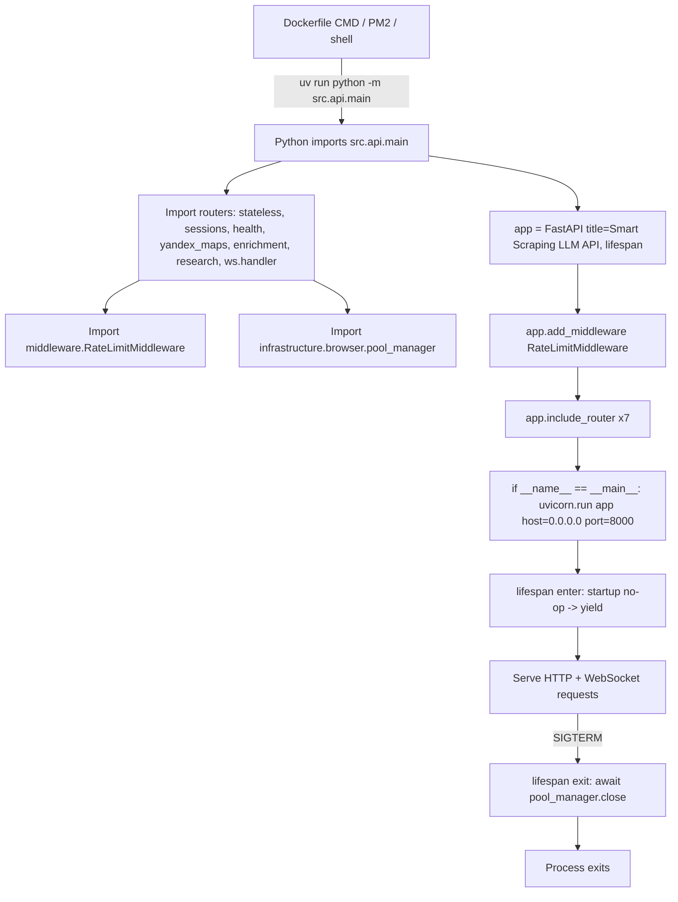
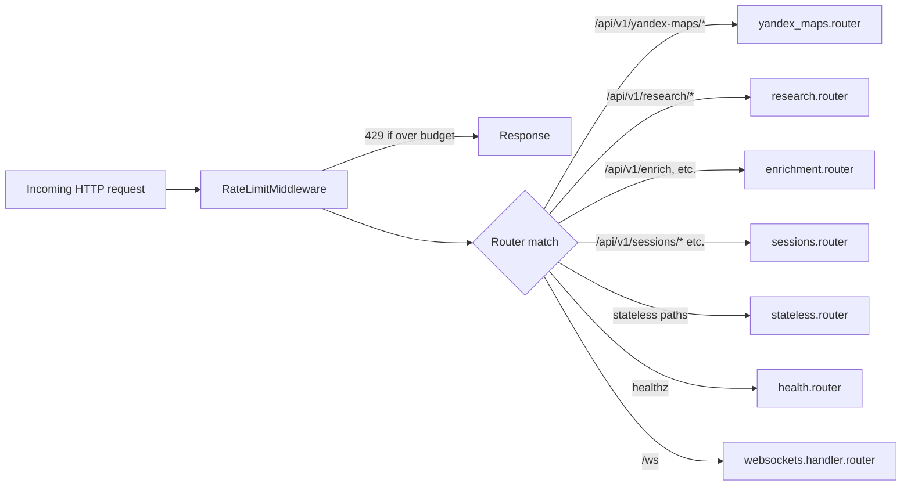

# API Bootstrap (src/api/main.py + entry points)

## Files analyzed

| Path | LOC | Role |
|------|-----|------|
| `src/api/main.py` | 44 | FastAPI app construction, lifespan, uvicorn entry |
| `src/__init__.py` | 0 | Marks `src` as a package (empty) |
| `src/api/__init__.py` | 0 | Marks `src.api` as a package (empty) |
| `src/api/routers/__init__.py` | 0 | Marks routers sub-package (empty; no aggregate router exported) |
| `main.py` (repo root) | 6 | Vestigial `uv init` placeholder — prints "Hello from atomic-scraper-service!", **NOT** the real entry point |
| `ecosystem.config.js` | 20 | PM2 process manifest for `scraper-api` + `taskiq-worker` |
| `Dockerfile` | 22 | Container image, healthcheck, `CMD` |
| `docker-compose.yml` / `docker-compose.override.yml` | 58 / 29 | Service topology (redis, api, worker) and env injection |

## Purpose & responsibilities

`src/api/main.py` is the **single real process entry point** for the HTTP/WebSocket service. It:

1. Builds the FastAPI app with a `lifespan` async context manager.
2. Wires the seven HTTP routers and the WebSocket router.
3. Installs one custom middleware (`RateLimitMiddleware`).
4. On shutdown, closes the global Playwright browser pool (`pool_manager.close()`).
5. When executed as `python -m src.api.main`, calls `uvicorn.run(app, host="0.0.0.0", port=8000)`.

The repo-root `main.py` is a **stub** left over from `uv init`; it is never invoked by Dockerfile, compose, or PM2.

## Key classes / functions

- `app: FastAPI` — `title="Smart Scraping LLM API"`, no explicit `version`, `lifespan=lifespan`.
- `lifespan(app: FastAPI)` — `@asynccontextmanager`. Startup body is empty (`yield` immediately); on shutdown awaits `pool_manager.close()`.
- `app.add_middleware(RateLimitMiddleware)` — the only middleware registered in this file (CORS, GZip, auth middleware are **not** added here).
- Router registrations (in source order):
  | Router | `include_router` args | Effective prefix |
  |--------|----------------------|------------------|
  | `stateless.router` | no prefix/tags | as defined inside router module |
  | `sessions.router` | no prefix/tags | as defined inside router module |
  | `health.router` | no prefix/tags | as defined inside router module (e.g. `/healthz`) |
  | `handler.router` (websockets) | no prefix/tags | WebSocket routes |
  | `yandex_maps.router` | `prefix="/api/v1/yandex-maps"`, `tags=["yandex-maps"]` | `/api/v1/yandex-maps/*` |
  | `enrichment.router` | `prefix="/api/v1"`, `tags=["enrichment"]` | `/api/v1/*` (e.g. `/api/v1/enrich`) |
  | `research.router` | `prefix="/api/v1/research"`, `tags=["research"]` | `/api/v1/research/*` |

- `if __name__ == "__main__": uvicorn.run(app, host="0.0.0.0", port=8000)` — no `reload`, no `workers` arg, no `log_config`.

## Data flow within slice (startup order)

1. Container/PM2 invokes `uv run python -m src.api.main`.
2. Python imports `src.api.main`, which transitively imports every router module (those modules in turn import their dependencies — settings, redis client, browser pool, LLM clients).
3. FastAPI `app` is constructed; `RateLimitMiddleware` is added; routers are mounted.
4. uvicorn starts the ASGI server on `0.0.0.0:8000`.
5. uvicorn enters the `lifespan` context → startup phase is a no-op → `yield`.
6. App serves requests. Per-request flow: `RateLimitMiddleware` → router endpoint → handler → response.
7. On SIGTERM, uvicorn exits the `lifespan` context → `pool_manager.close()` shuts down Playwright browsers.

## Mermaid diagram(s)

## External dependencies

- **fastapi** (`>=0.135.1`) — `FastAPI`, `include_router`, `add_middleware`, `lifespan`.
- **uvicorn** (`>=0.30.0`) — ASGI server invoked via `uvicorn.run(...)`.
- **playwright** (indirect, via `infrastructure.browser.pool_manager`) — drained on shutdown.
- **redis / taskiq-redis** — NOT initialized in `main.py` directly; loaded lazily by routers/middleware/infra modules at import time.
- **Image base**: `mcr.microsoft.com/playwright/python:v1.58.0`.
- **Container healthcheck**: `curl -f http://localhost:8000/healthz` every 30 s, start-period 40 s, 3 retries.
- **PM2** (`ecosystem.config.js`): two apps — `scraper-api` (`uv run python -m src.api.main`) and `taskiq-worker` (`uv run taskiq worker src.infrastructure.queue.broker:broker src.infrastructure.queue.workers src.infrastructure.queue.session_actor src.infrastructure.queue.cleanup_worker src.infrastructure.queue.research_task`). Note: the PM2 worker list includes `research_task` which is **absent** from the compose worker command.
- **docker-compose** services: `redis` (7-alpine, port 6379), `api` (built, port 8000, mounts `./proxies.txt`), `worker` (built, runs taskiq with `session_actor`, `cleanup_worker`, `workers`). Compose `override` injects `REDIS_URL`, `API_KEY=default_internal_key`, `SESSION_INACTIVITY_TIMEOUT=1800`, OpenAI-compatible LM Studio endpoints for extraction + orchestration, and `host.docker.internal` mapping.

## Tests covering this slice

There are **no dedicated tests for `src/api/main.py`** (no `tests/**/*main*.py`, no startup/lifespan fixture). Effective coverage is indirect:

- `tests/contract/test_health_endpoint.py` — imports/invokes the app to hit `/healthz` (FR-003).
- `tests/contract/test_stateless.py`, `test_sessions.py`, `test_scraper.py`, `test_searxng_search.py`, `test_html_to_md.py`, `test_yandex_maps_api.py`, `test_yandex_maps_reviews_api.py`, `test_enrichment_api.py`, `test_research_endpoint.py` — exercise each mounted router and therefore confirm the wiring done in `main.py`.
- `tests/integration/test_docker_compose.py` — verifies container boot path (Dockerfile `CMD` → `src.api.main`).
- `tests/integration/test_auth.py`, `tests/e2e/test_auth_flow.py`, `tests/e2e/test_rate_limiting_flow.py` — exercise middleware chain end-to-end (note: auth is enforced inside routers/dependencies, not via `add_middleware` in `main.py`).
- `tests/e2e/test_yandex_maps_full_flow.py`, `tests/e2e/test_site_enrichment_flow.py` — full request flow.

## Open questions / smells

1. **Repo-root `main.py` is a stub.** It prints a hello message and is never wired into Docker, compose, or PM2. Either delete or convert into a thin CLI shim to avoid future confusion.
2. **No explicit `version` on `FastAPI(...)`** — OpenAPI docs report the FastAPI default. `pyproject.toml` has `version = "0.1.0"` that is never propagated.
3. **CORS is not configured.** Browser-based clients will fail unless behind a proxy/gateway that injects CORS headers.
4. **No global exception handlers** (`@app.exception_handler(...)`). Unhandled errors surface as 500 with FastAPI defaults — no structured error envelope.
5. **Lifespan startup is empty.** Browser pool, redis, broker, session manager are all initialized lazily on first import / first request rather than explicitly at startup. This makes the first request to a cold container slow and hides init failures behind 500s instead of failing fast at boot.
6. **Only `pool_manager.close()` runs on shutdown.** Redis clients, taskiq broker shutdown, WebSocket manager teardown, and pending session cleanup are not awaited explicitly — relies on process exit + GC.
7. **Middleware order is minimal.** Only `RateLimitMiddleware` is registered in `main.py`. Auth (`middleware/auth.py` per STRUCTURE.md) is not added globally here — auth must be enforced per-router via dependencies. This is easy to forget on new routers.
8. **PM2 vs compose worker drift.** `ecosystem.config.js` loads `research_task` module; `docker-compose.override.yml` worker command omits it. Two deployment paths run different background workers.
9. **Routers without prefixes in `include_router`** (stateless, sessions, health, websockets) define their own prefixes inside the router module — global URL map is not visible from `main.py` alone, hurting discoverability.
10. **`uvicorn.run(app, ...)`** uses the imported app object rather than the import string `"src.api.main:app"`; reload/workers flags cannot be enabled without code changes.
11. **`tags`** are inconsistent — only three routers set tags; the others appear ungrouped in `/docs`.
12. **No `src/api/routers/__init__.py` aggregation** — empty; each router is imported individually in `main.py`, making it easy to forget to mount a new router.
