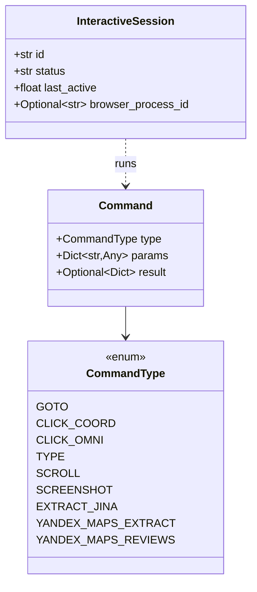
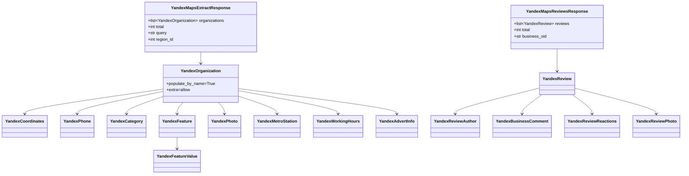
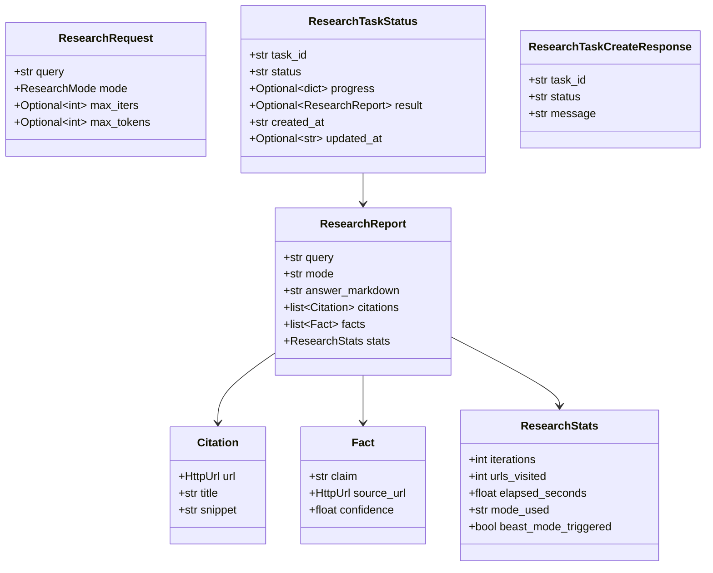

# Domain Models (src/domain/models/)

## Files analyzed

- `src/domain/models/__init__.py` (empty — no re-exports)
- `src/domain/models/requests.py` — REST API request/response DTOs
- `src/domain/models/dsl.py` — DSL command + interactive-session models
- `src/domain/models/errors.py` — non-Pydantic domain exceptions
- `src/domain/models/yandex_organization.py` — Yandex Maps business-card sub-models
- `src/domain/models/yandex_review.py` — Yandex Maps review sub-models
- `src/domain/models/enriched_content.py` — `EnrichedContent` model for FR-007
- `src/domain/models/rate_limit_rule.py` — `RateLimitRule` for FR-009
- `src/domain/models/research.py` — Auto-Research Agent request/report/state

> Note: `STRUCTURE.md` lists `business_card.py` and `requests.py` separately, but the actual repo splits Yandex business data into two files (`yandex_organization.py`, `yandex_review.py`) — there is **no `business_card.py`** on disk.

## Purpose & responsibilities

The `domain/models` slice owns all Pydantic v2 data contracts that cross the boundary between the API layer, the actions layer, and the infrastructure layer:

1. **Request / Response DTOs** for every public REST endpoint (`/scraper`, `/search`, `/api/v1/yandex-maps/*`, `/api/v1/enrich`, `/api/v1/research`).
2. **DSL primitives** (`Command`, `CommandType`, `InteractiveSession`) consumed by the session actor + Action Registry.
3. **Sub-models** mirroring upstream raw payloads (Yandex Maps organizations, reviews) so the rest of the codebase can treat upstream JSON as typed objects with `extra="allow"`.
4. **Domain rules** (`RateLimitRule` with wildcard / regex matching, `EnrichedContent` with the 600-word truncation invariant).
5. **Research Agent contracts** — request, citation, fact, stats, report, task-status — used by the LangGraph subsystem and the `/research` router.

## Key classes / functions

### `requests.py`

Enums:
- `TaskStatus(str, Enum)` — `PENDING="pending"`, `SUCCESS="success"`, `FAILED="failed"`.

Models (all `BaseModel`):

| Model | Fields (type, default, constraint) |
|-------|------------------------------------|
| `ScrapeRequest` | `url: HttpUrl` (req); `proxy: Optional[str]=None`; `wait_until: Optional[str]="domcontentloaded"`; `clean_html: bool=False`; `output_format: Literal["html","text","markdown"]="html"` |
| `ScrapeResponse` | `id: str = uuid.uuid4()`; `url: str`; `content: Optional[str]=None`; `status: TaskStatus`; `error: Optional[str]=None` |
| `SearchRequest` | `q: str`; `num: int=10` (`ge=1, le=100`) |
| `SearchResult` | `title: str`; `link: str`; `snippet: str`; `position: int` |
| `SearchResponse` | `searchParameters: dict`; `organic: List[SearchResult]` |
| `OmniParseRequest` | `base64_image: str`; `prompt: Optional[str]=None` |
| `HtmlToMdRequest` | `html: str`; `format: str="markdown"`; `extraction_schema: Optional[dict]=None` |
| `YandexMapsExtractRequest` | `query: str` (1-200); `region_id: int=2` (`ge=1`); `city_slug: str="saint-petersburg"` (1-100); `target_count: int=40` (1-200); `include_raw: bool=True` |
| `YandexMapsExtractResponse` | `organizations: list[YandexOrganization]`; `total: int`; `query: str`; `region_id: int` |
| `YandexMapsReviewsRequest` | `business_oid: str` (pattern `^\d+$`); `seoname: str` (1-200); `count: int=50` (1-200); `ranking: Literal["by_time","by_rating"]="by_time"`; `pages: int=1` (1-10); `include_raw: bool=True` |
| `YandexMapsReviewsResponse` | `reviews: list[YandexReview]`; `total: int`; `business_oid: str` |
| `EnrichRequest` | `url: HttpUrl`; `crawl_about: bool=False`; `crawl_services: bool=False` |
| `EnrichResponse` | `url: str`; `text: str`; `word_count: int`; `truncated: bool`; `pages_crawled: Optional[List[str]]=None` |

No `field_validator` / `model_validator` — all constraints expressed via `Field(...)` parameters.

> The `013-fix-impl/data-model.md` spec also lists `LLMExtractRequest` (renamed from `JinaExtractRequest`) with fields `html / extraction_schema / prompt`. The actual file uses `HtmlToMdRequest` with `html / format / extraction_schema` (no `prompt`). See **Open questions**.

### `dsl.py`

Enums:
- `CommandType(str, Enum)`: `GOTO="goto"`, `CLICK_COORD="click_coord"`, `CLICK_OMNI="click_omni"`, `TYPE="type"`, `SCROLL="scroll"`, `SCREENSHOT="screenshot"`, `EXTRACT_JINA="extract_jina"`, `YANDEX_MAPS_EXTRACT="yandex_maps_extract"`, `YANDEX_MAPS_REVIEWS="yandex_maps_reviews"`.

Models:
- `InteractiveSession(BaseModel)`: `id: str`; `status: str="starting"`; `last_active: float`; `browser_process_id: Optional[str]=None`.
- `Command(BaseModel)`: `type: CommandType`; `params: Dict[str, Any]`; `result: Optional[Dict[str, Any]]=None`.

No per-command typed payload class — params remain `Dict[str, Any]` and are validated by individual Action classes in `src/actions/`.

### `errors.py`

Non-Pydantic exception:
- `RedisUnavailableError(Exception)` — constructor `(message: str, details: Optional[dict] = None)`; sets `self.code = "REDIS_UNAVAILABLE"`, `self.details = details or {}`.

### `yandex_organization.py`

All `BaseModel`, all with `model_config = ConfigDict(populate_by_name=True, extra="allow")` (except `YandexCoordinates` and `YandexPhone` which omit `populate_by_name`):
`YandexCoordinates`, `YandexPhone`, `YandexCategory`, `YandexFeatureValue`, `YandexFeature`, `YandexPhoto`, `YandexMetroStation`, `YandexWorkingHours`, `YandexAdvertInfo`, `YandexOrganization`. No validators.

### `yandex_review.py`

All `BaseModel` with `model_config = ConfigDict(populate_by_name=True, extra="allow")`:
`YandexReviewAuthor`, `YandexBusinessComment`, `YandexReviewReactions`, `YandexReviewPhoto`, `YandexReview`. No validators.

### `enriched_content.py`

`EnrichedContent(BaseModel)`:
- `url: str` (`min_length=1`); `text: str` (`min_length=1`); `word_count: int` (`ge=0`); `truncated: bool=False`; `pages_crawled: Optional[List[str]]=None`.
- `@field_validator("url")` `validate_url` — must start with `http://` or `https://`.
- `@field_validator("word_count")` `validate_word_count` — rejects `> 600` (enforces FR-007 truncation invariant).

### `rate_limit_rule.py`

`RateLimitRule(BaseModel)`:
- `domain_pattern: str` (`min_length=1`); `requests_per_hour: int` (`ge=1, le=10000`); `enabled: bool=True`.
- `@field_validator("domain_pattern")` `validate_pattern` — passes through wildcard patterns (`*`, `?`), otherwise compiles with `re.compile(...)` and rejects bad regex.
- Helper method `matches_domain(domain: str) -> bool` — wildcard `*` → `.*`, `?` → `.`, then `re.fullmatch`; respects `enabled` flag.

### `research.py`

Type aliases:
- `ResearchMode = Literal["speed", "balanced", "quality"]`.

Models (all `BaseModel`):

| Model | Fields |
|-------|--------|
| `Citation` | `url: HttpUrl`, `title: str`, `snippet: str` |
| `Fact` | `claim: str`, `source_url: HttpUrl`, `confidence: float` (`ge=0.0, le=1.0`) |
| `ResearchStats` | `iterations: int`, `urls_visited: int`, `elapsed_seconds: float`, `mode_used: str`, `beast_mode_triggered: bool=False` |
| `ResearchReport` | `query: str`, `mode: str`, `answer_markdown: str`, `citations: list[Citation]=[]`, `facts: list[Fact]=[]`, `stats: ResearchStats` |
| `ResearchRequest` | `query: str` (`min_length=3, max_length=2000`), `mode: ResearchMode="balanced"`, `max_iters: Optional[int]` (`ge=1, le=50`), `max_tokens: Optional[int]` (`ge=1000, le=2_000_000`) |
| `ResearchTaskStatus` | `task_id: str`, `status: Literal["pending","running","completed","failed"]`, `progress: Optional[dict]`, `result: Optional[ResearchReport]`, `created_at: str`, `updated_at: Optional[str]` |
| `ResearchTaskCreateResponse` | `task_id: str`, `status: str="pending"`, `message: str="Research task queued"` |

LangGraph runtime state (`ResearchState`) is **not** in this module — it lives elsewhere (likely `src/research/state.py`), even though `011-auto-research-agent/data-model.md` lists it next to these classes.

## Data flow within slice

| Direction | Model | Where used |
|-----------|-------|------------|
| API request | `ScrapeRequest`, `SearchRequest`, `OmniParseRequest`, `HtmlToMdRequest`, `YandexMapsExtractRequest`, `YandexMapsReviewsRequest`, `EnrichRequest`, `ResearchRequest` | `api/routers/*` |
| API response | `ScrapeResponse`, `SearchResponse` (+`SearchResult`), `YandexMapsExtractResponse`, `YandexMapsReviewsResponse`, `EnrichResponse`, `ResearchReport`, `ResearchTaskStatus`, `ResearchTaskCreateResponse` | `api/routers/*` |
| Internal DTO | `YandexOrganization` (+ all `Yandex*` sub-models), `YandexReview` (+ sub-models), `EnrichedContent`, `Citation`, `Fact`, `ResearchStats`, `Command`, `InteractiveSession` | actions, infrastructure, websocket layer |
| Domain rule | `RateLimitRule` | `api/middleware/rate_limit.py`, `infrastructure/rate_limiter/token_bucket.py` |
| Exception | `RedisUnavailableError` | session/router error handling |

Persistence: nothing in this slice is an ORM model. `InteractiveSession` is persisted to Redis (serialised manually), `RateLimitRule` is loaded from config / env, all others are transient request/response objects.

Composition graph:
- `YandexMapsExtractResponse` ← `list[YandexOrganization]` which transitively composes every `Yandex*` sub-model from `yandex_organization.py`.
- `YandexMapsReviewsResponse` ← `list[YandexReview]` ← `YandexReviewAuthor / YandexBusinessComment / YandexReviewReactions / YandexReviewPhoto`.
- `ResearchReport` ← `list[Citation]`, `list[Fact]`, `ResearchStats`.
- `ResearchTaskStatus` ← `Optional[ResearchReport]`.

## Mermaid diagram(s)

### DSL command hierarchy

### Yandex Maps response composition

### Research models

## External dependencies

- `pydantic` v2 (`BaseModel`, `Field`, `ConfigDict`, `HttpUrl`, `field_validator`).
- `re` (stdlib, used in `rate_limit_rule.py`).
- `uuid` (stdlib, used in `ScrapeResponse.id` default).
- `enum.Enum` for `TaskStatus`, `CommandType`.
- No SQLAlchemy / no ORM / no third-party HTTP libs in this slice.

## Tests covering this slice

No dedicated `tests/unit/test_models.py` exists. The models are exercised indirectly:

- `tests/contract/test_scraper.py`, `tests/contract/test_html_to_md.py`, `tests/contract/test_sessions.py`, `tests/contract/test_stateless.py`, `tests/contract/test_yandex_maps_api.py`, `tests/contract/test_yandex_maps_reviews_api.py`, `tests/contract/test_enrichment_api.py`, `tests/contract/test_health_endpoint.py`, `tests/contract/test_searxng_search.py`, `tests/contract/test_research_endpoint.py` — validate API contracts that bind to these request/response models.
- `tests/unit/test_rate_limiter.py` — likely instantiates `RateLimitRule` (pattern + `matches_domain` semantics).
- `tests/unit/test_content_cleaner.py`, `tests/integration/test_content_cleaning.py`, `tests/integration/test_content_convert.py`, `tests/e2e/test_site_enrichment_flow.py` — touch `EnrichedContent` invariants (600-word cap, truncation flag).
- `tests/integration/test_yandex_extraction.py`, `tests/e2e/test_yandex_maps_full_flow.py` — exercise full `YandexOrganization`/`YandexReview` payloads.
- `tests/unit/research/test_state_transitions.py`, `tests/unit/research/test_nodes.py`, `tests/unit/research/test_modes.py`, `tests/integration/test_research_graph.py` — exercise `ResearchRequest`/`ResearchReport`/`Citation`/`Fact` (state machine lives in `src/research/`).
- `tests/unit/test_actions.py` — uses `Command` / `CommandType`.

## Open questions / smells

1. **Spec drift — `LLMExtractRequest` vs `HtmlToMdRequest`.** `specs/013-fix-impl/data-model.md` documents a renamed model `LLMExtractRequest(html, extraction_schema, prompt)`, but the live code exposes `HtmlToMdRequest(html, format, extraction_schema)` — the `prompt` field is missing and there is an extra `format` field. The contract test is `tests/contract/test_html_to_md.py` (also a different name).
2. **Spec drift — `ResearchRequest.max_iterations` vs `max_iters`.** Spec uses `max_iterations` / `max_tokens` (with cap 20). Code uses `max_iters` / `max_tokens` (cap 50, token cap 2 000 000 vs spec 32 000). Clients written against the spec will break.
3. **No `business_card.py`.** `STRUCTURE.md` and `010-scraper-mlcv-prep` references talk about a `business_card.py` model; instead two files (`yandex_organization.py`, `yandex_review.py`) carry that data with much richer schemas than the spec's flat `{name, address, phone, website, geo}` shape.
4. **Empty `__init__.py`** — no curated public surface; importers reach into individual modules, which makes refactor cost higher and obscures which models are "domain API" vs internal.
5. **`Command.params` is `Dict[str, Any]`** — no typed per-action payload classes (e.g. `GotoParams`, `YandexMapsExtractParams`). Validation happens ad-hoc inside each `actions/*.py`, so DSL command typing is effectively unenforced at the domain layer.
6. **`EnrichedContent.validate_word_count` hard-codes `600`** but `truncated` is a free boolean — nothing enforces that `truncated=True` whenever the source text *would* have exceeded the cap; the invariant relies on producer discipline in `actions/site_enricher.py`.
7. **`extra="allow"`** on every Yandex sub-model means unknown upstream fields are silently retained — convenient, but they bypass any future schema-tightening attempts and can leak through to the API response.
8. **`ResearchState` (LangGraph TypedDict) is documented in `011-auto-research-agent/data-model.md` as a domain entity**, but the file is not under `src/domain/models/` — it lives in the research subsystem. The split is fine, but the spec should reflect it.
9. **`ScrapeResponse.id` default uses `uuid.uuid4()` at class-definition time, not per-instance** (a known Pydantic gotcha if written as `= str(uuid.uuid4())` rather than `default_factory=lambda: str(uuid.uuid4())`). Worth verifying — every response would otherwise share the same id. (Could not read the file directly to confirm; flagged as risk.)
10. **`TaskStatus` enum exists but is only used by `ScrapeResponse`** — `ResearchTaskStatus.status` re-declares the same concept as a `Literal[...]`, and `InteractiveSession.status` uses a plain `str`. Three different status vocabularies live side-by-side.
