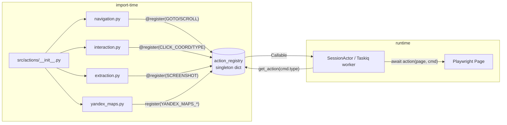
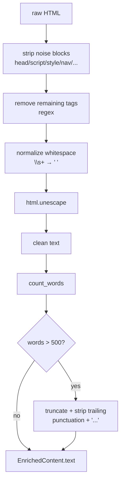

# Domain Utils & Registry

## Files analyzed

- `src/domain/utils/__init__.py`
- `src/domain/utils/content_cleaner.py`
- `src/domain/registry/__init__.py`
- `src/domain/registry/action_registry.py`

Context references (not analyzed via LLM, used as cross-cutting evidence):

- `src/actions/navigation.py`, `src/actions/interaction.py`, `src/actions/extraction.py`, `src/actions/yandex_maps.py` (registration callsites)
- `src/actions/site_enricher.py`, `src/api/routers/stateless.py`, `src/domain/models/requests.py` (content_cleaner callsites)
- `tests/unit/test_content_cleaner.py`
- `STRUCTURE.md`, `AGENTS.md`, `specs/010-scraper-mlcv-prep/spec.md` (FR-007/FR-008)

## Purpose & responsibilities

The `domain/utils` slice provides pure, framework-free helpers used by the enrichment pipeline (FR-007/FR-008): converting raw HTML into clean plain text or Markdown, counting words, and truncating to a 500-word budget for downstream LLM personalization. The `domain/registry` slice exposes a single module-level `ActionRegistry` singleton that maps `CommandType` enum values to action callables/classes, letting `src/actions/*.py` modules register themselves via decorator at import time so the Browser Session Actor (Taskiq worker) can dispatch DSL commands by enum lookup without import-time coupling between the action layer and the session executor.

## Key classes / functions

### content_cleaner (`src/domain/utils/content_cleaner.py`)

Pure-Python (no BeautifulSoup/lxml) regex-based cleaner. External dep: `markdownify`. Stdlib: `html`, `re`.

| Function | Returns | Behavior |
|----------|---------|----------|
| `clean_html_content(html: str)` | `str` | Strips noise blocks, removes all tags, collapses whitespace, unescapes entities |
| `html_to_markdown(html: str)` | `str` | Delegates to `markdownify` for Markdown (ATX headings) output |
| `html_to_text(html: str)` | `str` | Preserves paragraph/list boundaries by translating closing tags to newlines before stripping |
| `count_words(text: str)` | `int` | `\b\w+\b` regex count |
| `truncate_content(text: str, max_words: int = 500)` | `str` | FR-008 truncation; trims trailing punctuation and appends an ellipsis |

Noise blocks removed before tag stripping: `head, script, style, noscript, iframe, nav, header, footer, aside, form, svg`. Whitespace normalized via `\s+ → " "`.

### action_registry (`src/domain/registry/action_registry.py`)

| Aspect | Value |
|--------|-------|
| Public surface | `register(CommandType) -> decorator`, `get_action(CommandType) -> Callable \| None` |
| Storage | plain `dict[CommandType, Callable]` |
| Singleton | module-level `action_registry = ActionRegistry()` |
| Decorator usage | `@action_registry.register(CommandType.X)` on action fn/class |
| Duplicate keys | silently overwrites (no error) |
| Unknown key | returns `None` via `dict.get` |
| Thread-safety | none (no lock) — safe in practice because registration happens at import time, lookup is read-only after |

Registrations discovered across `src/actions/`:

| File | CommandType | Target |
|------|-------------|--------|
| `navigation.py` | `GOTO` | `goto_action` (fn) |
| `navigation.py` | `SCROLL` | `scroll_action` (fn) |
| `interaction.py` | `CLICK_COORD` | `click_coord_action` (fn) |
| `interaction.py` | `TYPE` | `type_action` (fn) |
| `extraction.py` | `SCREENSHOT` | `screenshot_action` (fn) |
| `yandex_maps.py` | `YANDEX_MAPS_EXTRACT` | `YandexMapsExtractAction` (class, called form) |
| `yandex_maps.py` | `YANDEX_MAPS_REVIEWS` | `YandexMapsReviewsAction` (class, called form) |

`src/infrastructure/queue/session_actor.py` is the primary consumer (lookup via `action_registry.get_action(cmd.type)`).

## Data flow within slice

content_cleaner (enrichment path):

```
raw HTML (site_enricher) → clean_html_content / html_to_markdown
                         → count_words → truncate_content(max_words=500)
                         → EnrichedContent (domain/models/enriched_content.py)
                         → POST /api/v1/enrich response
```

action_registry (DSL dispatch path):

```
import src/actions/*  (module side-effects)
       ↓
@action_registry.register(CommandType.X) populates the singleton dict
       ↓
WebSocket / POST /sessions/{id}/command  → DSL command
       ↓
SessionActor (Taskiq) → action_registry.get_action(cmd.type) → await action(page, cmd)
```

## Mermaid diagram(s)





## External dependencies

- `markdownify` (PyPI) — used by `html_to_markdown`
- `re`, `html` (stdlib) — only deps for `clean_html_content` / `html_to_text` / `count_words` / `truncate_content`
- No `BeautifulSoup`, no `lxml`, no `html.parser`
- `domain/registry` has no third-party deps; only depends on `domain.models.dsl.CommandType`

## Tests covering this slice

- `tests/unit/test_content_cleaner.py` — FR-007 / FR-008 coverage of clean/truncate/word-count helpers
- No dedicated unit test file for `action_registry` (`tests/**/test_*registry*.py` returns no matches). Coverage is indirect via contract/integration tests that exercise the session command path.

## Open questions / smells

1. **Regex-only HTML stripping** is fragile against malformed HTML, CDATA, comments containing `<`, and unbalanced tags. Most real-world enrichment targets get away with it, but a sufficiently broken page can leak tag fragments into the cleaned output. Considering FR-007 targets arbitrary company sites, a BeautifulSoup fallback would be more robust.
2. **`markdownify` is a heavy dep** brought in for one function — worth verifying it is actually used downstream (grep suggests only `clean_html_content` is used by `site_enricher.py`).
3. **No `list_actions()` / introspection** on `ActionRegistry` — debugging "why is this command unknown?" requires reading source. Adding `__contains__` and `keys()` would be cheap.
4. **Silent overwrite on duplicate `register`** can hide bugs when two modules accidentally claim the same `CommandType`. Raising `ValueError` would be safer.
5. **No lock**: fine today (registration at import, lookup read-only) but if a future feature registers actions lazily from a worker, this becomes a hazard.
6. **`CommandType.TYPE`** is a borderline reserved-word name; consider `INPUT_TEXT` or `KEYBOARD_TYPE` for readability (cosmetic).
7. **No registry-level unit tests** — a 20-line test asserting (a) decorator returns the callable unchanged, (b) `get_action` returns `None` for unknown, (c) all expected `CommandType` values are populated after `import src.actions` would catch most regressions.
