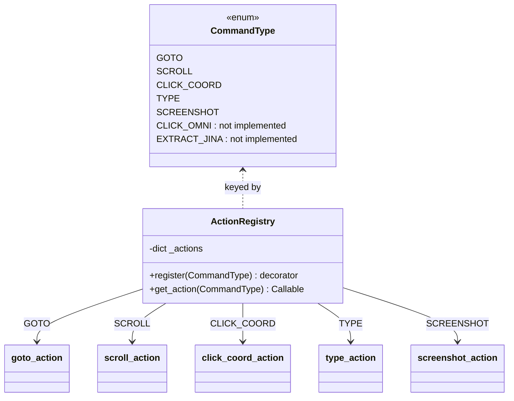
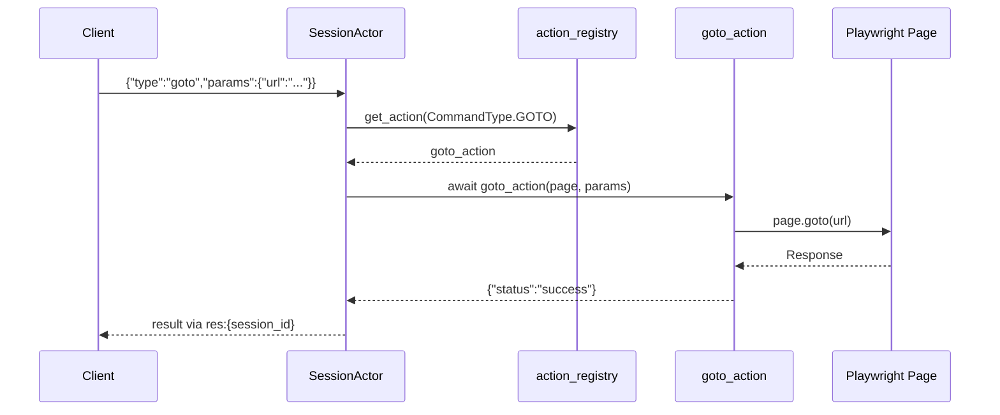

# Basic DSL Actions (src/actions/ — base/navigation/interaction/extraction/ai_actions)

## Files analyzed

Actually present in the slice:

- `src/actions/__init__.py` — package init, imports submodules to trigger registry side-effects
- `src/actions/navigation.py` — `goto`, `scroll`
- `src/actions/interaction.py` — `click_coord`, `type`
- `src/actions/extraction.py` — `screenshot`

Referenced for context (registration plumbing):

- `src/domain/registry/action_registry.py` — singleton registry + `register` decorator
- `src/domain/models/dsl.py` — `CommandType` enum

Out-of-slice / not analyzed here: `src/actions/yandex_maps.py`, `src/actions/site_enricher.py`, `src/actions/research/**`.

NOT present despite being documented in `STRUCTURE.md`:

- `src/actions/base.py` — does not exist (there is no `BaseAction` class in this layer)
- `src/actions/ai_actions.py` — does not exist (the AI actions `click_omni` / `extract_jina` are declared as `CommandType` values in `dsl.py` and listed as "Planned" in `web_interactions.md`, but have no handler implementation registered)

## Purpose & responsibilities

The `src/actions/` package contains thin, stateless function handlers that map DSL `CommandType` values to concrete Playwright `Page` operations. Each module is a side-effect importer: importing it registers one or more handlers into the global `action_registry` (see `src/domain/registry/action_registry.py`). The session actor (`src/infrastructure/queue/session_actor.py`) is the consumer that looks up handlers by `CommandType` and invokes them with the current `Page` and the incoming `params` dict.

This slice covers the original "basic DSL" surface (navigation + UI interaction + a single extraction primitive). Higher-level actions (Yandex Maps, site enrichment, AI/visual) live in sibling files outside this slice.

## Key classes / functions

There are **no Action classes** — contrary to the spec in `specs/010-scraper-mlcv-prep/contracts/dsl.md` (which requires `execute(page, params) -> dict`, `validate_params`, `get_name`), the actual implementation is **function-based**, registered via decorator.

### `src/actions/__init__.py`

Imports `navigation`, `interaction`, `extraction`, `yandex_maps`. Importing these modules triggers their `@action_registry.register(...)` decorators. `site_enricher` is NOT imported here (so unless something else imports it explicitly, its handler is not registered).

### `src/actions/navigation.py`

- `goto_action` — registered as `CommandType.GOTO`. Params: `url`, optional `wait_until`/`timeout` (per `dsl.md` extension). Calls `page.goto(url)`. Returns `{"status": "success"}`.
- `scroll_action` — registered as `CommandType.SCROLL`. Params: `direction` ("up"/"down"), `amount` (pixels). Calls `page.evaluate(...)` with a JS snippet to scroll. Returns `{"status": "success"}`.

### `src/actions/interaction.py`

- `click_coord_action` — `CommandType.CLICK_COORD`. Params: `x`, `y` in normalised range `[0.0, 1.0]`. Reads `page.viewport_size` to scale to pixel coordinates, then `page.mouse.click(px, py)`. Returns `{"status": "success"}`.
- `type_action` — `CommandType.TYPE`. Params: `selector` (CSS), `text`. Calls `page.fill(selector, text)`. Returns `{"status": "success"}`.

### `src/actions/extraction.py`

- `screenshot_action` — `CommandType.SCREENSHOT`. Params: none. Calls `page.screenshot()`, returns `{"status": "success", "data": "<base64-png>"}`. This is the only extraction primitive in this slice; richer extraction (Yandex card parsing, site text) lives in other slices.

### `src/actions/ai_actions.py` (missing)

The `CommandType` enum declares `CLICK_OMNI = "click_omni"` and `EXTRACT_JINA = "extract_jina"`, and `web_interactions.md` section "4. AI-Enhanced Interactions (Planned)" describes payloads for them. **No handler is registered** for either — invoking these via DSL will currently return a "not found" / `None` from `action_registry.get_action(...)` and fail at the session actor layer.

### Registry (`src/domain/registry/action_registry.py`)

- Internal store: `self._actions: dict[CommandType, Callable]`.
- `register(command_type: CommandType)` — returns a decorator that stores `func` under the key and returns `func` unchanged.
- `get_action(command_type) -> Optional[Callable]` — lookup.
- No dispatch / no validation / no base-class enforcement. Module-level singleton `action_registry`.

`CommandType` enum (string values): `goto`, `click_coord`, `click_omni`, `type`, `scroll`, `screenshot`, `extract_jina`, `yandex_maps_extract`, `yandex_maps_reviews`. Notably absent from the enum: `site_enrich` and `apply_stealth` from `dsl.md`.

## Data flow within slice

1. App startup imports `src.actions` somewhere upstream; `__init__.py` re-imports the four submodules.
2. Each submodule's decorator call mutates the singleton `action_registry._actions` dict — pure side effect at import time.
3. A WebSocket / REST command arrives, is parsed into a `Command(type=CommandType, params=dict)` model.
4. The session actor calls `action_registry.get_action(cmd.type)` and awaits `handler(page, params)`.
5. The handler invokes a single Playwright API and returns a small dict that is serialised back to the client over Redis pub/sub.

Handlers do not own state, do not retry, and do not catch exceptions — Playwright errors propagate to the actor, which is responsible for wrapping them into error responses.

## Mermaid diagram(s)

## External dependencies

- **Playwright** (`Page`, `page.goto`, `page.evaluate`, `page.mouse.click`, `page.fill`, `page.screenshot`, `page.viewport_size`) — the only runtime dependency of the handler bodies.
- **`src.domain.registry.action_registry`** — singleton registry.
- **`src.domain.models.dsl.CommandType`** — enum keys.
- **No** LLM facade, **no** Jina client, **no** Omni-Parser client in this slice. The `infrastructure/external_api/jina_client.py` and `omni_client.py` are placeholders (see `STRUCTURE.md`) and have no caller from these files since `ai_actions.py` does not exist.

Standard-lib `base64` is used (transitively in `screenshot_action`) to encode the PNG bytes from Playwright.

## Tests covering this slice

- `tests/unit/test_actions.py` — only unit test that targets this layer directly. Likely exercises the registry + a subset of handlers (not inspected per the slice rules).
- `tests/integration/test_yandex_extraction.py` — out of slice (yandex_maps).
- No dedicated `test_navigation*.py`, `test_interaction*.py`, or `test_extraction*.py` files exist.

Coverage of `click_coord` viewport scaling, `scroll` JS snippet, and `screenshot` base64 envelope is unverified from filenames alone.

## Open questions / smells

- **STRUCTURE.md vs reality**: `STRUCTURE.md` lists `base.py` and `ai_actions.py` under `src/actions/`. Neither file exists. Either the structure doc is aspirational, or the files were removed without updating the doc.
- **Spec vs reality (`dsl.md`)**: contract requires `execute / validate_params / get_name` on action *classes*; implementation uses bare async functions registered via decorator. Either the contract is stale or the implementation owes a refactor.
- **`web_interactions.md` "Planned" AI actions**: `click_omni` and `extract_jina` are declared in `CommandType` but unhandled. Calling them will produce a `None` lookup from `action_registry.get_action()` — error UX depends entirely on the session actor.
- **Missing `CommandType` values vs `dsl.md`**: `site_enrich` and `apply_stealth` are specced but absent from the enum (`site_enricher.py` likely exposes its handler through a non-DSL path, e.g., REST `/api/v1/enrich`).
- **`site_enricher` not imported by `__init__.py`**: if it relies on decorator-time registration, its handler may only be loaded when another module imports it directly (verify in slice 08).
- **No error wrapping in handlers**: all handlers blindly return `{"status": "success"}` and rely on Playwright exceptions propagating. There is no per-action timeout, no retry, no structured error payload — these concerns must be implemented by the session actor or are simply missing.
- **No `validate_params`**: handlers use `params.get("...")` with defaults; malformed payloads (e.g., string `x` instead of float) will fail deep inside Playwright with cryptic errors instead of a 422-style rejection.
- **`screenshot` returns inline base64**: no size cap visible — large viewports could produce multi-MB Redis pub/sub payloads.
