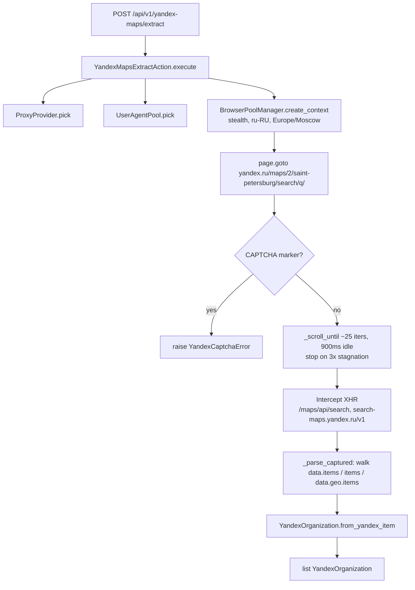
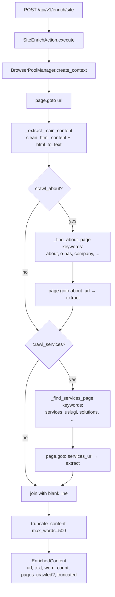

# Extraction Actions (Yandex Maps + Site Enricher)

## Files analyzed

- `src/actions/yandex_maps.py` — Yandex Maps search + reviews scraping action
- `src/actions/site_enricher.py` — website content extractor / enricher

Context sources:
- `docs/yandex-maps-scraping.md` (strategy/legal background)
- `specs/010-scraper-mlcv-prep/spec.md` (FR-006 yandex extract, FR-007/FR-008 enrichment)
- `specs/010-scraper-mlcv-prep/data-model.md` (BusinessCard, EnrichedContent)
- Related actions co-located in `src/actions/` (`extraction.py`, `navigation.py`, `interaction.py`, `research/`)

## Purpose & responsibilities

These two modules are the **special-purpose extractors** sitting alongside the generic DSL actions. Where `extraction.py`/`navigation.py` are atomic primitives orchestrated by a DSL plan, these are end-to-end "vertical" actions that own their own Playwright lifecycle and return strongly-typed domain models.

| Module | Responsibility | Spec link |
|---|---|---|
| `yandex_maps.py` | Run a Yandex Maps category search inside a stealth browser context, scroll the SERP list, intercept the internal XHR JSON responses, parse them into `YandexOrganization`. A second action paginates a single org's reviews via DOM scroll + XHR intercept. | FR-006, US3 |
| `site_enricher.py` | Open a company website with Playwright, optionally follow About / Services links, clean HTML→text, truncate to ~500 words, return `EnrichedContent`. | FR-007, FR-008, US4 |

## Key classes / functions

### Yandex Maps (`src/actions/yandex_maps.py`)

Classes:

- `YandexMapsExtractAction` — main search action
  - `execute(query, region_id=2, city_slug="saint-petersburg", target_count=40, include_raw=True) -> list[YandexOrganization]`
  - `_scroll_until(...)` — iterative JS scroll loop (~25 iterations, ~900 ms idle), with stagnation detection (stops after ≥3 unchanged counts)
  - `_parse_captured(...)` — walks intercepted JSON payloads at known paths (`data.items`, `items`, `data.geo.items`) and filters business items by `_is_business_item()` (presence of `permalink`/`seoname`/`oid`/`id`)
- `YandexMapsReviewsAction` — reviews scraper
  - `execute(business_oid, seoname, count=50, ranking="by_time", pages=1, include_raw=True) -> list[YandexReview]`
  - `_scroll_reviews_pane(...)` — analogous scroll loop on `.business-reviews-card-view` pane (~1200 ms idle)
  - `_dedup_reviews(...)` — de-dupes by review id
- `YandexCaptchaError` — raised when page HTML contains `smartcaptcha` / `showcaptcha` markers; no retry/solve logic on the action side

URL pattern:

```
https://yandex.ru/maps/{region_id}/{city_slug}/search/{quoted_query}/
```
defaults: `region_id=2`, `city_slug=saint-petersburg` (Saint Petersburg). Query is `urllib.parse.quote(query, safe='')`-encoded.

Extraction strategy is **XHR-intercept, not DOM**: the action listens to responses from `/maps/api/search` and `search-maps.yandex.ru/v1`, collects bodies in parallel via `asyncio.gather`, and parses JSON. The DOM selectors (`.search-list-view`, `li.search-snippet-view`, `.scroll__container`, `.search-list-view__list`) are used only to drive scrolling and count progress. Field extraction (`name`, `address`, `phone`, `website`, geo, category, hours, rating, photos, etc., 65+ fields) is delegated to `YandexOrganization.from_yandex_item(raw_item, keep_raw=include_raw)`.

Browser context is created via `BrowserPoolManager.create_context(...)` with:

```python
user_agent=<UserAgentPool>,
stealth=True,
proxy=<ProxyProvider>,
locale="ru-RU",
timezone_id="Europe/Moscow",
viewport={"width": 1440, "height": 900}
```

Concurrency: one fresh browser context per call, no internal batching; parallelism is per-response body via `asyncio.gather`.

### Site Enricher (`src/actions/site_enricher.py`)

Class: `SiteEnrichAction`

- `execute(url, crawl_about=False, crawl_services=False, max_words=500) -> EnrichedContent`
- `_extract_main_content(page) -> str` — `page.content()` → `clean_html_content` (`infrastructure/content_cleaner.py`: strip scripts/styles/nav) → `html_to_text` → `_clean_whitespace`
- `_clean_whitespace(text)` — collapses runs of whitespace
- `_find_about_page(page, base_url)` / `_find_services_page(page, base_url)` — wrappers around `_find_page_by_keywords`
- `_find_page_by_keywords(page, base_url, keywords)` — enumerates `<a href>`, case-insensitively matches link text/URL against keyword list, returns absolute URL via `urljoin`

Keyword lists:

```
about_keywords    = ["about", "about-us", "o-nas", "company", "history", "who-we-are"]
services_keywords = ["services", "what-we-do", "solutions", "products", "uslugi", "offer"]
```

Combining strategy: main + (optional) About + (optional) Services content is concatenated with `"\n\n".join(...)`, then `truncate_content(combined, max_words=500)` (from `content_cleaner`). `truncated` flag is set when pre-truncation word count exceeded `max_words`. `pages_crawled` is populated only when more than one page was fetched.

No LLM is invoked here — purely DOM + HTML cleaning.

## Data flow within slice

```
Yandex Maps:
  HTTP request (category, region_id, city_slug, target_count)
    → YandexMapsExtractAction.execute
      → BrowserPoolManager.create_context(stealth, proxy, ru-RU, Europe/Moscow)
      → page.goto(yandex.ru/maps/2/saint-petersburg/search/<q>/)
      → CAPTCHA marker check  → YandexCaptchaError (no retry)
      → _scroll_until(...)    (drives list, also accumulates XHR JSONs)
      → _parse_captured(...)  → YandexOrganization.from_yandex_item(...)
    → list[YandexOrganization]  (returned to API/MCP layer)

Site Enricher:
  HTTP request (url, crawl_about?, crawl_services?, max_words=500)
    → SiteEnrichAction.execute
      → page.goto(url)
      → _extract_main_content  (clean_html_content → html_to_text → whitespace)
      → optional: _find_about_page → goto → _extract_main_content
      → optional: _find_services_page → goto → _extract_main_content
      → combine + truncate_content(..., max_words=500)
    → EnrichedContent(url, text, word_count, pages_crawled?, truncated)
```

## Mermaid diagrams





## External dependencies

Shared:
- `playwright.async_api` (Page, Response) — driven through `BrowserPoolManager`
- `src/infrastructure/browser/pool_manager.py` — context lifecycle
- `src/infrastructure/browser/proxy_provider.py` — proxy selection
- `src/infrastructure/browser/user_agent_pool.py` — UA rotation
- `src/config/settings.py` — defaults (timeouts, target counts, max_words)

Yandex-specific:
- `src/domain/models/yandex_organization.py` — `YandexOrganization.from_yandex_item`
- `src/domain/models/yandex_review.py` — `YandexReview.from_yandex_item`

Enricher-specific:
- `src/infrastructure/content_cleaner.py` — `clean_html_content`, `html_to_text`, `truncate_content`
- `src/domain/models/enriched_content.py` — `EnrichedContent` Pydantic model
- `urllib.parse.urljoin` — relative-link resolution

No LLM client is invoked in either action. (LLM pipeline lives in `src/actions/research/` — a separate slice.)

## Tests covering this slice

Yandex Maps:
- `tests/contract/test_yandex_maps_api.py` — request/response schema for the extract endpoint
- `tests/contract/test_yandex_maps_reviews_api.py` — reviews endpoint schema
- `tests/integration/test_yandex_extraction.py` — wired browser+parse integration
- `tests/e2e/test_yandex_maps_full_flow.py` — US3 acceptance flow

Site Enricher:
- `tests/contract/test_enrichment_api.py` — FR-007 contract
- `tests/e2e/test_site_enrichment_flow.py` — US4 acceptance flow

(No dedicated `tests/unit/test_yandex_maps.py` — the action is exercised through contract/integration/e2e layers, which is consistent with `specs/010-scraper-mlcv-prep/spec.md` FR-TDD-004.)

## Open questions / smells

1. **CAPTCHA = hard fail.** `YandexCaptchaError` is raised on first detection with no retry, no proxy rotation, no 2Captcha/Bright Data integration. `docs/yandex-maps-scraping.md` §7 explicitly recommends a mitigation tier; right now the action sits on tier 1 only ("avoid triggering it"). At target rates this will be the dominant failure mode.
2. **Scroll heuristic is brittle.** 25 iterations × 900 ms with 3-stagnation cutoff is fixed; large categories (>~300 orgs) will be truncated, small categories will pay full ~22s before stagnation triggers. `target_count` parameter is passed in but the loop terminates on count stagnation, not on reaching the target — worth verifying alignment.
3. **DOM selectors are fragile.** `.search-snippet-view`, `.scroll__container`, `.business-reviews-card-view` are Yandex BEM class names that the strategy doc warns "break on redesigns every 6–12 months." There is no fallback path if these vanish, even though the JSON intercept itself would still work.
4. **`include_raw=True` default** balloons response payload. Consumers that don't need the raw blob still receive it; spec's `BusinessCard` shape is much narrower than `YandexOrganization`'s ~65 fields.
5. **No `BusinessCard` adapter.** Spec FR-006 / data-model entity is `BusinessCard` (name/address/phone/website/geo/category). The action returns `YandexOrganization`; mapping to the spec entity happens elsewhere (likely API serializer) — worth pointer in code.
6. **Enricher keyword lists are English+a couple Russian transliterations** (`o-nas`, `uslugi`). Pure Cyrillic slugs (`/о-нас`, `/услуги`) won't match. For a SPB-targeted pipeline that's a meaningful gap.
7. **Enricher concatenation is order-insensitive** (`"\n\n".join`) but the order is main → about → services. If About/Services pages are huge, truncation may evict the most important main-page content. No per-page budget.
8. **No robots.txt check** in `site_enricher.py`, despite spec edge case "SHOULD respect robots.txt directives."
9. **Rate-limiting is enforced by middleware** (FR-009), not inside these actions — so a direct call from the worker that bypasses the API surface (if any exists) would skip the 30 req/h Yandex cap.
