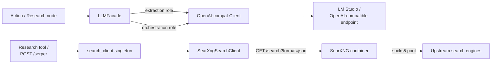

# Infrastructure: External API (src/infrastructure/external_api/)

## Files analyzed

Real files present:

- `src/infrastructure/external_api/__init__.py`
- `src/infrastructure/external_api/facade.py`
- `src/infrastructure/external_api/clients/__init__.py`
- `src/infrastructure/external_api/clients/openai_client.py`
- `src/infrastructure/external_api/search_client.py`
- `src/infrastructure/external_api/searxng_client.py`

Context read (non-`.py`):

- `STRUCTURE.md`, `AGENTS.md`, `README.md` (env vars), `docker-compose.override.yml`
- `infra/searxng/README.md`
- `specs/011-auto-research-agent/research.md`

Tests touching this slice (file names only, not opened):

- `tests/unit/test_llm_facade.py`
- `tests/contract/test_searxng_search.py`
- `tests/integration/test_search_client.py`
- `tests/integration/test_research_agent.py` (uses facade indirectly via the flat-loop agent; replaced `test_research_graph.py` on 2026-05-29)
- `tests/contract/test_research_endpoint.py` (uses facade indirectly)

## Purpose & responsibilities

Unified outbound layer for **LLM/VLM/Search** external services. Two
concerns sit side-by-side:

1. **LLM Facade** (`facade.py` + `clients/openai_client.py`) — single
   provider abstraction over any OpenAI-compatible `/v1/chat/completions`
   endpoint. Two logically-separate roles share the same client class
   but use different env-configured deployments:
   - **extraction** — small/local model (LM Studio, `jinaai.readerlm-v2`)
     for HTML→structured-data turns inside actions/site_enricher.
   - **orchestration** — larger reasoning model
     (`qwen3.5-9b-claude-4.6-opus-reasoning-distilled` or GPT-4o per
     `.env.example`) for research-agent planner / answer nodes.

2. **Search** (`search_client.py` re-exporting `searxng_client.py`) —
   single SearXNG-backed search client used by `POST /serper` router
   and by the research-agent `web_search` LangChain tool.

There is **no Jina or Omni client** in the codebase, despite
`STRUCTURE.md` and `AGENTS.md` listing `jina_client.py` and
`omni_client.py` as placeholders and `AGENTS.md` describing an "AI
Grounding Specialist" persona built on them. The "Jina-extract" /
"Omni-click" capabilities mentioned in `src/actions/ai_actions.py`
docs are unimplemented at the infra layer (see Open questions).

## Key classes / functions

### facade (`facade.py`)

Public surface (per local-LLM analysis):

- abstract `LLMFacade` with `generate(...)` and `extract(...)` methods.
- factory functions that build two instances from `core.config`
  settings:
  - `EXTRACTION_API_BASE` / `EXTRACTION_API_KEY` / `EXTRACTION_MODEL_NAME`
  - `ORCHESTRATION_API_BASE` / `ORCHESTRATION_API_KEY` / `ORCHESTRATION_MODEL_NAME`
- `generate(prompt, system_prompt=None)` — appends optional `system`
  message then `user` message; calls chat completions; returns string.
- `extract(prompt, ...)` — same call path but tries `json.loads` on the
  raw text, falling back to `{"raw_response": text}` on parse error.
  No Pydantic validation, no JSON-mode flag visible, no retry layer.
- No explicit `temperature` / `max_tokens` / `response_format`
  parameters surfaced — relies on `AsyncOpenAI` defaults.

### openai_client (`clients/openai_client.py`)

Thin async wrapper around `openai.AsyncOpenAI`:

- Constructor takes `base_url`, `api_key`, `model_name`.
- Single backing call: `client.chat.completions.create(model=..., messages=...)`.
- No bespoke timeout/retry — inherits SDK defaults (~2 retries, ~60 s
  per request).
- Errors propagate; minimal `except Exception` only in `extract()`'s
  JSON-parse fallback (per analysis above).

### search_client (`search_client.py`)

Re-export shim for backwards compatibility:

- Exposes `SearchClient = SearXngSearchClient` alias.
- Exports a process-wide singleton `search_client` used by both the
  `POST /serper` router (`src/api/routers/stateless.py`) and the
  research-agent's `@tool web_search` (`src/actions/research/tools.py`).
- **No** legacy Google/Playwright fallback any more — the old
  Playwright-based scraper has been removed.

### searxng_client (`searxng_client.py`)

Async HTTPX client against a local SearXNG instance:

- Endpoint: `GET {SEARXNG_BASE_URL}/search?q=...&format=json&language=en`.
- Knobs (from `src/core/config.py`):
  - `SEARXNG_BASE_URL` (default `http://localhost:8080`)
  - `SEARXNG_TIMEOUT = 30.0`
  - `SEARXNG_MAX_RETRIES = 2`  (so up to 3 attempts total)
  - `SEARXNG_RETRY_DELAY = 0.5` s
  - `SEARXNG_MIN_ORGANIC = 1` (per `infra/searxng/README.md`)
- Result shape returned to callers:
  ```python
  {
    "searchParameters": {"q", "type", "engine", "num"},
    "organic": [SearchResult(title, link, snippet, position), ...]
  }
  ```
  This is **shaped like Serper's `organic` block** but is not a true
  Serper transformer — it's just a flat normalisation of
  SearXNG's `results[]` (dedup by URL, http(s)-only, sliced by `num`).
- Proxy handling is **delegated to SearXNG itself** — the client
  does not touch `proxies.txt`. The socks5 pool lives in
  `infra/searxng/searxng/settings.yml` (`outgoing.proxies.all://`).

## Data flow within slice

```
DSL action / research node
   │
   ├─ LLM path  ─────────────►  LLMFacade.generate / .extract
   │                              │
   │                              └─► openai_client (AsyncOpenAI)
   │                                    └─► POST {API_BASE}/chat/completions
   │                                          (LM Studio @ host or OpenAI)
   │
   └─ Search path ───────────►  search_client (singleton)
                                  └─► SearXngSearchClient.search()
                                        └─► GET http://searxng:8080/search?format=json
                                              └─► (SearXNG → socks5 pool → upstream engines)
```

Callers identified from prior reports / context:

- `src/actions/site_enricher.py` → `LLMFacade` (extraction role)
- `src/actions/research/agent.py` → `LLMFacade` (orchestration role) — uses the new multi-turn `chat()` method for the main loop and the auxiliary critic/refraser/compact calls
- `src/actions/research/tools.py` → `search_client.search()` via plain async `web_search` (no `@tool` decorator as of 2026-05-29)
- `src/api/routers/stateless.py` → `search_client.search()` via `POST /serper`

## Mermaid diagram



## External dependencies

- `httpx` — used by `searxng_client`.
- `openai` (`AsyncOpenAI`) — used by `openai_client`.
- LM Studio (or any OpenAI-compatible endpoint) at
  `EXTRACTION_API_BASE` / `ORCHESTRATION_API_BASE`. In dev override,
  both point to `http://host.docker.internal:20022/v1/`.
- SearXNG container at `SEARXNG_BASE_URL` (see `infra/searxng/`).
- Transitively: residential socks5 proxy pool used by SearXNG; a
  host-level VPN is required for ~95 % SERP success per
  `infra/searxng/README.md`.

## Tests covering this slice

- `tests/unit/test_llm_facade.py` — unit tests for the facade.
- `tests/contract/test_searxng_search.py` — contract test for the
  search client.
- `tests/integration/test_search_client.py` — integration test
  against (likely mocked) SearXNG.
- Indirect coverage through the flat-loop research agent smoke and the
  `/serper`-endpoint tests (`tests/integration/test_research_agent.py`,
  `tests/contract/test_research_endpoint.py`).

## Open questions / smells

- **Doc-vs-code drift (high):** `STRUCTURE.md` and `AGENTS.md` list
  `jina_client.py` and `omni_client.py` as placeholders and describe
  an "AI Grounding Specialist" persona built on them. Neither file
  exists. The `ai_actions.py` "Omni-click / Jina-extract" feature
  surface is therefore not wired at the infra layer — either remove
  those mentions or land the placeholders.
- **Same endpoint for both roles in dev:** `docker-compose.override.yml`
  points `EXTRACTION_API_BASE` and `ORCHESTRATION_API_BASE` at the same
  LM Studio instance and even sets `ORCHESTRATION_API_KEY=no` while
  `EXTRACTION_API_KEY=lm-studio`. The "two-deployment" split is
  configurational only — there is no model-aware routing logic, and a
  single-GPU LM Studio backend will serialise both roles. (Compare
  CLAUDE.md note about `--concurrency 1` for single-GPU endpoints.)
- **No retry / timeout on the LLM path:** facade and openai_client
  rely on `AsyncOpenAI` defaults (120 s connect, 2 retries); no
  `tenacity`, no circuit breaker. The new `chat()` method accepts an
  optional per-call `timeout` (the flat-loop research agent passes
  `settings.RESEARCH_LLM_TIMEOUT_S=180.0`); the older `generate*`
  methods still use client defaults. Loud failures still propagate
  straight into the research loop.
- **`extract()` has no schema validation:** silently falls back to
  `{"raw_response": text}` on JSON parse failure, which downstream
  code may or may not handle. No Pydantic / `response_format=json_object`
  / assistant prefill pattern (contrast with the
  `auto_monitor` project's `build_relevance_messages` prefill).
- **Naming confusion:** `search_client.py` is now just a re-export
  shim for `SearXngSearchClient` — the historical "Google Search
  transformation logic" description in `STRUCTURE.md` is stale (the
  Playwright Google scraper is gone).
- **Proxy abstraction crosses a layer boundary:** proxy rotation for
  search lives in `infra/searxng/searxng/settings.yml`, not in
  Python config, which is fine but easy to miss when debugging
  search failures from the Python side (the Python client sees only
  opaque HTTP timeouts).
- **Singleton `search_client`** is module-scoped — no graceful
  shutdown for its underlying `httpx.AsyncClient` is visible from
  this slice alone; worth confirming during the app-lifecycle review.
