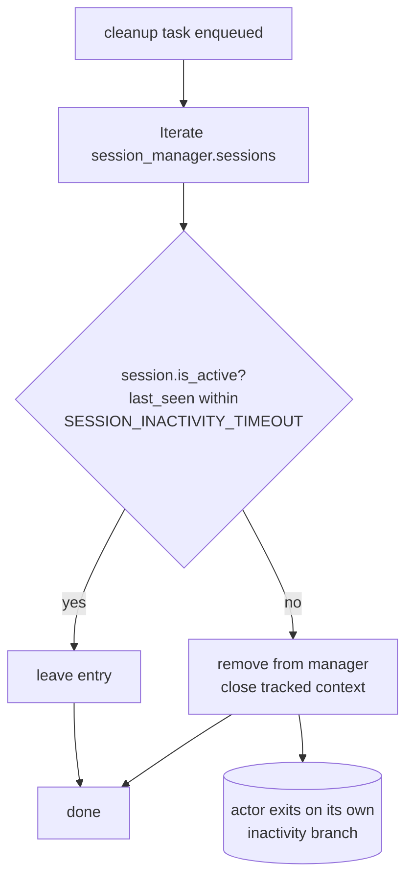
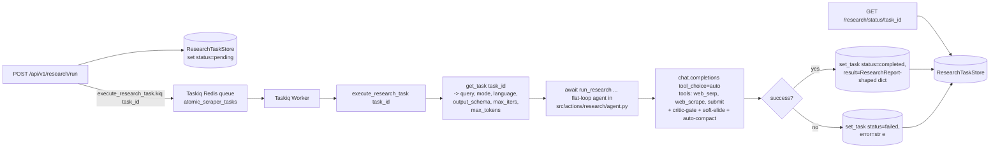
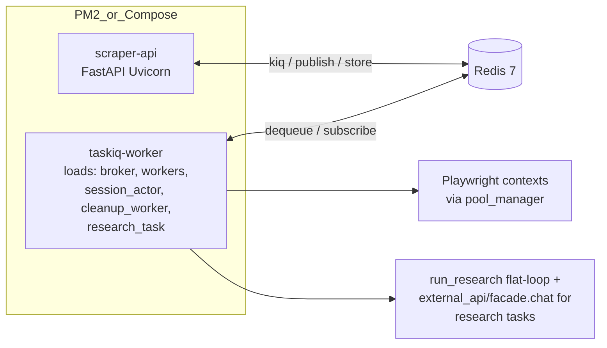

# Infrastructure: Queue (src/infrastructure/queue/)

## Files analyzed

- `src/infrastructure/queue/__init__.py` — empty package marker, no re-exports.
- `src/infrastructure/queue/broker.py` — Taskiq Redis broker bootstrap.
- `src/infrastructure/queue/session_actor.py` — stateful Playwright session actor + Redis pub/sub command loop.
- `src/infrastructure/queue/cleanup_worker.py` — idle-session reaper.
- `src/infrastructure/queue/workers.py` — placeholder/general Taskiq tasks.
- `src/infrastructure/queue/research_task.py` — long-running research task driver (delegates to `src/actions/research/agent.py:run_research`).

Cross-referenced: `STRUCTURE.md`, `docker-compose.yml`, `docker-compose.override.yml`, `ecosystem.config.js`, `specs/009-smart-scraping-llm-api/spec.md` (US2/US3 — interactive sessions + 10-min inactivity), `specs/011-auto-research-agent/spec.md` (research queue + concurrency cap).

## Purpose & responsibilities

This slice provides the **asynchronous execution substrate** of the service. It satisfies:

- **FR-005 / FR-007 (spec 009)** — isolated processes with dedicated browser instances per interactive session, terminated after inactivity timeout.
- **FR (spec 011)** — long-running research tasks executed off the API request thread, results stored externally and polled.
- General background work submitted from API routers.

Concretely it owns:

1. The Taskiq broker (Redis-backed list queue, queue name `atomic_scraper_tasks`).
2. A **stateful actor pattern** where each session is one Taskiq task that owns a Playwright context and pumps a Redis pub/sub command channel.
3. A **cleanup worker** that walks `session_manager.sessions` and closes idle contexts.
4. A **research task entrypoint** that delegates to `run_research` (flat-loop agent) and persists the resulting `ResearchReport` via `ResearchTaskStore`.

## Key classes / functions

### broker (`broker.py`)

- `broker = ListQueueBroker(url=settings.REDIS_URL, queue_name="atomic_scraper_tasks")` from `taskiq_redis`.
- `settings.REDIS_URL` is read from env (`REDIS_URL`, see `docker-compose.override.yml` → `redis://redis:6379`).
- **No custom middlewares, no result backend, no `schedule_source`** declared in the file — Taskiq defaults are used. There is no cron/scheduled-source wiring; periodic work (cleanup) is driven by its own loop, not by Taskiq scheduler.
- `__init__.py` is empty; modules are loaded explicitly via the worker command line.

### session_actor (`session_actor.py`) — central piece

- Taskiq task: `run_session_actor(session_id, headless=True, proxy=None, user_agent=None, viewport=None)` decorated with `@broker.task`.
- Helper class `SessionActor` encapsulates Playwright lifecycle:
  - `start()` — acquires context via `pool_manager.create_context(...)` and opens a `page`.
  - `execute(command)` — resolves `CommandType` from the command payload, looks up handler via `action_registry.get_action(type)` and calls it with `(page, params)`.
  - `stop()` — closes the Playwright context.
- Loop body (simplified):
  1. Connect to Redis (`redis.asyncio`), `pubsub.subscribe("cmd:{session_id}")`.
  2. `last_active = time.time()`.
  3. Loop forever:
     - If `time.time() - last_active > settings.SESSION_INACTIVITY_TIMEOUT` (`1800` s in override.yml; spec 009 FR-007 calls for 10 min — there is a drift, see Open Questions), `break`.
     - `asyncio.wait_for(pubsub.get_message(ignore_subscribe_messages=True), timeout=10.0)`.
     - On `{"type": "stop"}` → `break`.
     - Otherwise execute action and `publish` JSON result to `res:{session_id}`; reset `last_active`.
  4. `finally`: unsubscribe, `actor.stop()` (closes Playwright context), close Redis connection.
- The API side (`api/routers/sessions.py` + `api/websockets/`) is the producer on `cmd:{session_id}` and the consumer on `res:{session_id}`.

### cleanup_worker (`cleanup_worker.py`)

- Defines a Taskiq task that iterates `session_manager.sessions` and checks `is_active()` (which compares `last_seen` against `SESSION_INACTIVITY_TIMEOUT`).
- For each idle session it closes/clears the manager entry. **It does not appear to publish a `stop` message on `cmd:{session_id}`** — the actor relies on its own inactivity branch to exit. This means cleanup is best-effort bookkeeping of the manager, not a guaranteed kill switch.
- There is no Taskiq cron / `ScheduleSource` registered; the worker is invoked as a regular task. It must be triggered by an external scheduler or a periodic in-process loop (not visible in this slice — possible smell).

### workers (`workers.py`)

- Currently contains only a demonstration / placeholder task (e.g. `example_task`). No production work lives here; it exists so `ecosystem.config.js` and `docker-compose.yml` can load the module without import errors.

### research_task (`research_task.py`)

- Taskiq task: `execute_research_task(task_id: str)`.
- Flow (post 2026-05-29 rewrite — no LangGraph any more):
  1. `get_task(task_id)` from `src.infrastructure.tasks.research_store` → pulls `query`, `mode` (default `"balanced"`), `language`, `output_schema`, `max_iters`, `max_tokens`.
  2. `await run_research(query, mode=mode, language=target_language, output_schema=output_schema, max_turns=task_data.get("max_iters"), max_tokens=task_data.get("max_tokens"))` from `src.actions.research.agent`.
  3. On success: `set_task(task_id, {status: "completed", phase: "completed", result: <ResearchReport-shaped dict>})`.
  4. On exception: `logger.exception(...)` + `set_task(task_id, {status: "failed", error: str(e)})`.
- The endpoint `POST /api/v1/research/run` enqueues via `execute_research_task.kiq(task_id)`; `GET /research/status/{task_id}` polls the store; `GET /research/stream/{task_id}` polls the store + emits SSE.

## Data flow within slice

- **Producers**: REST routers (`sessions.py`, `research.py`, stateless endpoints) call `*.kiq(...)` on Taskiq tasks; the WebSocket handler publishes JSON commands on `cmd:{session_id}` through Redis (not Taskiq).
- **Transport**: Redis serves three distinct roles —
  1. Taskiq list queue (`atomic_scraper_tasks`) carrying task invocations.
  2. Pub/Sub command/response channels per session (`cmd:{session_id}` / `res:{session_id}`).
  3. State store for `ResearchTaskStore` and `SessionManager` bookkeeping.
- **Consumers**: Taskiq workers launched per `docker-compose.yml` / `ecosystem.config.js` import the four modules (`broker`, `session_actor`, `cleanup_worker`, `workers`, `research_task`) so their `@broker.task` decorators register.

## Mermaid diagram(s)

### Stateful session lifecycle

```mermaid
sequenceDiagram
    participant Client
    participant API as FastAPI (sessions router / WS)
    participant Broker as Taskiq broker (Redis list)
    participant Worker as Taskiq Worker
    participant Actor as SessionActor (in worker)
    participant Redis as Redis Pub/Sub
    participant PW as Playwright context

    Client->>API: POST /sessions  (create)
    API->>Broker: run_session_actor.kiq(session_id, proxy, ua, ...)
    Broker-->>Worker: dequeue task
    Worker->>Actor: instantiate + start()
    Actor->>PW: pool_manager.create_context() + new_page()
    Actor->>Redis: SUBSCRIBE cmd:{session_id}

    loop until stop / inactivity
        Client->>API: POST /sessions/{id}/command  OR  WS frame
        API->>Redis: PUBLISH cmd:{session_id}  (JSON command)
        Redis-->>Actor: deliver command
        Actor->>Actor: action_registry.get_action(CommandType)
        Actor->>PW: action_func(page, params)
        PW-->>Actor: result / error
        Actor->>Redis: PUBLISH res:{session_id}  (JSON result)
        Redis-->>API: WS manager relays to client
        API-->>Client: WS message / HTTP response
    end

    Note over Actor: every 10s wake-up<br/>checks now - last_active > SESSION_INACTIVITY_TIMEOUT
    Actor->>PW: context.close()
    Actor->>Redis: UNSUBSCRIBE / close
```

### Cleanup loop



### Research task



### Process / deployment view



## External dependencies

- **Redis** — three roles: Taskiq list backend, per-session pub/sub, key/value store for `ResearchTaskStore` and `SessionManager` tracking.
- **Taskiq + taskiq_redis** — `ListQueueBroker`, default serializer.
- **Playwright** (via `infrastructure/browser/pool_manager`) — context creation/teardown inside the session actor.
- **`domain/registry/action_registry`** + `domain/models/dsl.CommandType` — command dispatch table.
- **`infrastructure/browser/session_manager`** — last-seen tracking consumed by the cleanup worker.
- **`infrastructure/tasks/research_store`** (`get_task`, `set_task`) — persistence for research task lifecycle.
- **`actions/research/agent.run_research`** — flat tool-calling loop driving the research task (replaces the pre-2026-05-29 `graph.build_graph` + `state.create_initial_state` LangGraph wiring).
- **`core/config.settings`** — `REDIS_URL`, `SESSION_INACTIVITY_TIMEOUT`, etc.

## Tests covering this slice

- `tests/unit/test_cleanup.py` — exercises cleanup-worker / session-manager interaction.
- `tests/contract/test_research_endpoint.py` — contract for POST `/research/run` and GET `/research/status/{task_id}`, indirectly covers `execute_research_task` enqueue + store contract.
- `tests/integration/test_research_agent.py` — drives `run_research` end-to-end with a fake `OpenAICompatibleClient` + stubbed `web_search`/`scrape_url`; asserts the dict parses into `ResearchReport`. Replaces the deleted `test_research_graph.py`.
- **Gaps**: no dedicated test for `session_actor.run_session_actor` (Redis pub/sub loop, inactivity timeout), no direct test for `broker.py`, no test for `workers.py`.

## Open questions / smells

1. **Inactivity-timeout drift**: spec 009 FR-007 mandates 10 minutes (600 s) but `docker-compose.override.yml` sets `SESSION_INACTIVITY_TIMEOUT=1800` (30 min). One of spec / config is stale.
2. **No scheduler for cleanup**: `cleanup_worker` is a regular Taskiq task, not registered with any `ScheduleSource`. Unless an external cron/loop calls `.kiq()` periodically, idle entries linger in `session_manager` until the actor self-exits.
3. **Cleanup does not actively kill actors**: it removes the manager record but does not publish `{"type":"stop"}` on `cmd:{session_id}`. The Playwright context is freed only when the actor’s own 10-second poll observes the inactivity threshold.
4. **`workers.py` is a placeholder** — kept only so the worker command can import it; either delete or document.
5. **No result backend on the broker** — Taskiq tasks are fire-and-forget; for `execute_research_task` the contract is recovered via `ResearchTaskStore`, but generic tasks have no return-value path.
6. **Worker module list inconsistency**: `docker-compose.yml` loads `src.infrastructure.queue.tasks` (a module that does not exist in this slice — `tasks.py` is absent), while `docker-compose.override.yml` and `ecosystem.config.js` load the correct module set. Plain `docker-compose up` (without the override) would fail to import.
7. **Three different Redis usage patterns** (Taskiq queue, pub/sub, KV store) all share one connection URL with no namespacing; risk of channel/key collisions as the surface grows.
8. **Encoding**: Taskiq default (`pickle`) is used because no encoder is configured — fine for in-cluster use, but pickled payloads make the queue brittle to code refactors.
