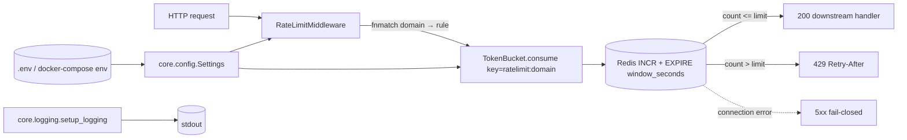

# Infrastructure: Rate Limiter + Core (config, logging)

## Files analyzed

- `src/infrastructure/rate_limiter/__init__.py`
- `src/infrastructure/rate_limiter/token_bucket.py`
- `src/core/__init__.py`
- `src/core/config.py`
- `src/core/logging.py`

Context references:

- `STRUCTURE.md` (layers, FR-009/FR-010 mapping)
- `.env.example`
- `docker-compose.override.yml`
- `pyproject.toml`
- `specs/010-scraper-mlcv-prep/spec.md` (US5, FR-009, FR-010, SC-005)

## Purpose & responsibilities

This slice covers two cross-cutting infrastructure concerns:

1. **Per-domain rate limiting** (FR-009, FR-010, US5): enforce upstream quotas
   (e.g. `*.yandex.*` → 30 req/h) so the scraper respects Terms of Service and
   avoids upstream bans. State lives in Redis so it is shared across the FastAPI
   worker processes and the Taskiq worker container declared in
   `docker-compose.override.yml`.
2. **Cross-cutting config & logging** (`src/core/`): single `pydantic-settings`
   `Settings` object reads `.env` / process env (`REDIS_URL`, `API_KEY`,
   `EXTRACTION_*`, `ORCHESTRATION_*`, `RATE_LIMIT_*`, `SEARXNG_*`, …) and a
   minimal stdlib `logging` setup used by both `api` and `worker` services.

## Key classes / functions

### token_bucket (`src/infrastructure/rate_limiter/token_bucket.py`)

Despite its name, the implementation is a **fixed-window counter** on top of
Redis `INCR` + `EXPIRE`, not a true token bucket (no refill rate, no Lua
script, no sliding window).

- Redis key pattern: `ratelimit:{domain}`
- TTL: `window_seconds` (default `3600`, matching `*_PER_HOUR` settings)
- Public surface (per LLM read):
  - `check_rate_limit(...)` — peek current counter / remaining quota
  - `consume(...)` — atomic `INCR` (+ `EXPIRE` on first hit)
  - `reset(domain)` — drop the key
  - `get_remaining(...)` — derived from limit − current count
- Domain matching: `fnmatch.fnmatch(domain, pattern)` — supports wildcards
  like `*.yandex.*`, no regex, no exact-only mode. This aligns with spec
  acceptance scenario 1 (`*.yandex.*` after 30 reqs/hour).
- Redis failure mode: no explicit `try/except` wrapper observed → exceptions
  propagate, behaviour is effectively **fail-closed** (requests blocked when
  Redis is down). Spec does not mandate fail-open.

`__init__.py` re-exports the bucket class for the API middleware
(`api/middleware/rate_limit.py`, FR-009/FR-010 entry point).

### Settings (`src/core/config.py`)

`pydantic-settings` `Settings` class, all fields have defaults (so the service
boots without an `.env`, but with insecure placeholders). Fields observed:

| Group | Fields |
|---|---|
| Auth | `API_KEY` (default `default_internal_key`) |
| Redis | `REDIS_URL`, `REDIS_HOST`, `REDIS_PORT` |
| HTTP | `PORT` |
| Extraction LLM | `EXTRACTION_API_BASE`, `EXTRACTION_API_KEY`, `EXTRACTION_MODEL_NAME` |
| Orchestration LLM | `ORCHESTRATION_API_BASE`, `ORCHESTRATION_API_KEY`, `ORCHESTRATION_MODEL_NAME` |
| Browser | `BROWSER_TIMEOUT`, `SESSION_INACTIVITY_TIMEOUT` |
| Concurrency | `MAX_CONCURRENT_RESEARCH_TASKS` (Field `ge=1, le=100`, default 5) |
| Rate limit | `RATE_LIMIT_YANDEX_PER_HOUR` (30), `RATE_LIMIT_DEFAULT_PER_HOUR` (1000) |
| SearxNG | `SEARXNG_BASE_URL`, `SEARXNG_TIMEOUT`, `SEARXNG_MAX_RETRIES`, `SEARXNG_RETRY_DELAY`, `SEARXNG_MIN_ORGANIC` |

- No `env_prefix` (env vars used flat, matching `.env.example`).
- No nested `BaseSettings` sub-classes.
- Three secret-bearing fields: `API_KEY`, `EXTRACTION_API_KEY`,
  `ORCHESTRATION_API_KEY` — all with non-empty placeholder defaults.
- `src/core/__init__.py` does **not** re-export `settings`; callers must
  `from src.core.config import settings` (or equivalent).

### logging setup (`src/core/logging.py`)

- Pure stdlib `logging`, no `structlog` (despite project-wide CLAUDE.md
  referencing structlog for the *parent* repo — this service does not depend
  on it; `pyproject.toml` confirms).
- Plain text format, default level `INFO`, single `StreamHandler` → `stdout`.
- No correlation IDs (no `request_id` / `trace_id` injection, no contextvars
  filter). FastAPI middleware in `api/middleware/` does not feed anything in
  either.
- No file/JSON handler → all observability comes from container stdout
  (Docker logging driver).

## Data flow within slice

1. A request reaches `api/middleware/rate_limit.py` (out of slice).
2. Middleware resolves the request's target domain and asks the
   `TokenBucket` (`infrastructure/rate_limiter/token_bucket.py`) for the
   matching rule — `fnmatch` walks configured patterns
   (`*.yandex.*` → `RATE_LIMIT_YANDEX_PER_HOUR`, fallback
   `RATE_LIMIT_DEFAULT_PER_HOUR`).
3. `consume()` pipelines `INCR ratelimit:{domain}` + `EXPIRE … window` to
   the shared Redis (`REDIS_URL`, same instance used by Taskiq broker and
   WebSocket pub/sub).
4. If counter ≤ limit → request proceeds; otherwise middleware returns 429
   (FR-010). Bucket also exposes `get_remaining` / `reset` for ops.
5. Throughout, `core.config.settings` provides limits/Redis URL, and
   `core.logging` emits a single-line INFO record to stdout.

## Mermaid diagram(s)

## External dependencies

- **Redis** (`redis>=7.3.0`, `taskiq-redis>=1.2.2`) — single instance shared
  with Taskiq broker (`infrastructure/queue/broker.py`) and WebSocket manager.
- **pydantic-settings** (`>=2.13.1`) — env/`.env` loading, no `python-dotenv`
  needed.
- **stdlib `logging`** — no `structlog`, no `loguru` (not in
  `pyproject.toml`).
- Python ≥ 3.12.

## Tests covering this slice

- `tests/unit/test_rate_limiter.py` — unit coverage for `TokenBucket`
  (FR-009, FR-010 per `STRUCTURE.md`).
- `tests/e2e/test_rate_limiting_flow.py` — end-to-end enforcement of the
  `*.yandex.*` 30/hour rule (US5, SC-005).
- No dedicated `test_config.py` / `test_logging.py` were found — config is
  exercised implicitly via every other test that imports `settings`.

## Open questions / smells

- **Misleading name**: `token_bucket.py` is a fixed-window counter; spec
  language ("rate limit") is satisfied, but the file name promises a refill
  algorithm that is not implemented. Either rename or add Lua-based refill
  if burst smoothing matters.
- **No Redis-failure policy**: behaviour on Redis outage is implicit
  (fail-closed via raised exception). Spec/SC-005 does not mandate fail-open,
  but middleware should at least log and convert to 503 explicitly.
- **`.env.example` drift**: `SEARXNG_*`, `REDIS_HOST`, `REDIS_PORT`,
  `MAX_CONCURRENT_RESEARCH_TASKS` exist in `Settings` but are not in
  `.env.example`; `RATE_LIMIT_*` are commented out though they are the
  core of FR-009.
- **Default secrets**: `API_KEY=default_internal_key`,
  `ORCHESTRATION_API_KEY="sk-..."` ship as defaults — risk of running in
  prod with placeholder credentials. Consider making these required (no
  default) and failing fast.
- **No `env_prefix`** → bare names like `API_KEY`, `PORT` may collide with
  unrelated env vars in shared hosts.
- **`src/core/__init__.py` is empty** — every caller spells out
  `from src.core.config import settings`, no canonical re-export.
- **Logging has no correlation IDs** — debugging concurrent scraper sessions
  / WebSocket flows across `api` + `worker` containers is hard. No JSON
  formatter either, which limits downstream log aggregation.
- **Hard-coded model defaults** in `config.py` (`gpt-4o`, `jina-reader-lm`)
  disagree with `docker-compose.override.yml`
  (`qwen3.5-9b-claude-4.6-opus-reasoning-distilled`,
  `jinaai.readerlm-v2`) — env always wins, but the defaults are misleading
  documentation.
