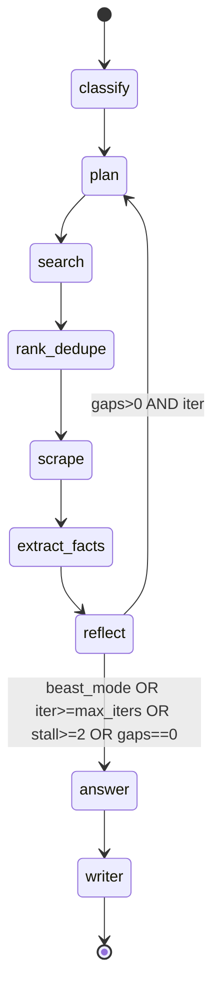
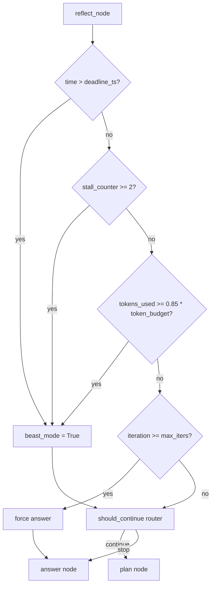

# Research Agent: Graph + State + Modes

## Files analyzed

- `src/actions/research/state.py` — `ResearchState` TypedDict, helper sub-typeddicts
- `src/actions/research/modes.py` — `ModePreset` dataclass, presets, `get_mode_preset`, `mode_to_initial_state`, override bounds
- `src/actions/research/graph.py` — LangGraph `StateGraph` topology, `should_continue` router, `build_graph`, `MemorySaver`

Out of scope for this slice: `nodes.py`, `tools.py`, `llm_utils.py`, `__init__.py`.

## Purpose & responsibilities

This slice owns the **shape, configuration and topology** of the auto-research agent:

- **state.py** — declares the LangGraph `State` channel schema (a `TypedDict(total=False)` so each node can return only the fields it changes; LangGraph default merge semantics overwrite per key).
- **modes.py** — declares the three research mode presets (`speed`, `balanced`, `quality`) per constitution X(a), plus override bounds and the helper that materialises an initial state dict from a `(query, mode, overrides)` triplet.
- **graph.py** — wires the 9 nodes into a LangGraph `StateGraph`, registers the static linear pipeline and the single conditional edge out of `reflect`, attaches a `MemorySaver` checkpointer and returns the compiled graph for the Taskiq worker (`infrastructure/queue/research_task.py`).

The slice contains no I/O and no LLM calls itself; it is pure schema/config/wiring consumed by `nodes.py`.

## Key classes / functions

### State (поля и reducers)

`ResearchState` is `TypedDict(..., total=False)` — no Pydantic, no validators, no explicit reducers. Per fixes report 2026-05-20, the `total=False` switch was deliberate so nodes can return partial dicts and LangGraph merges them with overwrite-per-key (no `Annotated[list, operator.add]`-style reducers). List accumulation is the node's responsibility — e.g. `visited_urls` is rebuilt as the union via the node itself, not by a reducer.

| Field | Type | Default / Reducer | Назначение | Written by |
|-------|------|-------------------|-----------|------------|
| `query` | `str` | set in `mode_to_initial_state` | original user question | init |
| `mode` | `str` | init | mode string ("speed"/"balanced"/"quality") | init |
| `query_type` | `str` | — | classification ("factoid"/"comparative"/"exploratory"/"decomposable") | classify_node |
| `max_iters` | `int` | preset, overridable | hard iteration cap | init |
| `max_tokens` | `int` | preset, overridable | hard token cap (mirror of `token_budget`) | init |
| `token_budget` | `int` | preset | budget for 85% beast-mode trigger | init |
| `tokens_used` | `int` | 0 | running token total — **never incremented in current code** (dead path) | (none) |
| `started_ts` | `float` | `time.time()` at init | wall-clock start (used by writer for elapsed) | init |
| `deadline_ts` | `float` | `started_ts + preset.deadline` | wall-clock deadline | init |
| `iteration` | `int` | 0 | current loop count, bumped in reflect | reflect_node |
| `gaps` | `list[str]` | `[]` | open sub-questions from plan | plan_node, reflect_node |
| `visited_urls` | `list[str]` | `[]` — was `set` pre-fix (not JSON-serialisable) | dedupe memory | scrape_node |
| `candidate_urls` | `list[ScoredUrl]` | `[]` | full ranked SERP pool | search_node, rank_dedupe_node |
| `current_batch` | `list[ScoredUrl]` | — | top-K unvisited to scrape this turn | rank_dedupe_node |
| `scraped_content` | `list[dict]` | `[]` | raw page content | scrape_node |
| `facts` | `list[dict]` | `[]` | extracted claims | extract_facts_node |
| `citations` | `list[dict]` | `[]` | per-URL citation entries | extract_facts_node |
| `answer_draft` | `Optional[str]` | None | partial answer | (reserved) |
| `final_answer` | `Optional[str]` | None | synthesised markdown | answer_node |
| `final_report` | `Optional[dict]` | None | full `ResearchReport`-shaped dict | writer_node |
| `beast_mode` | `bool` | False | force-finish flag | reflect_node, deadline checks |
| `stall_counter` | `int` | 0 | consecutive zero-new-URL search rounds | search_node, rank_dedupe_node |
| `trace` | `list[NodeEvent]` | `[]` | node-event log for SSE | every node via `emit_node_event` |

No `Annotated[..., operator.add]` reducers are declared — node functions return the full new value for each list field they modify.

### Modes (таблица: режим → параметры)

`ModePreset` dataclass per `modes.py`. Three presets in module-level `PRESETS: dict[str, ModePreset]`.

| Параметр | speed | balanced | quality |
|----------|------:|---------:|--------:|
| `max_iters` | 2 | 6 | 25 |
| `search_k` | 3 | 5 | 8 |
| `scrape_concurrency` | 2 | 3 | 5 |
| `token_budget` | 30,000 | 100,000 | 1,000,000 |
| `deadline` (s) | 120 | 300 | 1,200 |
| `scrape_strategy` | text-only enrich | full enrich + cleaner | full enrich + retry |

**Selection**: `get_mode_preset(mode: str) -> ModePreset` returns the preset for `"speed"|"balanced"|"quality"`, raises `ValueError` on unknown mode.

**Override bounds** (constants in `modes.py`):

| Constant | Value |
|----------|------:|
| `ITER_OVERRIDE_MIN` | 1 |
| `ITER_OVERRIDE_MAX` | 50 |
| `TOKEN_OVERRIDE_MIN` | 1,000 |
| `TOKEN_OVERRIDE_MAX` | 2,000,000 |

Per the 2026-05-20 fixes, these were raised from `[1..20]`/`[1000..32000]` to fit `quality` preset (`max_iters=25`, `token_budget=1_000_000`); `domain/models/research.py::ResearchRequest` bounds were aligned with the same values.

**Initial-state factory**: `mode_to_initial_state(query, mode_str, preset, max_iters_override=None, max_tokens_override=None) -> dict` produces the full starting `ResearchState` dict with `iteration=0`, `gaps=[]`, `visited_urls=[]`, `candidate_urls=[]`, `scraped_content=[]`, `facts=[]`, `citations=[]`, `beast_mode=False`, `stall_counter=0`, `tokens_used=0`, `trace=[]`, plus `started_ts=time.time()` and `deadline_ts=started_ts+preset.deadline`.

### Graph topology (nodes list + edges list)

**Nodes registered** (all in `build_graph()` in `graph.py`):

| Node name | Implementation |
|-----------|----------------|
| `classify` | `nodes.classify_node` |
| `plan` | `nodes.plan_node` |
| `search` | `nodes.search_node` |
| `rank_dedupe` | `nodes.rank_dedupe_node` |
| `scrape` | `nodes.scrape_node` |
| `extract_facts` | `nodes.extract_facts_node` |
| `reflect` | `nodes.reflect_node` |
| `answer` | `nodes.answer_node` |
| `writer` | `nodes.writer_node` |

**Entry point**: `classify`.

**Static edges** (`add_edge`):

| From | To |
|------|----|
| `classify` | `plan` |
| `plan` | `search` |
| `search` | `rank_dedupe` |
| `rank_dedupe` | `scrape` |
| `scrape` | `extract_facts` |
| `extract_facts` | `reflect` |
| `answer` | `writer` |
| `writer` | `END` |

**Conditional edges** (`add_conditional_edges`):

| From | Router | Possible targets | Condition |
|------|--------|------------------|-----------|
| `reflect` | `should_continue(state)` | `plan` | `gaps` non-empty AND `iteration < max_iters` AND `stall_counter < 2` AND NOT `beast_mode` |
| `reflect` | `should_continue(state)` | `answer` | `beast_mode` OR `iteration >= max_iters` OR `stall_counter >= 2` OR `gaps` empty |

**Terminal**: only `END` after `writer`.

**Checkpointer**: `MemorySaver()` is instantiated **inside `build_graph()`** on every call — checkpoints do **not** survive a worker restart (noted as open issue in fixes report).

## Data flow within slice

1. **Router (`api/routers/research.py`)** receives `POST /api/v1/research/run`, validates `ResearchRequest`, computes `preset = get_mode_preset(req.mode)`, calls `mode_to_initial_state(...)` → initial `ResearchState` dict.
2. Task is enqueued to Taskiq; `infrastructure/queue/research_task.py` calls `build_graph().ainvoke(initial_state, config={"configurable": {"thread_id": task_id}})`.
3. State flows: `classify` sets `query_type` → `plan` populates `gaps` → `search` appends to `candidate_urls` (and may bump `stall_counter` on empty SERP) → `rank_dedupe` selects `current_batch` of unvisited top-K → `scrape` fills `scraped_content` and grows `visited_urls` → `extract_facts` appends `facts` and dedupes `citations` per URL → `reflect` increments `iteration`, recomputes `gaps`, may flip `beast_mode`.
4. `should_continue(state)` routes back to `plan` (more work) or forward to `answer`.
5. `answer_node` writes `final_answer` (markdown with inline `[n]` citations), `writer_node` packages into `final_report` matching `ResearchReport(query, mode, answer_markdown, citations, facts, stats)`, then `END`.
6. Worker reads `state["final_report"]` and merges into the Redis-backed `research_store` dict.

## Mermaid diagram(s)

Main graph:

Beast-mode / loop-safety trigger flow (logical, enforced inside `reflect_node` + `should_continue`):

Note: the `tokens_used >= 0.85 * token_budget` branch is **declared by the constitution** but `tokens_used` is never incremented in current code (see Open questions).

## External dependencies

- `langgraph.graph.StateGraph`, `END` — graph builder
- `langgraph.checkpoint.memory.MemorySaver` — in-process checkpointing
- `nodes.py` (slice 14) — all 9 node functions
- `tools.py` (slice 15) — indirectly via nodes (`web_search`, `scrape_url`, `extract_facts_llm`)
- `domain/models/research.py::ResearchRequest` — mirrors override bounds
- `infrastructure/queue/research_task.py` — calls `build_graph().ainvoke(...)`
- `api/routers/research.py` — calls `get_mode_preset` + `mode_to_initial_state` before enqueue

No direct dependency on `LLMFacade`, Playwright, or Redis from this slice.

## Tests covering this slice

- `tests/unit/research/test_modes.py` — preset values, override precedence, `mode_to_initial_state` field shape
- `tests/unit/research/test_state_transitions.py` — `should_continue` truth table (gaps empty, beast_mode, iter>=max_iters, stall>=2)
- `tests/unit/research/test_nodes.py` — state transformations per node (touches state schema indirectly)
- `tests/integration/test_research_graph.py` — compiled graph terminates within `max_iters`, emits valid `ResearchReport`, tiny budget → beast-mode → answer still produced
- `tests/contract/test_research_endpoint.py` — request/response contract (touches mode validation and initial-state path)

## Open questions / smells

- **`tokens_used` is dead** — `state["tokens_used"]` is initialised to 0 but never incremented anywhere (no `usage.total_tokens` aggregation from the OpenAI-compatible client). The 85%-of-`token_budget` beast-mode trigger demanded by **constitution X(b)** is therefore **inert**. Only `deadline_ts` and `stall_counter` actually flip `beast_mode`.
- **Loop-safety completeness vs constitution X(b)**: of the four required hard constraints —
  - (1) token budget ≥ 85% → beast-mode → **NOT enforced** (`tokens_used` is dead, see above)
  - (2) iteration cap (`max_iters`) → enforced in `should_continue`
  - (3) wall-clock deadline (`deadline_ts`) → enforced inside `reflect_node` (flips `beast_mode`)
  - (4) URL stall detection (`stall_counter >= 2`) → enforced in `should_continue` and incremented by `search_node` / `rank_dedupe_node`
  → **3 of 4 fully enforced**; (1) is declared but no-op.
- **Naming mismatch with spec 011 / data-model.md**: spec uses `max_iterations` and `iterations`, code uses `max_iters` and `iteration`. Spec lists `search_breadth` / `scrape_concurrency`, code uses `search_k` / `scrape_concurrency`. `ResearchRequest` (in `domain/models/research.py`) still exposes the spec name `max_iterations` as the API field — translation happens in router/`mode_to_initial_state`.
- **Mode names match constitution X(a)** (`speed/balanced/quality`) — no drift to `quick/balanced/deep`.
- **Preset bounds vs spec data-model**: spec says `speed = 2 iters / 4K tokens`, `balanced = 5 / 8K`, `quality = 10 / 16K`. Actual presets are far larger (`speed=2/30K`, `balanced=6/100K`, `quality=25/1M`). Override bounds were raised in 2026-05-20 to fit. The spec data-model is stale.
- **Override bound `TOKEN_OVERRIDE_MAX=2_000_000` exceeds even `quality.token_budget=1_000_000`** — intentional headroom but worth confirming against `ResearchRequest` field validators in `domain/models/research.py`.
- **`MemorySaver` recreated per `build_graph()` call** — no cross-run persistence; documented as known limitation. A Redis-backed checkpointer would survive worker restarts.
- **`visited_urls: list[str]`** (was `set[str]`) — switched for JSON-serialisability; nodes must now dedupe manually before append. Risk of duplicates if a node forgets the check.
- **No explicit LangGraph reducers** — every node must return the full new list value to avoid silently dropping accumulated data (this exact class of bug bit `search_node` returning `[]` on stall, fixed 2026-05-20). Adding `Annotated[list, operator.add]` reducers would be safer.
- **`answer_draft` field is declared but apparently unused** in the current node set — vestigial.
- **`thread_id` for checkpointer** — `build_graph` returns a `MemorySaver`-checkpointed graph, but unless the worker passes a stable `configurable.thread_id`, checkpoints are useless even within a run.
