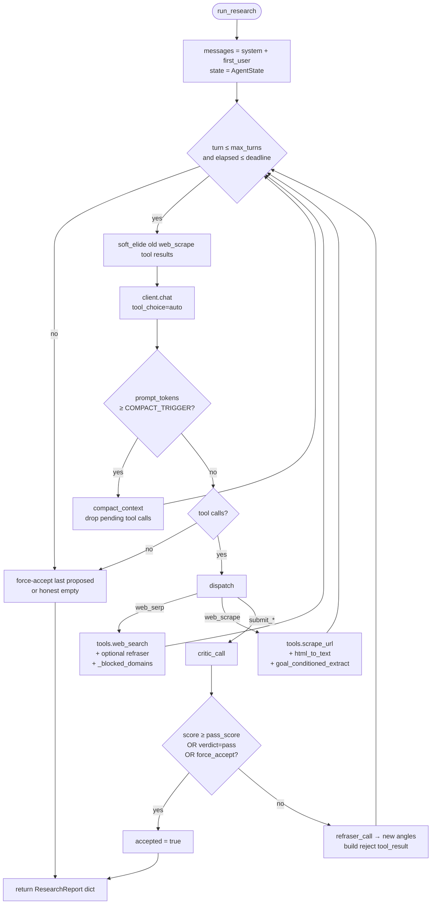

# Research Agent: flat-loop `run_research`

> Replaces the pre-2026-05-29 LangGraph agent (`graph.py` + `nodes.py` +
> `state.py`, all deleted). Reports 14 and 15 are the matching slices for
> the deprecated nodes table and the rewritten tool layer.

## Files analyzed

- `src/actions/research/agent.py` — `run_research`, `AgentState`, the main tool loop, dynamic submit tool builder, auxiliary critic/refraser/compact LLM calls, soft-elide + goal-conditioned scrape extract.
- `src/actions/research/modes.py` — `ModePreset` dataclass, three presets, `get_mode_preset`, override bounds.
- `src/actions/research/research_agent_prompts.yaml` — all prompts (system / critic_system / refraser_system / compact_system + templates).
- `src/actions/research/tools.py` — plain async `web_search` (SearXNG) and `scrape_url` (`SiteEnrichAction`).
- `src/actions/research/llm_utils.py` — `strip_reasoning`, `extract_json` (kept as helpers; `extract_json` is also used by `OpenAICompatibleClient.generate_structured` as a fallback).

## Purpose & responsibilities

A generic web research agent: given a `query` and (optionally) a JSON Schema, it iteratively searches and scrapes the web via two tools, lets an LLM critic gate the final submit, and returns a `ResearchReport`-shaped dict to the Taskiq driver.

Design intent (ported from the v2.1 prototype in `yandex_enrichment_experiment/simple_agent_v2.py`, then generalised — no organisation/anchor/yandex specifics in the service):

- **Flat loop, not a graph.** A single `chat.completions.create(..., tools=[...], tool_choice="auto")` call per turn; the model picks the next tool itself. No nodes, no router, no `MemorySaver`.
- **Two output modes via a dynamic terminal tool.**
  - `output_schema is None` → terminal tool `submit_answer(answer: str, sources: [...])` → fills `answer_markdown`.
  - `output_schema` given → terminal tool `submit_result(result, sources)` where `result` is constrained to the caller's JSON Schema → fills `structured_output`.
- **Critic-gate on submit.** A second LLM call scores the candidate (0–10, JSON verdict); below `RESEARCH_CRITIC_PASS_SCORE` (default 8.5) the submit is rejected with feedback + suggested new angles; after `RESEARCH_MAX_SUBMIT_REJECTS` (default 2) the next submit is force-accepted to avoid infinite loops.
- **Context hygiene.** Three cheap mechanisms keep the prompt small without dropping accumulated knowledge:
  - `soft_elide` — replaces old `web_scrape` tool results with a 1-line marker after `RESEARCH_SOFT_ELIDE_AFTER_TURNS` turns;
  - `compact_context` — when `prompt_tokens >= RESEARCH_COMPACT_TRIGGER_TOKENS`, drops the pending tool calls and asks an LLM to summarise everything so far; bounded by `RESEARCH_MAX_COMPACTIONS`;
  - `goal_conditioned_extract` — relevance-trims each scraped page to ~3.5 KB centred on query terms, schema property names, and generic contact regexes.
- **All numeric knobs in `Settings`, all prompts in YAML.** Nothing inline in `agent.py`.

## Modes — table

`ModePreset` dataclass (`modes.py`) carries per-mode knobs; cross-mode global knobs live in `Settings.RESEARCH_*`.

| Field | speed | balanced | quality |
|-------|------:|---------:|--------:|
| `max_turns` (LLM turns) | 8 | 15 | 25 |
| `search_k` (default `web_serp` `k`) | 3 | 5 | 8 |
| `scrape_concurrency` | 2 | 3 | 5 |
| `token_budget` (hard cost cap, prompt + completion) | 30 000 | 100 000 | 1 000 000 |
| `deadline` (wall-clock budget, seconds) | 120 | 300 | 1 200 |

**Caller overrides** (validated in `run_research`):

| Constant | Value | Maps to |
|----------|------:|---------|
| `ITER_OVERRIDE_MIN/MAX` | 1 / 50 | `max_turns` |
| `TOKEN_OVERRIDE_MIN/MAX` | 1 000 / 2 000 000 | `token_budget` |

`run_research(query, *, mode, language, output_schema, max_turns, max_tokens)` clamps the caller-supplied overrides into the bounds above and reads the rest of its knobs from `settings.RESEARCH_*`.

## Settings (`RESEARCH_*`)

All overridable via `.env`. Defaults match the production v2.1 batch (see `yandex_enrichment_experiment/` for provenance).

| Setting | Default | Purpose |
|---------|--------:|---------|
| `RESEARCH_COMPACT_TRIGGER_TOKENS` | 50 000 | last-turn `prompt_tokens` that triggers `compact_context` |
| `RESEARCH_MAX_COMPACTIONS` | 3 | hard cap on auto-compactions per run |
| `RESEARCH_SOFT_ELIDE_AFTER_TURNS` | 4 | how stale a `web_scrape` tool result must be before being soft-elided |
| `RESEARCH_REFRASER_EVERY_N_SERPS` | 15 | how often a refraser LLM call is fired (also fires once on submit reject) |
| `RESEARCH_DOMAIN_FAIL_THRESHOLD` | 3 | scrape failures per domain before it is announced as `_blocked_domains` in serp results |
| `RESEARCH_LLM_TIMEOUT_S` | 180.0 | per-call timeout passed into `OpenAICompatibleClient.chat` |
| `RESEARCH_SCRAPE_BUDGET_CHARS` | 3 500 | budget for `goal_conditioned_extract` |
| `RESEARCH_CRITIC_PASS_SCORE` | 8.5 | minimum critic score to accept a submit (or `verdict=="pass"`) |
| `RESEARCH_MAX_SUBMIT_REJECTS` | 2 | after this many rejects, the next submit is force-accepted |
| `RESEARCH_DEFAULT_LANGUAGE` | `ru` | only used by callers that omit `language` |
| `RESEARCH_DEFAULT_SERP_K` | 6 | fallback `k` for `web_serp` if the model omits it |
| `RESEARCH_DOMAINS_NEVER_BLOCK` | CSV of key infra domains | never auto-blocked even after repeated scrape failures |
| `RESEARCH_PROMPTS_PATH` | `src/actions/research/research_agent_prompts.yaml` | YAML prompt pack location |

## Tools the LLM sees

Always present:

- `web_serp(query: str, k: int = preset.search_k)` — SearXNG via `tools.web_search`; result carries optional `_supervisor_hint` (refraser angles) and `_blocked_domains` (after `DOMAIN_FAIL_THRESHOLD` failures).
- `web_scrape(url: str)` — `tools.scrape_url` → `SiteEnrichAction` (Playwright + proxy + stealth); the result text is run through `html_to_text` and `goal_conditioned_extract` before being returned to the model.

Dynamic terminal tool, built in `build_tools(output_schema)`:

- Free-form mode → `submit_answer(answer: str, sources: [{url, what_it_provided}])`.
- Schema mode → `submit_result(result, sources)` where `result` is the caller's `output_schema` verbatim.

Each `sources` entry is `sanitize_sources`-d (drops anything without an `http(s)` URL and a real host).

## Auxiliary LLM calls

All three auxiliary calls go through `OpenAICompatibleClient.chat(messages=..., timeout=RESEARCH_LLM_TIMEOUT_S)` with no tools and parse the first JSON object out of the content. Each accumulates into a separate `aux_usage` token counter.

| Call | Trigger | Prompt source (YAML) | Returns |
|------|---------|----------------------|---------|
| `critic_call` | every submit | `critic_system` + `templates.critic_user` | `{score, missing, wrong, feedback, verdict}` — fails open (score 10, pass) on unreachable LLM |
| `refraser_call` | every `RESEARCH_REFRASER_EVERY_N_SERPS` serps **and** on every submit-reject | `refraser_system` + `templates.refraser_user` | `{new_angles: [≤3 short queries], reason}` |
| `compact_context` | last-turn `prompt_tokens ≥ RESEARCH_COMPACT_TRIGGER_TOKENS` (pre- and post-tool guard) | `compact_system` + `templates.compact_user` | new `messages` list = system + first user + digest as assistant + short user note |

## Main loop (textual)

```
load_prompts() once, build_tools(), seed messages=[system, first_user]
state = AgentState()
for turn in 1..max_turns:
    if time > deadline → break
    soft_elide(messages, turn, RESEARCH_SOFT_ELIDE_AFTER_TURNS)
    resp = await client.chat(messages, tools, tool_choice="auto", timeout)
    append assistant message (with tool_calls if any)
    if prompt_tokens ≥ COMPACT_TRIGGER and compactions < MAX_COMPACTIONS:
        drop the pending tool calls, compact_context, continue
    if no tool calls → break
    for each tool call:
        web_serp  → tools.web_search + maybe refraser + maybe _blocked_domains
        web_scrape → tools.scrape_url + goal_conditioned_extract + domain-fail tracking
        submit_*   → critic_call → accept or reject (with refraser angles)
    if accepted → break
    post-tool compaction guard
    if total tokens ≥ token_cap → break
if not accepted → force-accept the last proposed submission (or honest empty)
```

## Return shape

`run_research(...) -> dict` that is consumed verbatim by `infrastructure/queue/research_task.execute_research_task` and stored in Redis. The shape is `ResearchReport`-parseable:

```json
{
  "query": "...", "mode": "balanced",
  "answer_markdown": "<markdown>",          // free-form mode; "" in schema mode
  "structured_output": null,                 // null in free-form mode
  "sources": [{"url": "...", "what_it_provided": "..."}],
  "critic": {"score": 9.0, "verdict": "pass", "feedback": "...", "missing": [...], "wrong": [...]},
  "stats": {
    "turns": int, "tool_calls": {tool: count, ...},
    "tokens": {"main": {...}, "aux": {...}, "grand_total": int},
    "elapsed_seconds": float, "mode_used": str,
    "submit_attempts": int, "compactions": int,
    "target_language": str, "had_output_schema": bool
  },
  "trace_summary": {
    "queries_history": [...], "visited_urls": [...],
    "critic_events": [...], "refraser_runs": int,
    "blocked_domains": [...], "accepted": bool
  }
}
```

## Mermaid diagram



## External dependencies

- `openai.AsyncOpenAI` via `src.infrastructure.external_api.facade.get_orchestration_client()` → `OpenAICompatibleClient.chat()` (multi-turn — added 2026-05-29).
- `src.actions.research.tools.web_search` → `SearXngSearchClient` (singleton, language-aware).
- `src.actions.research.tools.scrape_url` → `SiteEnrichAction` (Playwright + proxy + stealth via `pool_manager`).
- `pyyaml` — loads the prompt pack.
- `src.core.config.settings.RESEARCH_*` — all numeric knobs.

## Tests covering this slice

- `tests/unit/research/test_modes.py` — preset values, error on unknown mode.
- `tests/integration/test_research_agent.py` — drives `run_research` end-to-end with a fake `OpenAICompatibleClient` + stubbed `web_search`/`scrape_url`; both free-form and schema modes; asserts the dict parses into `ResearchReport`.
- `tests/contract/test_research_endpoint.py` — request/response contract on `/research/run` and `/research/status/{id}` against the new report shape.

The 2026-05-29 rewrite deleted `tests/unit/research/test_nodes.py`, `tests/unit/research/test_state_transitions.py`, and `tests/integration/test_research_graph.py` together with the LangGraph code they covered.

## Open questions / smells

- **Progress events are coarse.** `run_research` writes the store only on completion; `/status` shows `phase=starting, iteration=0` for the entire run. SSE clients see just `running → completed`. The hooks needed for granular progress (`task_id`-aware emitter, periodic store writes) are out of scope for the rewrite — flagged for follow-up.
- **`prompt_tokens` budget != `token_budget`.** `RESEARCH_COMPACT_TRIGGER_TOKENS` (50k) is per-turn; `preset.token_budget` is a cumulative cost wall enforced in the loop. The two are intentionally decoupled but easy to misconfigure (e.g. `max_tokens=10_000` below the compact trigger means compaction never fires).
- **Force-accept path.** If the loop ends with `submit_attempts == 0` (model never called the submit tool), the return is empty (`answer_markdown=""`, `structured_output=None`). This is the "graceful empty" path — honest, but a caller polling `/status` cannot tell it apart from a successful empty answer without inspecting `stats.submit_attempts`.
- **Critic LLM = orchestration LLM.** No separate critic endpoint; the critic uses `get_orchestration_client()` like the main loop. A weaker / cheaper critic would be a natural future split.
- **Tool result sizes.** Each `tool_result` content is truncated to 8 KB on insert; combined with `soft_elide` after N turns this works well in practice but a pathological 10-page run could still bloat the context — `compact_context` is the safety net.
- **YAML prompts substitute via `str.replace`**, not `str.format`. Placeholders look like `{key}` but JSON braces inside the prompts are safe (no escaping needed). Don't switch to `str.format` without escaping all the example-JSON braces in the YAML.
