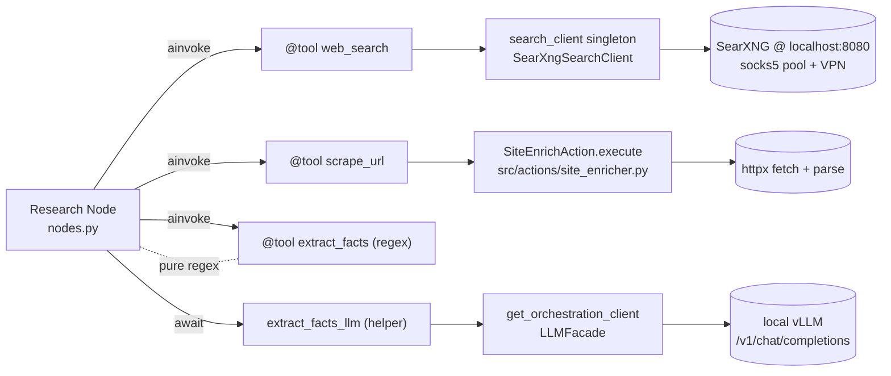

# Research Agent: Tools (src/actions/research/tools.py)

## Files analyzed

- `src/actions/research/tools.py` (primary slice — analyzed via `tools/ask_local_llm.py`)
- `specs/011-auto-research-agent/spec.md` (FR-004/005/006, FR-022 Yandex constraints)
- `specs/011-auto-research-agent/research.md` ("Tool Reuse Strategy" decision)
- `.specify/memory/constitution.md` (Principle X(c) — no external search APIs)
- `infra/searxng/README.md` (confirms `tools.py` is a `@tool web_search` call-site for SearXNG singleton)
- Test discovery: `tests/unit/research/` (`test_nodes.py`, `test_modes.py`, `test_state_transitions.py`), `tests/integration/test_research_graph.py`. No `test_tools.py` exists.

## Purpose & responsibilities

Thin LangChain-tool wrappers that expose the service's existing scraping / search / LLM
primitives to the LangGraph research agent (nodes in `nodes.py`). Each tool is the
**reuse seam** mandated by Constitution Principle X(c) — research nodes never talk to
SearXNG / `SiteEnrichAction` / `LLMFacade` directly, only through these wrappers.

Three concerns:

1. Translate plain string/scalar tool inputs (what the LLM emits) into the richer
   request objects the underlying services expect.
2. Bound failure: catch backend exceptions and surface them as tool-result payloads
   (`{"error": "..."}` / `[]`) so the LangGraph loop keeps going instead of crashing.
3. Provide a uniform JSON-serialisable return shape (list[dict] or dict) that the LLM
   can reason over for the next planning step.

## Key classes / functions

| Tool (LangChain name) | Input schema | Return shape | Under-the-hood call | Error policy |
|---|---|---|---|---|
| `web_search` | `query: str`, `k: int = 5` | `list[dict]` (title/url/snippet) | Module-singleton `search_client.search(...)` from `src/infrastructure/external_api/search_client.py` (re-exports `SearXngSearchClient`) | Returns `[]` on failure, logs |
| `scrape_url` | `url: str` | `dict` (title/text/links) | Direct Python `SiteEnrichAction().execute(url)` from `src/actions/site_enricher.py` | Returns `{"error": "..."}` on failure, logs |
| `extract_facts` | `doc: str`, `focus: str?`, `source_url: str?` | `list[dict]` (claim/confidence/source) | Pure-Python regex fallback (no I/O) | Returns `[{"error": "..."}]` on failure |
| `extract_facts_llm` (helper, **not** `@tool`-decorated — called from `nodes.py` directly) | `doc`, `focus?`, `source_url?` | `list[dict]` | `get_orchestration_client().generate(prompt, system_prompt)` — `LLMFacade` with JSON-only system prompt; `doc` truncated to ~4 KB | Returns `[]` on failure, logs |

Exported `TOOLS` list = `[web_search, scrape_url, extract_facts]`. `extract_facts_llm`
is a plain coroutine reserved for the `extract_facts` graph node (LLM-first path with
regex `extract_facts` as fallback).

## Data flow within slice

1. LangGraph node (`nodes.py:search_node` / `scrape_node` / `extract_facts_node`) calls
   `tool.ainvoke({...})`.
2. Tool wrapper unpacks the input, instantiates / fetches the singleton backend client,
   awaits the call.
3. Backend response is normalised to plain JSON-friendly dicts and returned to the node;
   the node merges results into `ResearchState` (visited URLs, facts, citations).
4. On any backend exception the wrapper catches → logs → returns a sentinel
   (`[]` / `{"error": ...}`). The graph stall-detector then sees "zero new URLs / no new
   facts" and increments `stall_counter`, eventually flipping `beast_mode`.

## Mermaid diagram(s)

## External dependencies

- `src.actions.site_enricher.SiteEnrichAction` — direct Python call (no HTTP loopback,
  no Taskiq actor).
- `src.infrastructure.external_api.search_client.search_client` — module-level singleton
  re-exporting `SearXngSearchClient`; same instance used by `POST /serper` router, so
  config (`SEARXNG_BASE_URL`, retries, timeouts from `core/config.py`) is shared.
- `LLMFacade` via `get_orchestration_client()` for `extract_facts_llm`.
- `langchain_core.tools.tool` decorator for `@tool` registration.
- No `action_registry` lookup, no DI container, no factory — services are wired by
  direct import.

## Tests covering this slice

- **No dedicated `tests/unit/research/test_tools.py`** — the wrappers are exercised only
  indirectly via `tests/unit/research/test_nodes.py` (which stubs the tools) and the
  end-to-end `tests/integration/test_research_graph.py` (which uses `FakeChatModel` plus
  stub tools). The wrappers themselves (error-to-sentinel mapping, schema marshalling)
  have no isolated coverage.

## Open questions / smells

- **Principle X(c) compliance: PASS.** All three search/scrape/extract paths use
  in-house infrastructure (SearXNG container, `SiteEnrichAction`, `LLMFacade`). No
  Google/Bing/Serper API client is imported. Yandex Maps (spec FR-022, opt-in only) is
  **not implemented in this file** — if/when added it must be a separate tool gated on
  explicit user intent.
- **Transport: PASS but tight coupling.** `scrape_url` does a direct
  `SiteEnrichAction().execute(...)` — no HTTP loopback to `/api/v1/enrich`, no Taskiq
  actor. Pro: minimal latency. Con: bypasses the API-layer auth / rate-limit / metrics
  middleware, so any production observability around enrich runs must be duplicated at
  the tool layer (currently only `structlog` info/error lines).
- **No concurrency control in `tools.py`.** No `asyncio.Semaphore`, no `tenacity`
  retries. The `mode.scrape_concurrency` budget from `modes.py` must be enforced by the
  caller (graph node fan-out), not here — verify that nodes actually wrap parallel
  `scrape_url` calls in a semaphore, otherwise `quality` mode can hammer SearXNG / vLLM.
- **`extract_facts_llm` truncates docs to ~4 KB.** Long pages lose tail content silently
  before fact extraction; consider chunking or a configurable cap surfaced via mode.
- **`extract_facts_llm` is not `@tool`-decorated** even though it's the primary path —
  intentional (called directly from the node, regex `extract_facts` is the LLM-visible
  fallback), but worth documenting in the docstring to avoid future "why isn't this a
  tool?" churn.
- **Sentinel-on-error pattern is good for loop safety but invisible to callers.**
  `{"error": "..."}` returns are not distinguished from successful empty responses in
  the node logic except by key presence — a typed result wrapper (or a counter in
  `ResearchStats`) would make degraded runs easier to diagnose.
- **Missing direct unit tests** for the wrappers themselves (input marshalling,
  exception-to-sentinel conversion, truncation boundary).
