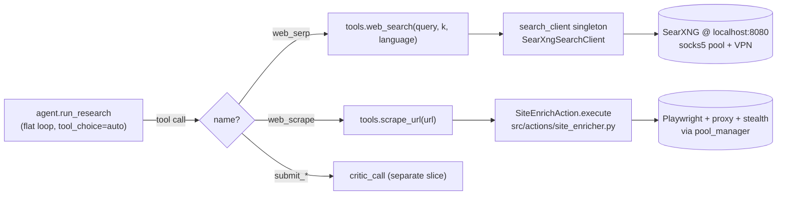

# Research Agent: Tools (`src/actions/research/tools.py`)

## Files analyzed

- `src/actions/research/tools.py` — two plain async functions used by
  `src/actions/research/agent.py:run_research`. No LangChain dispatcher;
  the agent calls these directly.

## Purpose & responsibilities

Thin async wrappers exposing the service's existing search / scrape
primitives to the flat-loop research agent. Each is the **reuse seam**
required by Constitution Principle X(c) — the research loop never talks
to SearXNG / `SiteEnrichAction` directly, only through these two
functions.

Three concerns:

1. Translate the lightweight string args the LLM emits into the richer
   request objects the underlying services expect.
2. Bound failure: catch backend exceptions and surface them as
   JSON-friendly result dicts (`[]` / `{"success": False, "error": ...}`)
   so the loop keeps going.
3. Provide a uniform JSON-serialisable return shape (`list[dict]` for
   search, `dict` for scrape) that the LLM can reason over for the next
   tool call.

## Key functions

| Function | Input | Returns | Backend | Error policy |
|----------|-------|---------|---------|--------------|
| `web_search(query: str, k: int = 5, language: str \| None = None)` | string query, optional `k` and BCP-47 language hint | `list[{url, title, snippet}]` | `src.infrastructure.external_api.search_client.search_client.search()` → `SearXngSearchClient` (singleton, shared with `POST /serper`) | Returns `[]` on any exception; error logged. The agent never sees an error sentinel mixed in with results. |
| `scrape_url(url: str)` | URL string | `{url, text, word_count, success: True}` on success; `{url, error, success: False}` on failure | `src.actions.site_enricher.SiteEnrichAction().execute(url)` (Playwright + proxy + stealth via `pool_manager`) | Catches all exceptions, returns the failure dict so the agent's domain-fail tracking can act on it. |

The agent additionally runs `goal_conditioned_extract` on the returned `text` before passing it back to the LLM (see report 13).

`extract_facts`, `extract_facts_llm`, `EXTRACT_FACTS_SCHEMA` and the LangChain `@tool` decorator were all **removed on 2026-05-29** as part of the rewrite.

## Data flow within slice

1. `agent.py` builds the OpenAI `tools=[...]` array around these wrappers (`web_serp` / `web_scrape` are the function-call shapes the LLM sees).
2. On a tool call, the agent JSON-decodes the model's arguments and `await`s the matching wrapper directly — no `action_registry`, no `langchain_core.tools.tool.ainvoke`.
3. The wrapper returns plain dicts / lists. The agent wraps them with `_supervisor_hint` / `_blocked_domains` (for `web_serp`) or runs `goal_conditioned_extract` (for `web_scrape`), then JSON-dumps the result into a `role:"tool"` message that becomes the next turn's input.
4. On any backend exception the wrapper returns a sentinel. For `scrape_url` the agent tracks the failing domain in `state.domain_fail_count`; after `RESEARCH_DOMAIN_FAIL_THRESHOLD` failures (default 3) the domain is announced as `_blocked_domains` on the next serp result (whitelisted infra domains in `RESEARCH_DOMAINS_NEVER_BLOCK` are exempt).

## Mermaid diagram

## External dependencies

- `src.infrastructure.external_api.search_client.search_client` — module-level singleton `SearXngSearchClient` (same instance used by `POST /serper`, so SearXNG config — `SEARXNG_BASE_URL`, retries, timeouts — is shared via `core.config`).
- `src.actions.site_enricher.SiteEnrichAction` — direct Python call (no HTTP loopback through `/api/v1/enrich`, no Taskiq actor). Bypasses API-layer auth and the `RateLimitMiddleware`; observability must live at the tool / action layer.
- `src.core.logging.get_logger` (for `web_search`) / stdlib `logging` (for `scrape_url`).
- No `langchain_core` import. No `action_registry`.

## Tests covering this slice

- **No dedicated `tests/unit/research/test_tools.py`.** The wrappers are exercised indirectly via `tests/integration/test_research_agent.py`, which monkeypatches `web_search` / `scrape_url` to fake responses and walks the full `run_research` loop.

## Open questions / smells

- **Constitution X(c) compliance: PASS.** Both paths use in-house infrastructure (SearXNG container, `SiteEnrichAction`). No Google / Bing / Serper API client is imported.
- **Bypass of `RateLimitMiddleware`.** `scrape_url` calls `SiteEnrichAction().execute(...)` directly, so its outbound HTTP isn't rate-limited by the middleware. Acceptable today (research is bursty and ad-hoc, and the rate-limit middleware is misconfigured anyway — see report 20 C-01), but worth re-evaluating once C-01 is fixed.
- **No concurrency control inside the wrapper.** `mode.scrape_concurrency` is declared in `ModePreset` but currently unused by the agent — scrapes are dispatched one tool call at a time. Parallel `web_scrape` calls would require the agent to fan out, which it doesn't yet.
- **Sentinel-on-error pattern is invisible to the LLM.** A failed `scrape_url` returns `{"success": false, "error": "..."}`; nothing forbids the model from "citing" the URL anyway. Domain-fail tracking and the critic-gate are the safety nets.
- **`scrape_url` returns the full `text` from `SiteEnrichAction`** (≤ 500 words per `EnrichedContent` invariant). `agent.py` then runs `goal_conditioned_extract` to trim further to `RESEARCH_SCRAPE_BUDGET_CHARS` (default 3 500). The two truncations are independent — if `SiteEnrichAction` ever drops the 500-word cap, the agent's budget is the next backstop.
- **No isolated unit tests for the wrappers.** Their argument shapes and exception-to-sentinel mapping are only covered by the integration smoke. A small `test_tools.py` (`AsyncMock` on `search_client._client.get` and on `SiteEnrichAction.execute`) would be cheap insurance.
