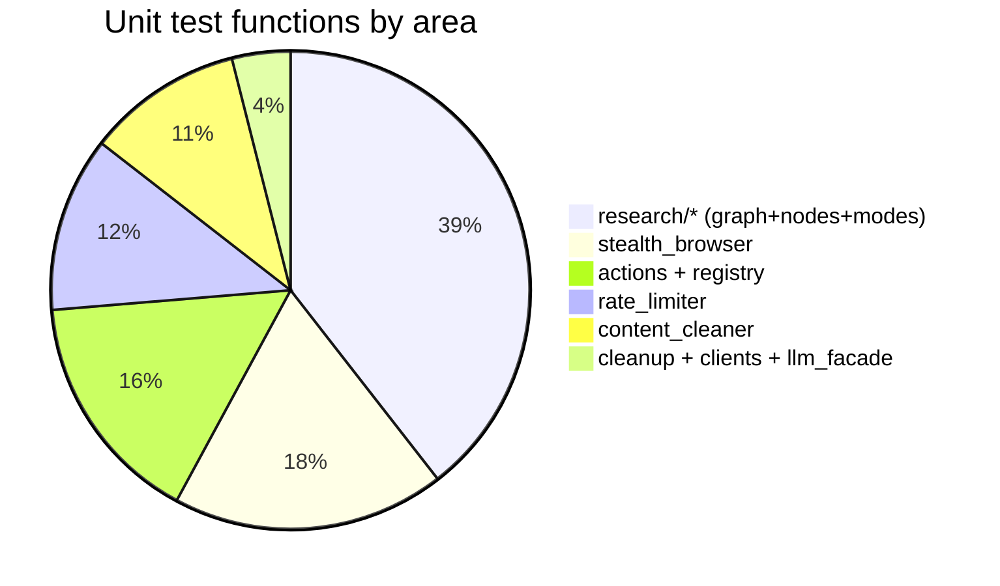

# Tests: tests/unit/

## Files analyzed

| File | Test functions (approx) | Topic |
| --- | --- | --- |
| `tests/unit/test_actions.py` | 12 | navigation/scroll actions + ActionRegistry / CommandType enum |
| `tests/unit/test_cleanup.py` | 1 | browser session inactivity timeout |
| `tests/unit/test_clients.py` | 1 | LLM client separation (extraction vs orchestration) |
| `tests/unit/test_content_cleaner.py` | 8 | HTML cleaning + word-limit truncation |
| `tests/unit/test_llm_facade.py` | 1 | `LLMFacade` ABC cannot be instantiated |
| `tests/unit/test_rate_limiter.py` | 9 | TokenBucket / RateLimitRule / RateLimitMiddleware sanity |
| `tests/unit/test_stealth_browser.py` | 14 | StealthPool, UserAgentPool, HumanEmulator surface checks |
| `tests/unit/research/test_modes.py` | 10 | ResearchMode presets (speed/balanced/quality) + user overrides |
| `tests/unit/research/test_nodes.py` | 10 | LangGraph nodes (classify/plan/search/dedupe/scrape/answer + beast-mode triggers) |
| `tests/unit/research/test_state_transitions.py` | 10 | Graph routing predicates + graph.compile() for each mode |

Total: ~76 test functions across 10 files. No local `conftest.py` under `tests/unit/` — the global `tests/conftest.py` provides two autouse fixtures (`mock_redis`, `reset_research_store`) that apply here too.

## Purpose & responsibilities

Unit suite is the lightest tier — no Docker, no real Redis, no real Playwright. It targets:

1. **Domain / registry plumbing** — `ActionRegistry` + `CommandType` enum (test_actions.py).
2. **Pure helpers** — `content_cleaner` HTML→text + word-limit truncation.
3. **Configuration plumbing** — that two LLM clients (`extraction` / `orchestration`) are correctly wired from settings, and that `LLMFacade` is an ABC.
4. **Rate-limit primitives** — module/model import sanity, domain glob matching (`*.yandex.*`), middleware init from settings.
5. **Stealth browser surface** — that `StealthPool`, `UserAgentPool`, `HumanEmulator` expose the expected methods and option flags (headless, no-sandbox, viewport, locale, ≥5 UAs, platform filter).
6. **Session lifecycle** — single test that fakes a stale `last_active` and asserts the cleanup worker prunes the session after the 10-min timeout.
7. **Research agent core** — most substantive group. Covers mode presets (max_iterations, search_k, token budgets), every node function with a fake LLM/search client, all routing predicates of the LangGraph, and that the graph compiles for all three modes.

Effectively a smoke + invariant suite — no end-to-end execution paths, mostly "module exists / method exists / preset value is X / predicate routes correctly".

## Key test groups

### Actions / Registry (`test_actions.py`)
- `GotoAction`, `ScrollAction` called with `MagicMock` page + `AsyncMock` for `goto`/`evaluate`; asserts `{"status": "success"}` envelope and that URL / direction are parsed from `params`.
- Registry tests: register/get round-trip, unknown CommandType returns `None`, multi-registration, enum is a `str` subclass (serialization friendly), `goto`/`scroll` are auto-registered on import.

### Content cleaner (`test_content_cleaner.py`)
- Pure-function tests: removes `<script>` / `<style>`, preserves visible text, truncates to 500 words while keeping sentence boundaries, accurate word count.

### Rate limiter (`test_rate_limiter.py`)
- `RateLimitRule` validation (domain pattern, requests/window), domain glob matching against `*.yandex.*` (this assertion is duplicated in `test_yandex_domain_matches_pattern`), `disabled=True` short-circuit, middleware has a `dispatch` method and initializes with rules pulled from settings. Note: no time-based bucket refill or "exceed → 429" scenarios — those live in contract/integration.

### Stealth browser (`test_stealth_browser.py`)
- Existence/shape tests only — no real Playwright launch. Asserts launch options dict contains `--no-sandbox` etc., context options carry `viewport` and `locale="en-US"`, UA pool has ≥5 unique UAs and supports a platform filter, `HumanEmulator` exposes `mouse_move`/`click`/`type`/`scroll`.

### Session cleanup (`test_cleanup.py`)
- Inserts a fake session into `session_manager.sessions`, rewinds `last_active` by ~700 s, runs the cleanup pass, asserts the session was removed.

### LLM facade / clients (`test_llm_facade.py`, `test_clients.py`)
- `test_llm_facade_base` — calling `LLMFacade()` raises `TypeError` (abstract).
- `test_clients_separation` — reads settings and verifies that the extraction client and the orchestration client are distinct objects with distinct `model_name` / `base_url`.

### Research modes (`research/test_modes.py`)
- Hardcoded preset values: speed → `max_iters=2`, `search_k=3`; balanced → 6/5; quality → 25/8. User overrides for `max_iterations` and `max_tokens` and bounds-validation.

### Research nodes (`research/test_nodes.py`) — the only file with real mocking
- `monkeypatch` replaces `facade.get_orchestration_client` with a `_FakeClient` returning canned JSON.
- `monkeypatch` replaces `search_client.search` with a `fake_search`.
- `patch` wraps `scrape_url` with an `AsyncMock`.
- Tests: classifier returns query type; planner emits gaps; search returns candidates; dedupe drops visited URLs; stall counter increments when 0 new results; beast-mode triggers at 85% token budget, at deadline, and at stall-threshold; scrape marks URL visited; `answer` node always returns output.

### Research graph (`research/test_state_transitions.py`)
- Pure predicate tests on the routing functions: continue when gaps remain and not beast-mode, stop when gaps empty / beast-mode / max iterations / stall threshold, `answer` transitions to `writer`. Plus `graph.compile()` succeeds for all three modes and `REQUIRED_NODES` are wired.

## Coverage map (модуль → тесты)

| src module | tests | покрытые сценарии |
| --- | --- | --- |
| `src/actions/navigation.py` (`GotoAction`, `ScrollAction`) | `tests/unit/test_actions.py` | success envelope, params parsing, default direction |
| `src/domain/registry/action_registry.py` | `tests/unit/test_actions.py` | register/get, unknown → None, multi-register, singleton, goto/scroll auto-registered |
| `src/domain/models/dsl.py` (`CommandType`) | `tests/unit/test_actions.py` | enum values present, is `str` subclass |
| `src/domain/utils/content_cleaner.py` | `tests/unit/test_content_cleaner.py` | strip `<script>`/`<style>`, preserve text, truncate by words, sentence boundary, word count |
| `src/infrastructure/browser/session_manager.py` | `tests/unit/test_cleanup.py` | inactivity timeout (>600 s) → session removed |
| `src/infrastructure/external_api/facade.py` (`LLMFacade` ABC) | `tests/unit/test_llm_facade.py` | abstract → `TypeError` on instantiation |
| `src/infrastructure/external_api/facade.py` + `clients/openai_client.py` | `tests/unit/test_clients.py` | extraction vs orchestration clients have distinct settings |
| `src/infrastructure/rate_limiter/token_bucket.py` | `tests/unit/test_rate_limiter.py` | module imports only (no refill / exhaust scenarios) |
| `src/domain/models/rate_limit_rule.py` | `tests/unit/test_rate_limiter.py` | model exists, validation, glob matching, disabled flag |
| `src/api/middleware/rate_limit.py` | `tests/unit/test_rate_limiter.py` | has `dispatch`, initialises from settings |
| `src/infrastructure/browser/stealth_pool.py` (`StealthPool`, `HumanEmulator`) | `tests/unit/test_stealth_browser.py` | launch/close/create_context methods exist, launch options include `--no-sandbox`, context has viewport + `en-US` locale, `human_emulation_enabled` flag, HumanEmulator surface |
| `src/infrastructure/browser/user_agent_pool.py` | `tests/unit/test_stealth_browser.py` | `get_random_ua()` returns string, ≥5 UAs, platform filter |
| `src/actions/research/modes.py` + `state.py` | `tests/unit/research/test_modes.py` | preset constants (max_iters, search_k, max_tokens), user override, bounds |
| `src/actions/research/nodes.py` | `tests/unit/research/test_nodes.py` | classify, plan, search, dedupe, scrape, answer, beast-mode triggers (budget/deadline/stall) |
| `src/actions/research/graph.py` | `tests/unit/research/test_state_transitions.py` | routing predicates, compile for speed/balanced/quality, `REQUIRED_NODES` |

## External dependencies (what's mocked)

- **Redis** — global `tests/conftest.py::mock_redis` (autouse) patches `redis.asyncio.Redis.from_url` and `redis.asyncio.client.Redis.from_url` with a `MagicMock` whose `ping`/`publish`/`close`/`pubsub.listen` are AsyncMocks; sync `redis.Redis.from_url` is forced to raise `ConnectionError` so `research_store` falls back to its per-process in-memory dict (cleared before/after each test by `reset_research_store`).
- **LLM** — in `test_nodes.py`, `facade.get_orchestration_client` is monkeypatched to a `_FakeClient` returning canned JSON; no httpx traffic.
- **Web search** — `search_client.search` monkeypatched with a `fake_search`.
- **Playwright** — not launched anywhere in the unit suite. `test_actions.py` passes a `MagicMock` `page` with `AsyncMock`'d `goto`/`evaluate`. `test_stealth_browser.py` only inspects class/method existence and option dictionaries.
- **scrape_url** — patched with `AsyncMock` in `test_nodes.py`.

## Mermaid diagram

## Open questions / smells

- **No real token-bucket behaviour tested.** `test_rate_limiter.py` only checks module/model existence and one regex match; refill, exhaustion → 429, Redis-down fallback are not in unit. Cross-ref `12-infra-rate-limit-core.md` — actual bucket semantics live there but are covered (if at all) only at contract/integration tier.
- **No coverage for whole subsystems**:
  - `src/api/websockets/*` — zero unit coverage (cross-ref `02-api-websockets.md`).
  - `src/actions/extraction.py`, `interaction.py`, `yandex_maps.py`, `site_enricher.py` — only `navigation.py` has unit tests; extractor actions and Yandex Maps action lack unit coverage (cross-ref `07-actions-basic.md`, `08-actions-extractors.md`).
  - `src/infrastructure/browser/pool_manager.py`, `proxy_provider.py` — no direct unit tests despite being load-bearing (cross-ref `09-infra-browser.md`).
  - `src/infrastructure/tasks/*` (Taskiq broker, research_store) — only indirectly exercised via the `reset_research_store` autouse fixture (cross-ref `11-infra-queue.md`).
  - `src/actions/research/tools.py` — covered only transitively via node tests; no direct unit (cross-ref `15-research-tools.md`).
  - `src/domain/models/business_card.py`, `enriched_content.py`, `requests.py` — no model-level unit tests (cross-ref `05-domain-models.md`).
- **"Module exists" tests** (`test_*_module_exists`, `test_*_has_*_method`) duplicate what an `import` + linter would catch — they pad the count but rarely catch regressions beyond signature drift.
- **Duplicate assertion**: `test_rate_limit_rule_matches_domain` and `test_yandex_domain_matches_pattern` test the same `*.yandex.*` matching.
- **`@pytest.mark.asyncio` on synchronous tests**: many tests in `test_content_cleaner.py`, `test_rate_limiter.py`, `test_stealth_browser.py` are marked async despite calling only sync code — harmless with `asyncio_mode = "auto"` but misleading.
- **No skipped/xfailed tests** in the unit suite — `AGENTS.md` Test Suite Status section reports "17 unit, fully mocked, 0 skipped" but the actual file count yields ~76 functions; either the number in `AGENTS.md` is stale or it counted at a coarser granularity.
- **No hardcoded secrets** spotted; `default_internal_key` is the only API-key sentinel and lives in settings, not in the unit files.
- **`tests/unit/test_cleanup.py` manipulates `time.time()` indirectly** by writing a stale `last_active`; if the production code switches to `time.monotonic()` this test will silently keep passing while real timeouts break.
