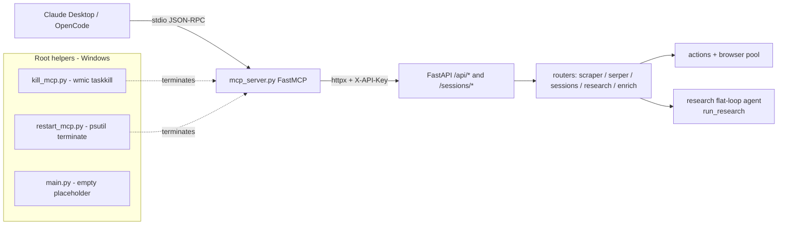

# MCP Server (src/mcp_server.py) + root helpers

## Files analyzed
- `src/mcp_server.py` — single-file FastMCP server exposing all Atomic Scraper REST endpoints as MCP tools.
- `main.py` (repo root) — empty/placeholder; no entry-point logic.
- `kill_mcp.py` — Windows-only process killer (uses `subprocess` + `wmic`) for `mcp_server.py` processes.
- `restart_mcp.py` — despite the name, only **kills** MCP processes via `psutil`; does not relaunch them.
- Cross-references: `README.md` §"MCP Server", `STRUCTURE.md`.

## Purpose & responsibilities
Translate every Atomic Scraper HTTP endpoint into an MCP tool callable from Claude Desktop / OpenCode over **stdio**. The server is intentionally a thin shim: it does not own a Playwright browser, scraping logic, or session state; it just builds JSON, fires `httpx` POST/GET/DELETE at the FastAPI app (default `http://localhost:8000`) and returns the JSON back.

It is the bridge that lets an LLM client drive both stateless one-shot endpoints (`/scraper`, `/serper`, `/jina-extract`, `/omni-parse`) and stateful browser sessions (via the `/sessions/{id}/command` HTTP-DSL transport rather than the WS one).

## Tools exported

| tool name | args | HTTP endpoint hit | notes |
| --- | --- | --- | --- |
| `scrape` | `url, proxy=None, wait_until="domcontentloaded"` | `POST /scraper` | stateless one-shot page fetch |
| `search` | `q, num=10` | `POST /serper` | SERP wrapper |
| `omni_parse` | `base64_image, prompt=None` | `POST /omni-parse` | OmniParser vision call |
| `jina_extract` | `html, extraction_schema=None` | `POST /jina-extract` | HTML→JSON via Jina/Reader |
| `yandex_maps_extract` | `category, lat, lng, radius=1000` | `POST /api/v1/yandex-maps/extract` | data-extraction pipeline |
| `enrich_website` | `url, crawl_about=False, crawl_services=False` | `POST /api/v1/enrich` | site enrichment |
| `research_run` | `query, mode="balanced"` | `POST /api/v1/research/run` | enqueues a flat-loop research task (`run_research`); the underlying `/research/run` body also accepts `language`, `output_schema`, `max_iters`, `max_tokens`, but the current MCP wrapper does not forward them |
| `research_status` | `task_id` | `GET /api/v1/research/status/{id}` | poll |
| `research_stream` | `task_id` | `GET /api/v1/research/stream/{id}` | SSE/streaming endpoint |
| `create_session` | — | `POST /sessions` | returns `session_id` to client |
| `delete_session` | `session_id` | `DELETE /sessions/{id}` | tear-down |
| `session_goto` | `session_id, url` | `POST /sessions/{id}/command` | DSL `goto` over HTTP |
| `session_scroll` | `session_id, direction="down", amount=400` | `POST /sessions/{id}/command` | DSL `scroll` |
| `session_click` | `session_id, x, y` | `POST /sessions/{id}/command` | DSL `click` (coords) |
| `session_type` | `session_id, selector, text` | `POST /sessions/{id}/command` | DSL `type` |
| `session_screenshot` | `session_id` | `POST /sessions/{id}/command` | DSL `screenshot` |
| `session_click_omni` | `session_id, element_description` | `POST /sessions/{id}/command` | DSL `click_omni` (vision-targeted) |
| `session_extract_jina` | `session_id, extraction_schema` | `POST /sessions/{id}/command` | DSL `extract_jina` |

## Transport & lifecycle
- Transport: **stdio** (default `mcp.run()` of FastMCP, no `transport=` override).
- Bootstrap: `if __name__ == "__main__": mcp.run()` — launched directly via `python src/mcp_server.py` or `python -m src.mcp_server`.
- Env vars: **not read from environment** in the code path — `BASE_URL` and `API_KEY` are hard-coded constants at module top (`http://localhost:8000`, placeholder `your_internal_key` / `default_internal_key`). The Claude Desktop config in README passes `API_KEY` via `env:` but the server does not look it up via `os.getenv()` (see Smells).
- Auth: every `httpx` call attaches `headers={"X-API-Key": API_KEY}` (the same header that `src/api/middleware/auth.py` validates).

## Data flow within slice

```
Claude Desktop / OpenCode
  └─ stdio JSON-RPC ──► FastMCP dispatcher (src/mcp_server.py)
        └─ tool fn ──► httpx.AsyncClient.{post,get,delete}
              ├─ POST /scraper, /serper, /jina-extract, /omni-parse  (stateless)
              ├─ POST /sessions, DELETE /sessions/{id}              (lifecycle)
              ├─ POST /sessions/{id}/command                        (DSL over HTTP)
              └─ POST/GET /api/v1/{enrich,yandex-maps,research}     (pipelines)
                    └─ FastAPI routers → actions / research graph / browser pool
```

The session tools are stateless from the MCP side: the client (LLM) is responsible for carrying `session_id` between calls. The MCP process holds no per-session state, so it can crash/restart without losing browser sessions (state lives in the API server's session registry).

## Mermaid diagram



## External dependencies
- `fastmcp` (FastMCP SDK) — `FastMCP(...)` + `@mcp.tool()` decorators + `mcp.run()`.
- `httpx` (async client) — all outbound calls.
- `psutil` (only in `restart_mcp.py`).
- `subprocess` + Windows `wmic` (only in `kill_mcp.py`).
- No `pydantic-settings`, no `tenacity`, no `structlog` in this slice.

## Tests covering this slice
None found. No `tests/**/test_mcp_server*` files in the search results — the MCP layer is exercised only manually by an MCP client (Claude Desktop / OpenCode). The contract/integration suites cover the underlying FastAPI endpoints that the MCP tools call.

## Open questions / smells
- **Hard-coded `BASE_URL` and `API_KEY`** — README's `env: { API_KEY: ... }` block is misleading because the code never calls `os.getenv`. Either add `os.getenv(..., default)` or wire `pydantic-settings`. Today, changing `API_KEY` from the MCP client config has no effect.
- **`BASE_URL = "http://localhost:8000"` hard-coded** — breaks when the API runs in a container with a different host/port or remotely.
- **Session tools route through HTTP `POST /sessions/{id}/command` instead of WebSocket** — the architectural comment in README ("MCP runs over stdio and cannot maintain a persistent WS connection") is correct, but each click/scroll pays a full HTTP round-trip, plus a re-attach of the Playwright session on the server side per command.
- **No retries / no timeouts / no structured error mapping.** `resp.raise_for_status()` propagates raw `httpx.HTTPStatusError` to the MCP client, which surfaces as an opaque tool failure to the LLM.
- **No structured logging.** Hard to debug MCP tool failures without re-running with `httpx` debug.
- **`main.py` at repo root is empty / dead.** Likely scaffolding leftover (the real API entry-point is `src/api/main.py`). Candidate for deletion.
- **`restart_mcp.py` does not restart** — it only terminates. The name should be `kill_mcp_psutil.py`, or it should actually `subprocess.Popen([...,'src/mcp_server.py'])` after termination.
- **`kill_mcp.py` is Windows-only** (uses `wmic`, which is also deprecated on modern Windows). Non-portable to the dev-container / Linux CI.
- **README "Available Tools" list matches the implementation** (cross-checked above) — no drift in tool names for now.
