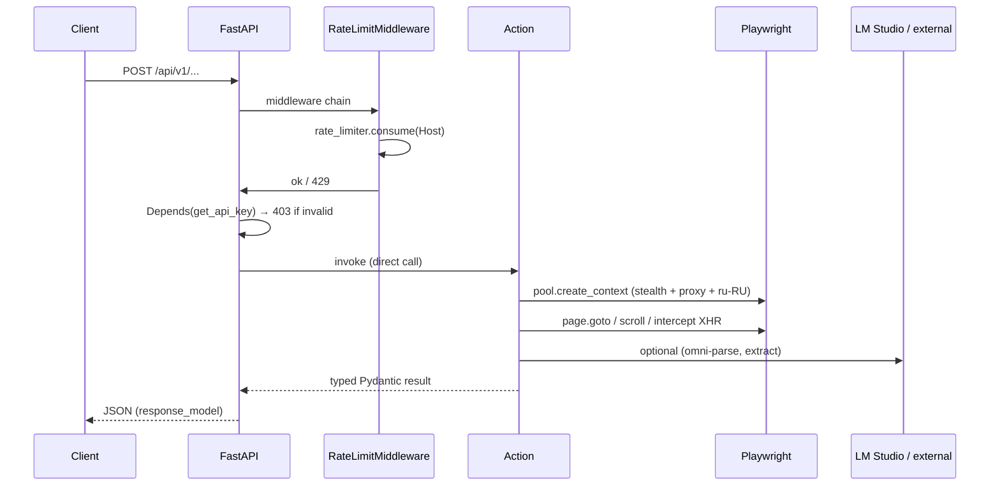
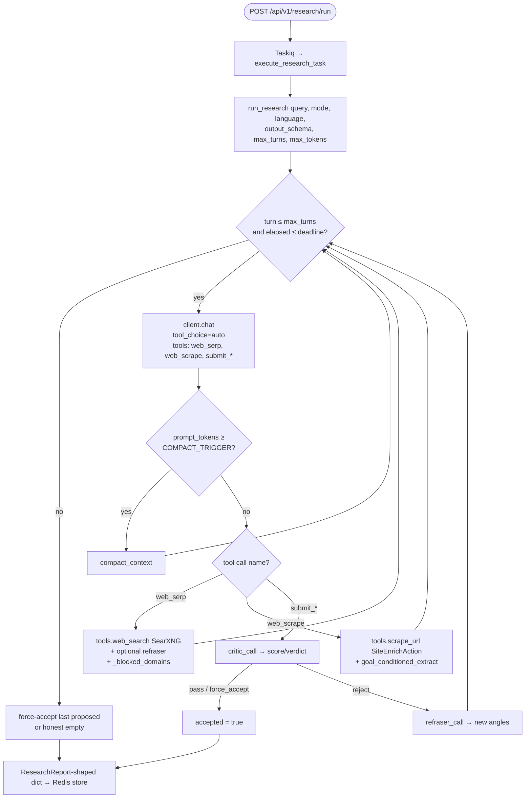

# Atomic Scraper Service — Project Overview

> Сгенерировано на основе 20 узких отчётов в этой же директории (`01-*.md` … `20-*.md`).
> Источник истины — код в `src/`; данная сводка отражает фактическую реализацию по состоянию на текущий момент.

## 1. Что это за сервис

Backend-сервис для веб-скрейпинга и автономного research'а. Построен на FastAPI + Playwright + Redis (Taskiq) и реализует **два контекста** (constitution I): **stateless** — атомарные HTTP-эндпоинты, использующие общий браузерный пул и возвращающие результат синхронно; и **stateful** — долгоживущие интерактивные DSL-сессии (`POST /sessions` + WebSocket / Redis pub/sub), где каждый `session_id` обслуживается отдельным Taskiq-актёром с собственным Playwright-контекстом. Поверх скрейпинговых примитивов поднят **Research Agent** (`src/actions/research/agent.py:run_research`) — плоский tool-calling loop (`chat.completions` с `tool_choice="auto"`, три тулзы: `web_serp`/`web_scrape`/динамический submit), с critic-gate на сабмите и двумя режимами вывода (free-form markdown или caller-supplied JSON Schema). Доступен через `POST /api/v1/research/run`. Параллельно живёт MCP-сервер (`src/mcp_server.py` на FastMCP, stdio), который экспонирует все REST-эндпоинты как MCP-tools для Claude Desktop / OpenCode.

## 2. Слои и их ответственность

Clean Architecture с однонаправленной зависимостью API → Domain ← Actions ← Infrastructure (constitution IV).

- **API** (`src/api/`) — `routers/` (7 HTTP + WS handler), `middleware/rate_limit.py`, `auth.py`, `main.py` (FastAPI app + lifespan). Тонкий слой: парсинг Pydantic, делегирование в Actions / Infra, ставит задачи в Taskiq. → см. `01-api-routers.md`, `02-api-websockets.md`, `03-api-middleware.md`, `04-api-bootstrap.md`.
- **Domain** (`src/domain/`) — `models/` (Pydantic-DTO для REST + DSL + Research + Yandex), `registry/action_registry.py` (singleton map `CommandType → Callable`), `utils/content_cleaner.py` (HTML→text + truncation на 500 слов для FR-007). → см. `05-domain-models.md`, `06-domain-utils-registry.md`.
- **Actions** (`src/actions/`) — async-функции-handlers DSL (navigation/interaction/extraction), плюс вертикальные actions `yandex_maps.py` и `site_enricher.py`, плюс подсистема `research/` (`agent.py` — flat-loop `run_research`, `tools.py` — `web_search`/`scrape_url`, `modes.py`, `research_agent_prompts.yaml`, `llm_utils.py`). → см. `07-actions-basic.md`, `08-actions-extractors.md`, `13-research-graph-state.md`, `14-research-nodes.md` (deprecated stub), `15-research-tools.md`.
- **Infrastructure** (`src/infrastructure/`) — `browser/` (Playwright pool, stealth, proxy, UA, session_manager), `external_api/` (`LLMFacade` + OpenAI-compatible client + SearXNG client), `queue/` (Taskiq broker, session_actor, cleanup_worker, research_task), `rate_limiter/token_bucket.py` (fixed-window на Redis), `tasks/research_store.py`. → см. `09-infra-browser.md`, `10-infra-external-api.md`, `11-infra-queue.md`, `12-infra-rate-limit-core.md`.
- **Core** (`src/core/`) — `config.py` (`pydantic-settings`, читает `.env`) и `logging.py` (stdlib `logging`, без structlog). → см. `12-infra-rate-limit-core.md`.

Дополнительно: `src/mcp_server.py` — отдельный процесс-шлюз для MCP-клиентов (см. `19-mcp-server.md`).

## 3. Модель данных

Все модели — Pydantic v2 в `src/domain/models/`. ORM нет; persistence — только Redis (Taskiq + KV + pub/sub).

| Модель | Файл | Где используется |
| --- | --- | --- |
| `ScrapeRequest` / `ScrapeResponse` | `src/domain/models/requests.py` | `POST /scraper` |
| `SearchRequest` / `SearchResponse` / `SearchResult` | `src/domain/models/requests.py` | `POST /serper` (SearXNG-backed) |
| `OmniParseRequest` | `src/domain/models/requests.py` | `POST /omni-parse` (нет `response_model`) |
| `HtmlToMdRequest` | `src/domain/models/requests.py` | `POST /html-to-md` (заменил spec'ный `/jina-extract`) |
| `YandexMapsExtractRequest` / `*Response` | `src/domain/models/requests.py` | `POST /api/v1/yandex-maps/extract` |
| `YandexMapsReviewsRequest` / `*Response` | `src/domain/models/requests.py` | `POST /api/v1/yandex-maps/reviews` |
| `YandexOrganization` (+ ~10 sub-моделей) | `src/domain/models/yandex_organization.py` | Yandex Maps action; `extra="allow"`, ~65 полей |
| `YandexReview` (+ sub-модели) | `src/domain/models/yandex_review.py` | Yandex Maps reviews action |
| `EnrichRequest` / `EnrichResponse` | `src/domain/models/requests.py` | `POST /api/v1/enrich` |
| `EnrichedContent` | `src/domain/models/enriched_content.py` | `SiteEnrichAction`; валидатор `word_count <= 600` |
| `Command` / `CommandType` / `InteractiveSession` | `src/domain/models/dsl.py` | WS handler, `session_actor`, `action_registry` |
| `RateLimitRule` | `src/domain/models/rate_limit_rule.py` | `RateLimitMiddleware`, `TokenBucket` |
| `ResearchRequest` / `ResearchReport` / `Source` / `ResearchStats` | `src/domain/models/research.py` | `/api/v1/research/*`, `research_task`, `run_research` |
| `ResearchTaskStatus` / `ResearchTaskCreateResponse` | `src/domain/models/research.py` | `/api/v1/research/run|status` |
| `AgentState` (dataclass, local) | `src/actions/research/agent.py` | внутри одного вызова `run_research`; не persisted, не Pydantic |
| `RedisUnavailableError` | `src/domain/models/errors.py` | sessions router, WS manager |

Источник — `05-domain-models.md`. Отсутствуют упомянутые в `STRUCTURE.md` `business_card.py` и в `013-fix-impl/data-model.md` `LLMExtractRequest` (см. отчёт 20, C-05/M-11).

## 4. API surface

Источник — `01-api-routers.md`, `02-api-websockets.md`, `04-api-bootstrap.md`, `17-tests-contract.md`.

| Endpoint | Auth | Router | Что вызывает |
| --- | --- | --- | --- |
| `GET /healthz` | no | `health.py` | Redis ping + `pool_manager` probe |
| `POST /scraper` | yes | `stateless.py` | `pool_manager.create_context` → Playwright |
| `POST /serper` | yes | `stateless.py` | `search_client` singleton → SearXNG |
| `POST /omni-parse` | yes | `stateless.py` | `orchestration_client` (LLMFacade) |
| `POST /html-to-md` | yes | `stateless.py` | локальная конверсия (`content_cleaner`) |
| `POST /sessions` | yes | `sessions.py` | `run_session_actor.kiq()` (Taskiq) |
| `POST /sessions/{id}/command` | yes | `sessions.py` | Redis `PUBLISH cmd:{id}` → ждёт `res:{id}` (60 s timeout) |
| `DELETE /sessions/{id}` | yes | `sessions.py` | Redis cleanup |
| `WS /ws/{session_id}` | **none** | `websockets/handler.py` | bridge между WS и Redis `cmd:`/`res:` (нет валидации, нет auth) |
| `POST /api/v1/yandex-maps/extract` | yes | `yandex_maps.py` | `YandexMapsExtractAction.execute` |
| `POST /api/v1/yandex-maps/reviews` | yes | `yandex_maps.py` | `YandexMapsReviewsAction.execute` |
| `POST /api/v1/enrich` | yes | `enrichment.py` | `SiteEnrichAction.execute` |
| `POST /api/v1/research/run` | yes | `research.py` | `execute_research_task.kiq(task_id)` (202) |
| `GET /api/v1/research/status/{task_id}` | yes | `research.py` | `research_store.get_task` |
| `GET /api/v1/research/stream/{task_id}` | yes | `research.py` | SSE polling, `POLL_INTERVAL=2.0`, `SSE_TIMEOUT=1800` |

Глобально включён только `RateLimitMiddleware` (ключуется по входящему `Host` — см. отчёт 20, C-01). Auth — per-route через `Depends(get_api_key)`, возвращает 403 вместо ожидаемого 401 (C-07).

## 5. Поток данных — Stateless



## 6. Поток данных — Stateful (DSL session)

```mermaid
sequenceDiagram
    participant Client
    participant API
    participant Redis
    participant Actor as Session Actor (Taskiq)
    participant Browser as Playwright

    Client->>API: POST /sessions
    API->>Actor: run_session_actor.kiq(session_id, proxy, ua, ...)
    Actor->>Browser: pool.create_context + new_page
    Actor->>Redis: SUBSCRIBE cmd:{session_id}

    par Client→commands
        Client->>API: WS /ws/{id}  OR  POST /sessions/{id}/command
        API->>Redis: PUBLISH cmd:{id} <json>
        Redis->>Actor: deliver command
        Actor->>Actor: action_registry.get_action(CommandType)
        Actor->>Browser: await handler(page, params)
        Browser-->>Actor: result / error
        Actor->>Redis: PUBLISH res:{id} <json>
        Redis-->>API: message on res:{id}
        API-->>Client: WS send_text / HTTP response
    and InactivityCheck (inside actor)
        loop wait_for(get_message, timeout=10s)
            Actor->>Actor: if now - last_active > SESSION_INACTIVITY_TIMEOUT: break
        end
    end

    alt Client DELETE /sessions/{id} OR inactivity OR {"type":"stop"}
        Actor->>Browser: context.close()
        Actor->>Redis: UNSUBSCRIBE + close
    end
```

Замечания (отчёты 02, 11, 20):
- WS-хендлер не валидирует входящий JSON, не закрывает PubSub явно, не имеет auth, не шлёт `TERMINATE` в actor при disconnect.
- `SESSION_INACTIVITY_TIMEOUT` в `docker-compose.override.yml` = 1800 s, конституция III и spec 009 FR-007 требуют 600 s (отчёт 20, C-03).
- `cleanup_worker` не зарегистрирован в `ScheduleSource` и не публикует stop-команду в `cmd:{sid}` — только убирает запись из `SessionManager` (M-15).

## 7. Очереди и воркеры

```mermaid
flowchart LR
    subgraph Redis
        Q[ListQueueBroker<br/>queue: atomic_scraper_tasks]
        PS_CMD[(pub/sub cmd:{sid})]
        PS_RES[(pub/sub res:{sid})]
        RL[(ratelimit:{domain})]
        ST[(research_store keys)]
        SM[(session_manager bookkeeping)]
    end

    API1[POST /sessions] -->|run_session_actor.kiq| Q
    API2[POST /api/v1/research/run] -->|execute_research_task.kiq| Q
    Q --> W1[Worker: run_session_actor]
    Q --> W2[Worker: execute_research_task]
    Q --> W3[Worker: cleanup_worker  no scheduler]
    Q --> W4[Worker: workers.example_task  placeholder]

    W1 <--> PS_CMD
    W1 <--> PS_RES
    W2 --> ST
    API_MW[RateLimitMiddleware] --> RL
```

Из отчёта 11: воркер-команда в `ecosystem.config.js` (PM2) грузит `broker + workers + session_actor + cleanup_worker + research_task`. `docker-compose.override.yml` грузит `session_actor + cleanup_worker + workers`. Базовый `docker-compose.yml` ссылается на несуществующий `src.infrastructure.queue.tasks` — расхождение (отчёт 20, C-08). Redis выполняет одновременно три роли (Taskiq backend, pub/sub, KV store), общий URL, без namespacing.

## 8. Research Agent (flat tool-calling loop)

> Заменил LangGraph-реализацию 2026-05-29. Подробности — отчёты
> `13-research-graph-state.md` (актуальная архитектура), `14-research-nodes.md`
> (заглушка с описанием того, что было), `15-research-tools.md` (две тулзы).



Ключевые точки (отчёты 13/15):
- Один процессный цикл, не граф. На каждом ходу модель сама решает, какую тулзу позвать, через `tool_choice="auto"`. Никаких `MemorySaver`, нод и роутера.
- **Два режима вывода** через динамически собираемую терминальную тулзу: `submit_answer(answer, sources)` → `answer_markdown`, либо `submit_result(result, sources)` где `result` ограничен caller'ской JSON Schema → `structured_output`.
- **Critic-gate**: на каждом сабмите ауxiliary LLM ставит балл и `verdict`; при `score < RESEARCH_CRITIC_PASS_SCORE` (по умолчанию 8.5) сабмит отбрасывается, агенту возвращается feedback + новые угол поиска от refraser'а. После `RESEARCH_MAX_SUBMIT_REJECTS` (по умолчанию 2) следующий сабмит force-accept'ится.
- **Hygiene**: `soft_elide` (старые `web_scrape` tool-results заменяются маркером после N ходов), `compact_context` (триггер по `RESEARCH_COMPACT_TRIGGER_TOKENS=50k`, до `RESEARCH_MAX_COMPACTIONS=3` сжатий), `goal_conditioned_extract` (regex-трим скрапа до `RESEARCH_SCRAPE_BUDGET_CHARS=3500` вокруг ключевых слов запроса/схемы и контактных regex).
- **Loop-safety**: `max_turns` (per-mode preset + caller override), wall-clock `deadline`, кумулятивный `token_budget` (prompt + completion), domain-fail tracking с whitelist `RESEARCH_DOMAINS_NEVER_BLOCK`.
- **3 режима** (`modes.py`): `speed` (`max_turns=8`, `search_k=3`, `token_budget=30K`, `deadline=120s`), `balanced` (15/5/100K/300s), `quality` (25/8/1M/1200s).
- **Все константы** — в `Settings.RESEARCH_*` (env-overridable), **все промпты** — в `src/actions/research/research_agent_prompts.yaml`. Ни одной hardcoded-цифры или строки промпта в `agent.py`.
- LLM — `get_orchestration_client()` → `OpenAICompatibleClient.chat()` (метод добавлен 2026-05-29; multi-turn, с `tools`/`tool_choice`/`timeout`). По умолчанию `qwen3.5-9b-claude-4.6-opus-reasoning-distilled` через локальный llama-server.
- Tools (constitution X(c), PASS): `web_search` → SearXNG singleton (language-aware), `scrape_url` → прямой `SiteEnrichAction().execute()` (минует API-middleware). `extract_facts*` удалены вместе с LangGraph-нодами.

## 9. Внешние зависимости

- **Redis** (7-alpine в compose) — Taskiq broker `atomic_scraper_tasks`, pub/sub `cmd:{id}`/`res:{id}`, fixed-window counters `ratelimit:{domain}` (TTL = window_seconds), research store keys, session_manager bookkeeping.
- **Playwright (Chromium)** — единый `Browser`-процесс на FastAPI/worker, новый `BrowserContext` на каждый stateless-запрос и на каждую stateful-сессию. Stealth-обёртка (`StealthBrowserPool`) добавляет launch-флаги, UA из `UserAgentPool` (~10 hardcoded), `add_init_script` для `navigator.webdriver=undefined`. Proxy инжектится при создании контекста через `{"server": url}` из `proxies.txt`.
- **LM Studio (или OpenAI-compatible)** — два логических endpoint'а в `core.config.settings`: `EXTRACTION_*` (по умолчанию `jinaai.readerlm-v2`) и `ORCHESTRATION_*` (qwen 9b reasoning). В dev-override оба указывают на `http://host.docker.internal:20022/v1/`. Один `LLMFacade` ABC + `OpenAICompatibleClient` через `openai.AsyncOpenAI`; нет retry, нет timeout-override, нет `response_format=json_object` (M-12).
- **SearXNG** (`infra/searxng/`) — единственный поисковый backend research-агента и `/serper`. Proxy-rotation живёт внутри контейнера (`searxng/settings.yml`, socks5-пул), не в Python.
- **Jina / Omni** — клиенты-плейсхолдеры из `STRUCTURE.md` отсутствуют (`jina_client.py`, `omni_client.py`). DSL-команды `extract_jina`, `click_omni` объявлены в `CommandType`, но handler'ов нет — `action_registry.get_action(...)` вернёт `None`.

## 10. Тесты

Источник — `16-tests-unit.md`, `17-tests-contract.md`, `18-tests-integration-e2e.md`.

- **unit/** — ~76 функций в 10 файлах. Основная масса (~30) на `research/*` (`test_nodes.py`, `test_modes.py`, `test_state_transitions.py`). Покрыты: `ActionRegistry`/`CommandType`, `content_cleaner`, `RateLimitRule`/middleware shape, `StealthPool`/`UserAgentPool` (только existence), `LLMFacade` ABC, session cleanup. Глубокие пробелы: WebSocket-хендлер, `extraction.py`/`interaction.py`/`yandex_maps.py`/`site_enricher.py`, `pool_manager`, `proxy_provider`, `tools.py`, MCP-сервер. Глобальный `tests/conftest.py` мокает Redis autouse.
- **contract/** — 10 файлов, ~14 эндпоинтов через `httpx.AsyncClient + ASGITransport`. Все защищённые эндпоинты покрыты на 200/403/422 + критичные ветки (503 на Redis-fail, 429 для research, captcha 503 для Yandex). **WS `/ws/{session_id}` не покрыт**. Пути контракт-тестов соответствуют коду, а не спекам 010 (`/api/v1/yandex-maps/extract` vs spec `/scrape/yandex-maps`).
- **integration/** — 11 файлов. Структурные (`test_docker_compose.py` парсит YAML), in-process FastAPI (`test_auth.py`, `test_session_redis_failure.py`), fake-Playwright (`test_proxy_integration.py`, `test_yandex_extraction.py`), flat-loop research-agent smoke (`test_research_agent.py` — заменил `test_research_graph.py` 2026-05-29). Реальный Playwright не запускается ни в одном.
- **e2e/** — 5 файлов, всего 23 теста. Из них **только 2 реально стучатся в `localhost:8000`**: `test_site_enrichment_flow::test_enrichment_returns_clean_text` и `test_yandex_maps_full_flow::test_yandex_maps_endpoint_returns_businesses` (последний требует residential-proxy в `proxies.txt`). Остальные — ASGITransport in-process.
- **MCP-сервер** — тестов нет вообще.

## 11. Несоответствия спецификациям

**Из `20-spec-vs-reality.md`**: 9 CRITICAL, 16 MAJOR, 17 MINOR, 6 INFO. Хедлайны:

1. **C-01 Rate-limit middleware ключуется по `Host` входящего запроса** → правило `*.yandex.*` никогда не матчится против целевого URL из тела запроса. FR-009/SC-005 не работают в проде.
2. ~~**C-02 `tokens_used` никогда не инкрементируется** → 85%-token-budget beast-mode мёртв; 1 из 4 hard-constraints конституции X(b) — dead code.~~ **Снят 2026-05-29**: вместе с LangGraph-агентом удалён и сам `tokens_used`/`beast_mode`. Новый flat-loop агент агрегирует `prompt_tokens`+`completion_tokens` через `OpenAICompatibleClient.chat().usage` и инфорсит кумулятивный `preset.token_budget` как hard wall в основном цикле (доп. см. отчёт 13). Loop-safety: deadline + max_turns + token_budget + critic-gate.
3. **C-03 `SESSION_INACTIVITY_TIMEOUT=1800`** в `docker-compose.override.yml` vs 600 s в spec 009 FR-007 / конституции III / AGENTS.md.
4. **C-04 `/serper` — это SearXNG, не Playwright→Google**; spec 013 FR-001/FR-002 устарел.
5. **C-05 `/jina-extract` удалён**, заменён на `/html-to-md`. MCP-tool `jina_extract` и `session_extract_jina` ведут на несуществующие URL → 404. STRUCTURE.md/AGENTS.md/web_interactions.md ссылаются на отсутствующие `jina_client.py`/`omni_client.py`/`ai_actions.py`.
6. **C-06 WebSocket не валидирует JSON, нет envelope, нет auth** на `/ws/{session_id}` — потенциальный session hijack по угадыванию `session_id`.
7. **C-07 Auth возвращает 403**, spec 011 / NFR-004 требует 401.
8. **C-08 `docker-compose.yml` грузит несуществующий модуль** `src.infrastructure.queue.tasks`; `docker compose up` без override-файла падает на импорте. PM2 и compose грузят разные наборы воркеров.
9. **C-09 `/healthz` не отдаёт 503** — спека описывает unhealthy-ветку с `{"redis": "disconnected"}`, контракт-тесты только happy-path. LB не сможет дренировать трафик.

Дополнительно: REST-пути 010 (`/scrape/yandex-maps`, `/enrich/site`) drifted; `EnrichRequest`/`YandexMapsExtractRequest` поля не совпадают со спекой; `max_iterations` (spec) vs `max_iters` (код); preset-цифры режимов в 100× больше spec'ных; DSL-actions `click_omni`/`extract_jina`/`apply_stealth`/`site_enrich` объявлены в спеке, но без handler'ов; STRUCTURE.md и AGENTS.md устарели (счётчики тестов, отсутствующие файлы).

→ полный список — в `20-spec-vs-reality.md`.

## 12. Карта отчётов

| # | Слой | Файл |
| --- | --- | --- |
| 01 | API routers | `01-api-routers.md` |
| 02 | API websockets | `02-api-websockets.md` |
| 03 | API middleware (rate-limit + auth) | `03-api-middleware.md` |
| 04 | API bootstrap (main.py, lifespan, Docker/PM2) | `04-api-bootstrap.md` |
| 05 | Domain models | `05-domain-models.md` |
| 06 | Domain utils + ActionRegistry | `06-domain-utils-registry.md` |
| 07 | Basic DSL actions (navigation/interaction/extraction) | `07-actions-basic.md` |
| 08 | Vertical actions (yandex_maps, site_enricher) | `08-actions-extractors.md` |
| 09 | Infrastructure: browser pool / stealth / proxy / session_manager | `09-infra-browser.md` |
| 10 | Infrastructure: external_api (LLMFacade, SearXNG client) | `10-infra-external-api.md` |
| 11 | Infrastructure: queue (Taskiq, session_actor, cleanup, research_task) | `11-infra-queue.md` |
| 12 | Infrastructure: rate-limiter + core (config, logging) | `12-infra-rate-limit-core.md` |
| 13 | Research Agent: graph + state + modes | `13-research-graph-state.md` |
| 14 | Research Agent: nodes | `14-research-nodes.md` |
| 15 | Research Agent: tools | `15-research-tools.md` |
| 16 | Tests: unit | `16-tests-unit.md` |
| 17 | Tests: contract | `17-tests-contract.md` |
| 18 | Tests: integration + e2e | `18-tests-integration-e2e.md` |
| 19 | MCP server + root helpers | `19-mcp-server.md` |
| 20 | Spec vs reality reconcile | `20-spec-vs-reality.md` |
