# DeepResearch Pipeline Documentation

https://github.com/jina-ai/node-deepresearch

## Overview

This document describes the deep research pipeline implemented in node-DeepResearch. The system performs iterative search-read-reason cycles until a definitive answer is found or token budget is exceeded.

---

## Main Flowchart

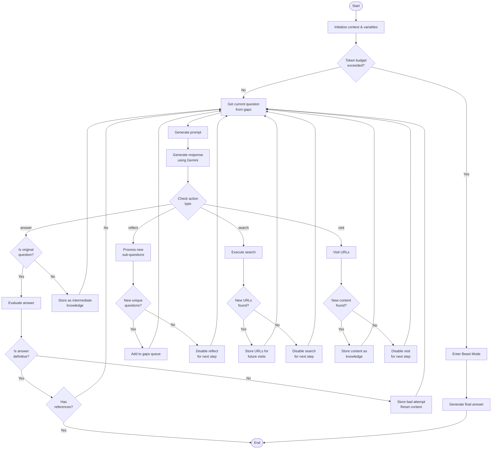

---

## Detailed Mermaid Diagrams

### 1. Search Action Flow

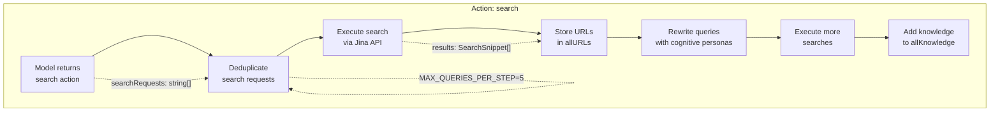

### 2. Visit Action Flow

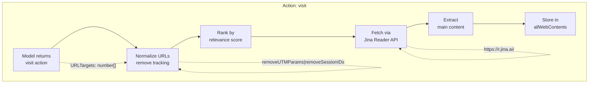

### 3. Reflect Action Flow

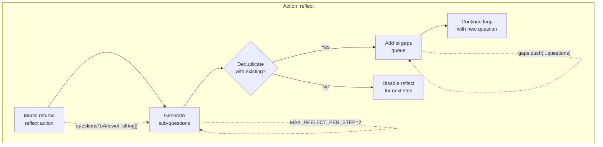

### 4. Answer & Evaluation Flow

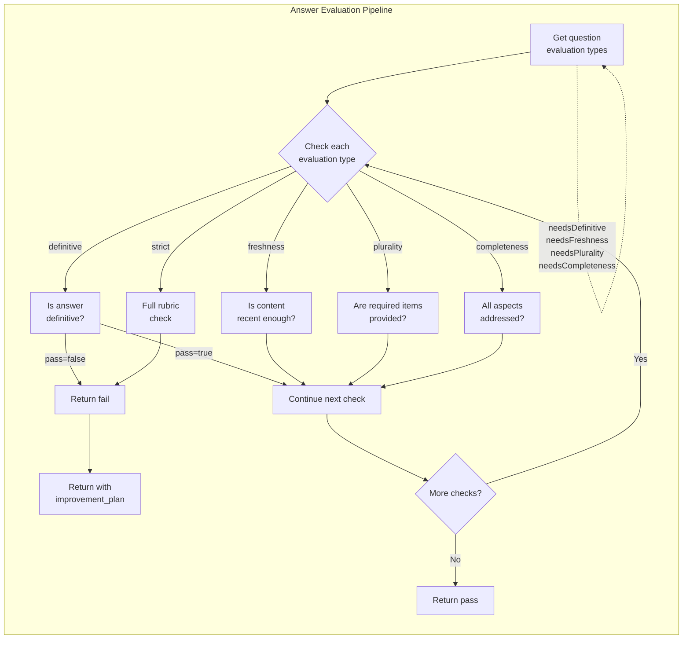

### 5. Model Interaction Flow

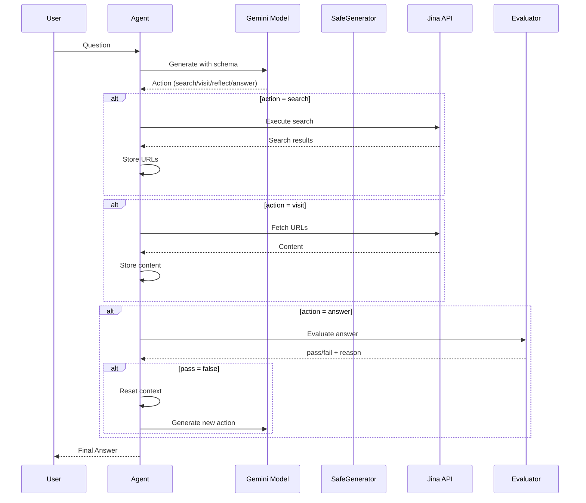

### 6. Data Flow Diagram

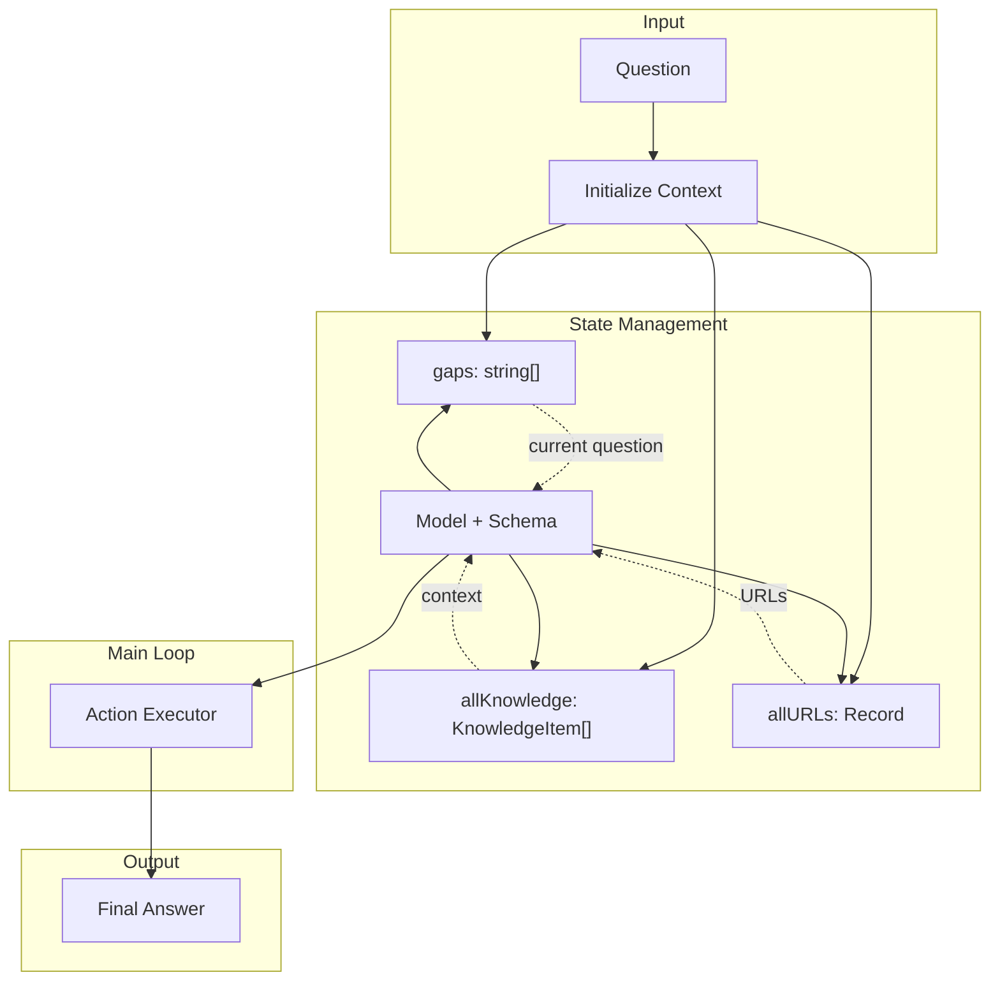

### 7. Token Budget Flow

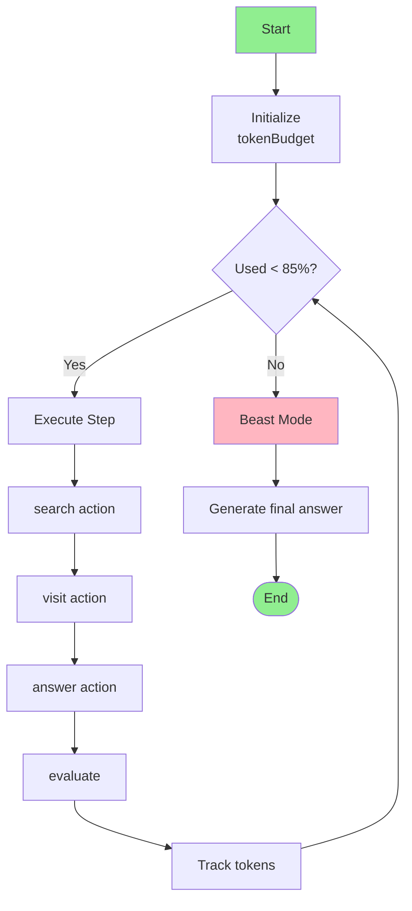

### 8. URL Processing Pipeline

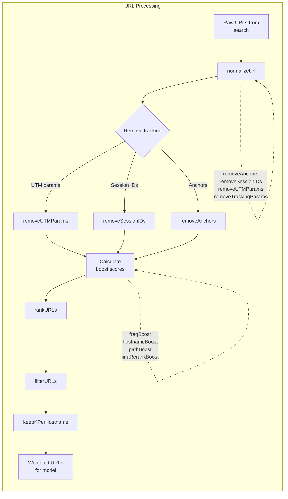

### 9. Query Rewriting Flow

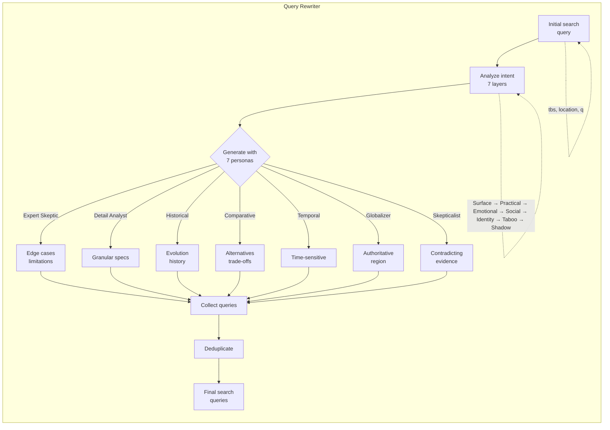

### 10. Knowledge Building Flow

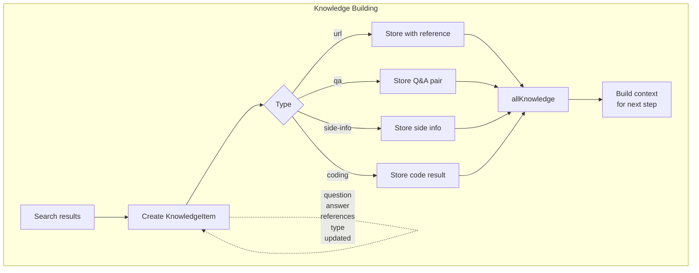

### 11. Evaluation Types Detail

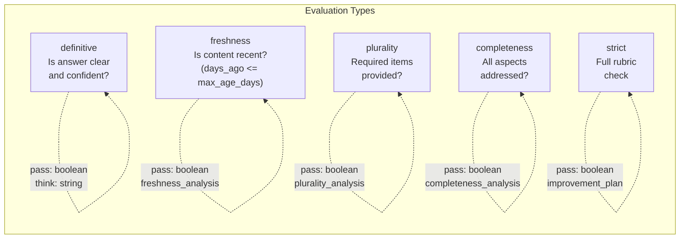

### 12. Beast Mode Flow

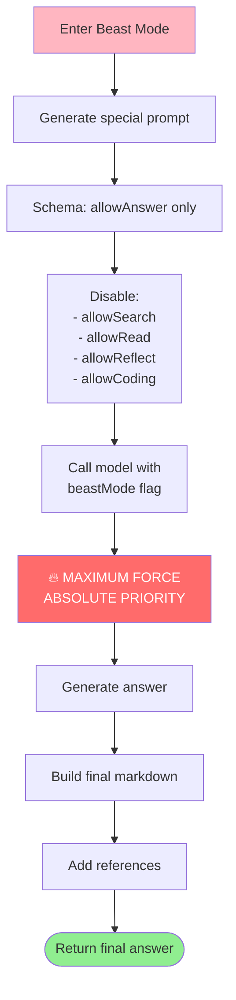

### 13. Research Team (Parallel) Flow

```mermaid
flowchart TD
    RT_START[Complex question] --> RT_ANALYZE[Analyze topic]
    
    RT_ANALYZE --> RT_DECOMPOSE[Decompose into<br/>N orthogonal subproblems]
    RT_DECOMPOSE --> RT_VALIDATE[Validate orthogonality]
    
    RT_VALIDATE -->|"Valid"| RT_PARALLEL[Parallel execution]
    RT_VALIDATE -->|"Invalid| RT_DECOMPOSE
    
    RT_PARALLEL --> RT_1[Subproblem 1<br/>researcher 1]
    RT_PARALLEL --> RT_2[Subproblem 2<br/>researcher 2]
    RT_PARALLEL --> RT_3[Subproblem N<br/>researcher N]
    
    RT_1 --> RT_AGGREGATE[Aggregate results]
    RT_2 --> RT_AGGREGATE
    RT_3 --> RT_AGGREGATE
    
    RT_AGGREGATE --> RT_MERGE[Merge knowledge]
    RT_MERGE --> RT_FINAL[Final answer]
    
    RT_DECOMPOSE -.->|"teamSize parameter"| RT_DECOMPOSE
    RT_PARALLEL -.->|"getResponse(..., teamSize=1)"| RT_PARALLEL
```

### 14. State Transitions

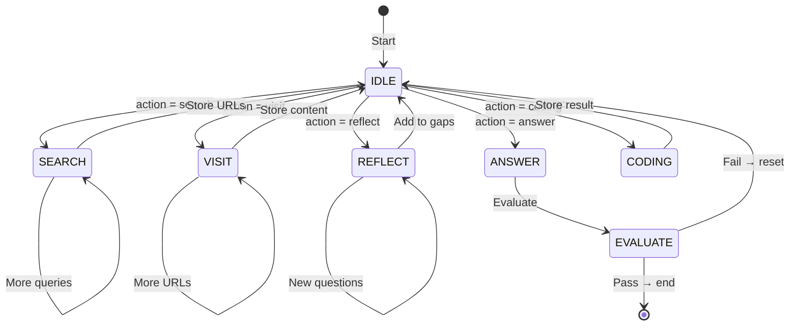

### 1. Main Agent Loop (`src/agent.ts`)

The main orchestration happens in `getResponse()` function (lines 419-1146).

**Key Variables:**
```typescript
const gaps: string[] = [question];        // Questions queue
const allKnowledge: KnowledgeItem[] = []; // Intermediate knowledge
const allURLs: Record<string, SearchSnippet> = {}; // URL storage
const weightedURLs: BoostedSearchSnippet[] = []; // Ranked URLs
const regularBudget = tokenBudget * 0.85; // 85% for normal mode
```

**Loop Condition:**
```typescript
while (context.tokenTracker.getTotalUsage().totalTokens < regularBudget) {
    // ... step execution
}
```

---

## Step Types and Processing

### Action: `search`

**Flow:** Search Query → Execute Search → Store URLs → Add to Knowledge

**Code Location:** `src/agent.ts:804-931`

```typescript
} else if (thisStep.action === 'search' && thisStep.searchRequests) {
    // Deduplicate search requests
    thisStep.searchRequests = chooseK(
        (await dedupQueries(thisStep.searchRequests, [], context.tokenTracker)).unique_queries,
        MAX_QUERIES_PER_STEP
    );

    // Execute search
    const { searchedQueries, newKnowledge } = await executeSearchQueries(
        thisStep.searchRequests.map(q => ({ q })),
        context,
        allURLs,
        SchemaGen,
        allWebContents,
        onlyHostnames,
        searchProvider
    );
```

**Search Providers:**
- `jina` (default) - Jina AI search API
- `duck` - DuckDuckGo
- `brave` - Brave Search
- `serper` - Serper API

**Query Rewriting:**
After initial search, queries are rewritten using cognitive personas (`src/tools/query-rewriter.ts`):

```typescript
// 7 cognitive perspectives generate orthogonal queries:
1. Expert Skeptic      - Focus on edge cases, limitations
2. Detail Analyst      - Granular technical specs
3. Historical Researcher - Evolution over time
4. Comparative Thinker - Alternatives, trade-offs
5. Temporal Context   - Time-sensitive queries
6. Globalizer        - Authoritative language/region
7. Reality-Hater-Skepticalist - Contradicting evidence
```

---

### Action: `visit`

**Flow:** Visit URLs → Extract Content → Store as Knowledge

**Code Location:** `src/agent.ts:931-986`

**URL Processing Pipeline:**
1. Normalize URLs (remove tracking params, sessions)
2. Rank by relevance score
3. Fetch content via Jina Reader API
4. Extract main content and metadata

**Storage:** Content stored in `allWebContents`:
```typescript
const allWebContents: Record<string, WebContent> = {};
// WebContent:
//   - full: string
//   - chunks: string[]
//   - chunk_positions: number[][]
//   - title: string
```

---

### Action: `reflect`

**Flow:** Generate Sub-Questions → De-duplicate → Add to Gaps Queue

**Code Location:** `src/agent.ts:773-803`

```typescript
} else if (thisStep.action === 'reflect' && thisStep.questionsToAnswer) {
    thisStep.questionsToAnswer = chooseK(
        (await dedupQueries(thisStep.questionsToAnswer, allQuestions, context.tokenTracker)).unique_queries,
        MAX_REFLECT_PER_STEP
    );
    // Add to gaps queue
    gaps.push(...newGapQuestions);
    allQuestions.push(...newGapQuestions);
```

---

### Action: `answer`

**Flow:** Generate Answer → Evaluate → Check Quality

**Code Location:** `src/agent.ts:612-747`

**Evaluation Types:**
- `definitive` - Must provide clear, confident response
- `freshness` - Must have recent information
- `plurality` - Must provide requested number of items
- `completeness` - Must address all explicitly named aspects
- `strict` - Full rubric-based evaluation

---

## Models Used

### Primary Reasoning Model

**Model:** `gemini-2.0-flash` (default) or OpenAI-compatible models

**Purpose:** Main agent reasoning, action selection, answer generation

**Configuration:**
```typescript
const generator = new ObjectGeneratorSafe(context.tokenTracker);
const result = await generator.generateObject({
    model: 'agent',
    schema,
    system,
    messages: msgWithKnowledge,
    numRetries: 2,
});
```

### Specialized Models

| Model Name | Purpose | Schema |
|-----------|--------|--------|
| `agent` | Main reasoning loop | `getAgentSchema()` |
| `agentBeastMode` | Fallback when budget exceeded | `getAgentSchema(allowAnswerOnly)` |
| `queryRewriter` | Expand queries with cognitive personas | `getQueryRewriterSchema()` |
| `evaluator` | Evaluate answer quality | `getEvaluatorSchema()` |
| `researchPlanner` | Decompose complex topics | `getResearchPlanSchema()` |
| `serpCluster` | Cluster search results | `getSerpClusterSchema()` |

---

## Structured Output Schemas

### Agent Schema (Main)

**File:** `src/utils/schemas.ts:268-335`

```typescript
getAgentSchema(allowReflect, allowRead, allowAnswer, allowSearch, allowCoding, currentQuestion)
```

**Output Structure:**
```typescript
{
    think: string,                    // Reasoning explanation
    action: "search" | "answer" | "reflect" | "visit" | "coding",
    
    // Action-specific fields:
    search?: {
        searchRequests: string[]      // Google search queries
    },
    answer?: {
        answer: string               // Final/mid-answer
    },
    reflect?: {
        questionsToAnswer: string[]   // Gap questions
    },
    visit?: {
        URLTargets: number[]         // URL indices from list
    },
    coding?: {
        codingIssue: string          // Problem description
    }
}
```

### Query Rewriter Schema

**File:** `src/utils/schemas.ts:191-203`

```typescript
getQueryRewriterSchema()
```

**Output:**
```typescript
{
    think: string,
    queries: {
        tbs?: "qdr:h" | "qdr:d" | "qdr:w" | "qdr:m" | "qdr:y",  // Time filter
        location?: string,         // Search location
        q: string                 // Keyword query (2-3 words)
    }[]
}
```

### Evaluator Schema

**File:** `src/utils/schemas.ts:205-266`

**Definitive Evaluation:**
```typescript
{
    type: "definitive",
    think: string,
    pass: boolean
}
```

**Freshness Evaluation:**
```typescript
{
    type: "freshness",
    think: string,
    freshness_analysis: {
        days_ago: number,
        max_age_days: number
    },
    pass: boolean
}
```

**Plurality Evaluation:**
```typescript
{
    type: "plurality",
    think: string,
    plurality_analysis: {
        minimum_count_required: number,
        actual_count_provided: number
    },
    pass: boolean
}
```

**Completeness Evaluation:**
```typescript
{
    type: "completeness",
    think: string,
    completeness_analysis: {
        aspects_expected: string,
        aspects_provided: string
    },
    pass: boolean
}
```

**Strict Evaluation:**
```typescript
{
    type: "strict",
    think: string,
    improvement_plan: string,
    pass: boolean
}
```

---

## Prompt Templates

### Main Agent Prompt

**File:** `src/agent.ts:110-245`

```typescript
function getPrompt(
    context?: string[],
    allQuestions?: string[],
    allKeywords?: string[],
    allowReflect: boolean = true,
    allowAnswer: boolean = true,
    allowRead: boolean = true,
    allowSearch: boolean = true,
    allowCoding: boolean = true,
    knowledge?: KnowledgeItem[],
    allURLs?: BoostedSearchSnippet[],
    beastMode?: boolean,
): { system: string, urlList?: string[] }
```

**System Prompt Structure:**
```
Current date: {date}

You are an advanced AI research agent from Jina AI. You are specialized in multistep reasoning. 
Using your best knowledge, conversation with the user and lessons learned, answer the user question with absolute certainty.

[context section]
You have conducted the following actions:
<context>
{context}
</context>

[url-list section]
<action-visit>
- Ground the answer with external web content
- Read full content from URLs...
<url-list>
{urlListStr}
</url-list>
</action-visit>

[search section]
<action-search>
- Use web search to find relevant information...
</action-search>

[answer section]
<action-answer>
- For greetings, casual conversation... answer directly
- Provide deep, unexpected insights...
</action-answer>

[reflect section]
<action-reflect>
- Think slowly and planning lookahead...
</action-reflect>

[actions]
Based on the current context, you must choose one of the following actions:
<actions>
{actionSections}
</actions>
```

### Query Rewriter Prompt

**File:** `src/tools/query-rewriter.ts:7-201`

**Cognitive Persona System Prompt:**
```system
You are an expert search query expander with deep psychological understanding.
You optimize user queries by extensively analyzing potential user intents and generating comprehensive query variations.

<intent-mining>
Analyze through 7 layers:
1. Surface Intent: literal interpretation
2. Practical Intent: tangible goal
3. Emotional Intent: feelings driving search
4. Social Intent: relationships/standing
5. Identity Intent: who they want to be
6. Taboo Intent: unspoken aspects
7. Shadow Intent: unconscious motivations
</intent-mining>

<cognitive-personas>
Generate ONE query from each:
1. Expert Skeptic
2. Detail Analyst
3. Historical Researcher
4. Comparative Thinker
5. Temporal Context
6. Globalizer
7. Reality-Hater-Skepticalist
</cognitive-personas>
```

---

## Data Storage

### File Storage

**Location:** Current working directory (files created during execution)

| File | Content |
|-----|---------|
| `prompt-{step}.txt` | System prompt for each step |
| `context.json` | All context steps |
| `queries.json` | All searched queries |
| `questions.json` | All questions (gaps) |
| `knowledge.json` | Intermediate knowledge |
| `urls.json` | Weighted URLs |
| `messages.json` | Messages with knowledge |

**Code Location:** `src/agent.ts:1148-1192`

```typescript
async function storeContext(prompt, schema, memory, step) {
    await fs.writeFile(`prompt-${step}.txt`, ...);
    await fs.writeFile('context.json', ...);
    await fs.writeFile('queries.json', ...);
    // ... etc
}
```

### In-Memory Storage

| Variable | Type | Purpose |
|----------|------|---------|
| `allContext` | `StepAction[]` | All steps taken |
| `allKnowledge` | `KnowledgeItem[]` | Intermediate answers |
| `allURLs` | `Record<string, SearchSnippet>` | Discovered URLs |
| `weightedURLs` | `BoostedSearchSnippet[]` | Ranked URLs |
| `allWebContents` | `Record<string, WebContent>` | Crawled content |
| `visitedURLs` | `string[]` | Visited URLs |
| `badURLs` | `string[]` | Failed URLs |

---

## URL Processing Pipeline

### URL Ranking

**File:** `src/utils/url-tools.ts`

**Boost Factors:**
- `freqBoost` - URL frequency in results
- `hostnameBoost` - Hostname boosting
- `pathBoost` - Path relevance
- `jinaRerankBoost` - Jina reranker score

**Processing Steps:**
1. Normalize URL (remove tracking, sessions)
2. Calculate boost scores
3. Rank by final score
4. Keep top K per hostname (diversity)

### URL Normalization

```typescript
normalizeUrl(urlString, options = {
    removeAnchors: true,
    removeSessionIDs: true,
    removeUTMParams: true,
    removeTrackingParams: true,
    removeXAnalytics: true
})
```

---

## Evaluation Pipeline

### Question Evaluation

**File:** `src/tools/evaluator.ts:560-596`

Determines which evaluation types to apply:

```typescript
export async function evaluateQuestion(
    question: string,
    trackers: TrackerContext,
    schemaGen: Schemas
): Promise<EvaluationType[]> {
    // Returns: definitive, freshness, plurality, completeness
}
```

### Answer Evaluation

**File:** `src/tools/evaluator.ts:622-677`

```typescript
export async function evaluateAnswer(
    question: string,
    action: AnswerAction,
    evaluationTypes: EvaluationType[],
    trackers: TrackerContext,
    allKnowledge: KnowledgeItem[],
    schemaGen: Schemas
): Promise<EvaluationResponse>
```

**Evaluation Order:**
1. `definitive` - Always first
2. `freshness` - If required
3. `plurality` - If required
4. `completeness` - If required
5. `strict` - Final rubric check

---

## Research Team (Parallel Processing)

### Research Planner

**File:** `src/tools/research-planner.ts`

**Purpose:** Decompose complex topics into orthogonal subproblems

```typescript
export async function researchPlan(
    question: string,
    teamSize: number,
    soundBites: string,
    trackers: TrackerContext,
    schemaGen: Schemas
): Promise<string[]>
```

**System Prompt:**
```
You are a Principal Research Lead managing a team of {teamSize} junior researchers.
Your role is to break down a complex research topic into focused, manageable subproblems.

Orthogonality Requirements:
- Each subproblem must address a fundamentally different aspect/dimension
- Use different decomposition axes
- Minimize subproblem overlap

Depth Requirements:
- Each subproblem should require 15-25 hours of focused research
- Must go beyond surface-level information
```

---

## Beast Mode (Fallback)

**File:** `src/agent.ts:1036-1076`

When token budget exceeded (85%), enters Beast Mode:

```typescript
if (!(thisStep as AnswerAction).isFinal) {
    const { system } = getPrompt(
        diaryContext,
        allQuestions,
        allKeywords,
        false,  // allowReflect
        false,  // allowRead
        false,  // allowSearch
        false,  // allowCoding
        true,   // allowAnswer
        allKnowledge,
        weightedURLs,
        true,   // beastMode
    );
    
    schema = SchemaGen.getAgentSchema(false, false, true, false, false, question);
    // Generate with maximum force
}
```

---

## Search APIs Used

### Jina Search API

**Endpoint:** `https://svip.jina.ai/`

**File:** `src/tools/jina-search.ts`

```typescript
export async function search(
    query: SERPQuery,
    domain?: string,
    num?: number,
    meta?: string,
    tracker?: TokenTracker
): Promise<{ response: JinaSearchResponse }>
```

### Jina Reader API

**Endpoint:** `https://r.jina.ai/`

**File:** `src/tools/read.ts`

```typescript
export async function readUrl(
    url: string,
    withAllLinks?: boolean,
    tracker?: TokenTracker,
    withAllImages?: boolean
): Promise<{ response: ReadResponse }>
```

---

## Patterns Used

### 1. Gap-Driven Iteration

Questions stored in `gaps[]` queue, processed round-robin:
```typescript
const currentQuestion: string = gaps[totalStep % gaps.length];
```

### 2. Action Flags

Actions can be disabled after failure:
```typescript
allowAnswer = false;   // After failed answer
allowSearch = false;    // After failed search
allowRead = false;     // After failed visit
allowReflect = false;  // After no new questions
```

### 3. Knowledge Building

Intermediate knowledge built incrementally:
```typescript
allKnowledge.push({
    question: currentQuestion,
    answer: thisStep.answer,
    type: 'qa',
    updated: formatDateBasedOnType(new Date(), 'full')
});
```

### 4. De-duplication

Queries and questions always deduplicated:
```typescript
const { unique_queries } = await dedupQueries(items, existingItems, tokenTracker);
```

### 5. Token Budget Tracking

Every operation tracks token usage:
```typescript
tokenTracker.trackUsage('search', { totalTokens: credits, ... });
tokenTracker.trackUsage('read', { totalTokens: tokens, ... });
```

---

## Configuration Constants

**File:** `src/utils/schemas.ts`

```typescript
export const MAX_URLS_PER_STEP = 5
export const MAX_QUERIES_PER_STEP = 5
export const MAX_REFLECT_PER_STEP = 2
export const MAX_CLUSTERS = 5
```

---

## Types Reference

**File:** `src/types.ts`

### Core Types

```typescript
type StepAction = SearchAction | AnswerAction | ReflectAction | VisitAction | CodingAction;

type SearchAction = {
    action: "search";
    think: string;
    searchRequests: string[];
};

type AnswerAction = {
    action: "answer";
    think: string;
    answer: string;
    references: Reference[];
    isFinal?: boolean;
    mdAnswer?: string;
};

type ReflectAction = {
    action: "reflect";
    think: string;
    questionsToAnswer: string[];
};

type VisitAction = {
    action: "visit";
    think: string;
    URLTargets: number[];
};

type KnowledgeItem = {
    question: string;
    answer: string;
    references?: Reference[];
    type: 'qa' | 'side-info' | 'chat-history' | 'url' | 'coding';
    updated?: string;
};
```

---

## Execution Flow Summary

```
1. Initialize
   ├── Set up token budget (default: 1M tokens)
   ├── Create knowledge/base messages
   └── Initialize URL storage

2. Main Loop (while budget < 85%)
   ├── Get current question from gaps
   ├── Generate prompt with context
   ├── Call model with schema
   ├── Execute chosen action
   │   ├── search → execute queries → store URLs
   │   ├── visit → fetch URLs → extract content
   │   ├── reflect → generate sub-questions → add to gaps
   │   └── answer → evaluate → check quality
   └── Track tokens

3. Beast Mode (budget >= 85%)
   └── Generate final answer with all available knowledge

4. Finalize
   ├── Build markdown answer
   ├── Add references
   └── Return result
```

---

## Related Files

| File | Purpose |
|------|---------|
| `src/agent.ts` | Main orchestration |
| `src/utils/schemas.ts` | All Zod schemas |
| `src/utils/safe-generator.ts` | Model calling |
| `src/tools/jina-search.ts` | Search API |
| `src/tools/read.ts` | Reader API |
| `src/tools/query-rewriter.ts` | Query expansion |
| `src/tools/evaluator.ts` | Answer evaluation |
| `src/tools/url-tools.ts` | URL processing |
| `src/tools/research-planner.ts` | Team parallelization |
| `src/types.ts` | Type definitions |